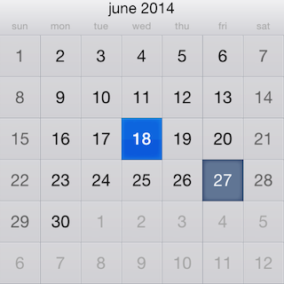
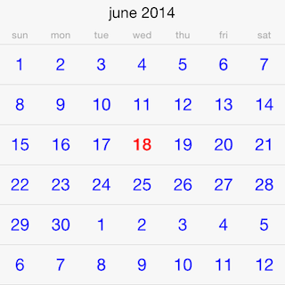

#Calendar: Customizations

<code>TKCalendar</code> allows customizing almost evety aspect of its visual appearance. This article demonstrates some of the customization techniques that can be used with it.

<code>TKCalendar</code> comes with two predefined themes: 
- <code>TKCalendarDefaultTheme</code> - a default theme
- <code>TKCalendarIPadTheme</code> - a theme designed for iPad

You can switch between themes by usig the <code>theme</code> property:

	TKCalendar *calendar = [[TKCalendar alloc] initWithFrame:self.view.bounds];
	calendar.theme = [TKCalendarIPadTheme new];

<code>TKCalendar</code> uses presenter classes to render different view modes. They all inherit from <code>UIView</code> and contain subviews with settings that can be changed. Most useful settings are grouped in a style property in the presenter class:

    TKCalendarMonthPresenter *presenter = (TKCalendarMonthPresenter*)calendar.presenter;
    presenter.style.titleCellHeight = 40;
    presenter.style.backgroundColor = [UIColor redColor];
    presenter.headerIsSticky = YES;

There are cases when specific cells must have custom design based on the cell state (e.g. today, weekend, selected). This can be dobe by adopging the <code>TKCalendarDelegate</code> protocol and implementing its <code>calendar:upateVisualsForCell:</code> method:

	- (void)calendar:(TKCalendar*)calendar updateVisualsForCell:(TKCalendarCell*)cell;
	{
    	if ([cell isKindOfClass:[TKCalendarDayCell class]]) {
        	TKCalendarDayCell *dayCell = (TKCalendarDayCell*)cell;
        	if (dayCell.state & TKCalendarDayStateToday) {
            	cell.style.textColor = [UIColor colorWithRed:0.0039 green:0.5843 blue:0.5529 alpha:1.0000];
        	}
    	}
	}

The cell can be replaced with a custom one for more complex scenarios. This can be done by implementing the <code>calendar:viewForCellOfKind:</code> method of <code>TKCalendarDelegate</code> protocol:

	- (TKCalendarCell *)calendar:(TKCalendar *)calendar viewForCellOfKind:(TKCalendarCellType)cellType
	{
    	if (cellType == TKCalendarCellTypeDay) {
        	CustomCell *cell = [CustomCell new];
        	return cell;
    	}
    	return nil;	
	}
	
The following is the implementation of the <code>CustomCell</code> class:

	@interface CustomCell : TKCalendarDayCell
	@end

	@implementation CustomCell

	- (instancetype)initWithFrame:(CGRect)frame
	{
    	self = [super initWithFrame:frame];
    	if (self) {
    	}
    	return self;
	}

	- (void)updateVisuals
	{
    	[super updateVisuals];
    
  	    if (self.state & TKCalendarDayStateToday) {
    	    self.label.textColor = [UIColor redColor];
   	    }	
   	    else {
   	    	self.label.textColor = [UIColor blueColor];
   	    }
	}

	@end
	
The result is presented below:

