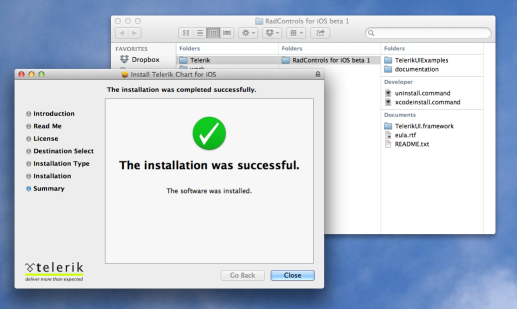

#Calendar: Getting Started

This quick start tutorial demonstrates how to create a simple iOS application with <code>TKCalendar</code>. 

##Prerequisites

In order to start using <code>TKCalendar</code>, you have first to install the latest version Telerik UI for iOS. You can download it from: [http://www.telerik.com/download/ios-ui](http://www.telerik.com/download/ios-ui). The file that you should download is the installation package - Telerik UI for iOS.pkg. Just double click the package icon and the installer will guide you trough the installation process. When done, it will open the newly created folder in your Documents folder. This folder contains everything necessary in order to start using <code>TKCalendar</code>.

##Setting up the project

After installing Telerik UI, you can proceed with the following steps:

<ol>
    <li>Open Xcode and choose <i>"Create a new Xcode project"</i>.</li>
    <li>Choose <i>"Single View Application"</i> from the <i>"Choose a template for your new project"</i> dialog.</li>
    <li>Give your project a name and click <i>Next</i>.</li>
    <li>Complete the process of creating a project by specifying the location for your project and clicking <i>Create</i>.</li>
    <li>Scroll down to the <i>Linked Frameworks and Libraries</i> section in your project settings and click on the <i>"+"</i> button.  
    </li>
    <li>Type <i>telerik</i> in the popup, select the <i>TelerikUI.framework</i> and click <i>Add</i>.  
    </li>
    <li>This is it, now you are ready to start working with Telerik Chart.</li>
</ol>

##Setting up TKCalendar

Now that our project is created and the TelerikUI.framework is added, we can start referencing and using the TelerikUI types:

Open your <code>ViewController.m</code> file and add a reference to Telerik UI header file:

    #import <TelerikUI/TelerikUI.h>

Type the following code in <code>viewDidLoad</code> method:

	TKCalendar *calendarView = [[TKCalendar alloc] initWithFrame:self.view.bounds];
    calendarView.autoresizingMask = UIViewAutoresizingFlexibleWidth | UIViewAutoresizingFlexibleHeight;
    [self.view addSubview:calendarView];

This code creates a new instance of <code>TKCalendar</code> and adds it as a subview of the ViewController's main view. The <code>autoresizingMask</code> property is set in order to allow correct resizing of the calendar when the device is rotated in landscape mode. 

The next step is to create some random data that will be consumed by the calendar. You can use the following code:

	self.events = [NSMutableArray new];
    NSCalendar *calendar = [NSCalendar currentCalendar];
    NSDate *date = [NSDate date];
    for (int i = 0; i<10; i++) {
        TKCalendarEvent *event = [TKCalendarEvent new];
        event.title = @"Sample event";
        NSDateComponents *components = [calendar components:NSCalendarUnitDay|NSCalendarUnitMonth|NSCalendarUnitYear fromDate:date];
        NSInteger random = arc4random()%20;
        components.day += random > 10 ? 20 - random : -random;
        event.startDate = [calendar dateFromComponents:components];
        components.hour += 2;
        event.endDate = [calendar dateFromComponents:components];
        event.eventColor = [UIColor redColor];
        [self.events addObject:event];
    }

This code will add 10 events with random dates to an array named <code>events</code>. The <code>arc4random</code> method is being used to create the random dates. The code also assigns a title and a color to the events.

Now let's add this random data to the calendar and present it. In order to do this, we should first adopt the <code>TKCalendarDataSource</code> protocol:

	@interface ViewController () <TKCalendarDataSource>

And we should implement its <code>calendar:eventsForDate:</code> method:

	- (NSArray *)calendar:(TKCalendar *)calendar eventsForDate:(NSDate *)date
    {
        NSDateComponents *components = [self.calendarView.calendar components:NSCalendarUnitYear|NSCalendarUnitMonth|NSCalendarUnitDay fromDate:date];
        components.hour = 23;
        components.minute = 59;
        components.second = 59;
        NSDate *endDate = [self.calendarView.calendar dateFromComponents:components];
        NSPredicate *predicate = [NSPredicate predicateWithFormat:@"(startDate <= %@) AND (endDate >= %@)", endDate, date];
        return [self.events filteredArrayUsingPredicate:predicate];
    }
    
Here, the predicate is used to filter the events array by date. Do not forget to assign the <code>dataSource</code> property of <code>TKCalendar</code>:

	calendarView.dataSource = self;

For information about populating <code>TKCalendar</code> with EventKit events, please refer to the following article: [Populating with data](populating-with-data)

As a next step you may want to tune up the calendar more precisely by specifying minimum and maximum allowed dates. This can be done by setting the <code>minDate</code> and <code>maxDate</code> properties:
	
	calendarView.minDate = [TKCalendar dateWithYear:2010 month:1 day:1 withCalendar:nil];
	calendarView.maxDate = [TKCalendar dateWithYear:2016 month:12 day:31 withCalendar:nil];
	
By default, <code>TKCalendar</code> displays the current date, use the <code>navigateToDate:animated</code> method to display a different date:

    NSDateComponents *components = [NSDateComponents new];
    components.year = 2015;
    components.month = 5;
    components.day = 1;
    NSDate *newDate = [self.calendarView.calendar dateFromComponents:components];
    [self.calendarView navigateToDate:newDate animated:YES];

<code>TKCalendar</code> sends different notifications. For example, in order to be notified when a date was selected, override the <code>calendar:didSelectDate:</code> method of <code>TKCalendarDelegate</code> protocol:

	- (void)calendar:(TKCalendar *)calendar didSelectDate:(NSDate *)date
	{
    	NSLog(@"%@", date);
	}
	
Note that <code>TKCalendar</code> supports single, multiple and range date selection. Selection modes are described in detail in the article about [Selection](selection).

Along with selection notifications <code>TKCalendar</code> supports navigation and customization notifications by adopting the <code>TKCalendarDelegate</code> protocol. These notifications are described in the articles about: [Navigation](navigation) and [Customizations](customizations).

Here is the full code of this example:

	#import "ViewController.h"
	#import <TelerikUI/TelerikUI.h>

    @interface ViewController () <TKCalendarDataSource, TKCalendarDelegate>
	@property (nonatomic, strong) NSMutableArray *events;
    @end
    
	@implementation ViewController

	- (void)viewDidLoad
	{
    	[super viewDidLoad];
    	// Do any additional setup after loading the view.
    
	    TKCalendar *calendarView = [[TKCalendar alloc] initWithFrame:self.view.bounds];
    	calendarView.autoresizingMask = UIViewAutoresizingFlexibleWidth | UIViewAutoresizingFlexibleHeight;
    	calendarView.dataSource = self;
    	calendarView.delegate = self;
    	calendarView.minDate = [TKCalendar dateWithYear:2010 month:1 day:1 withCalendar:nil];
		calendarView.maxDate = [TKCalendar dateWithYear:2016 month:12 day:31 withCalendar:nil];
    	[self.view addSubview:calendarView];
    	self.calendarView = calendarView;
    
    	self.events = [NSMutableArray new];
    	NSCalendar *calendar = [NSCalendar currentCalendar];
   		NSDate *date = [NSDate date];
    	for (int i = 0; i<10; i++) {
        	TKCalendarEvent *event = [TKCalendarEvent new];
        	event.title = @"Sample event";
        	NSDateComponents *components = [calendar components:NSCalendarUnitDay|NSCalendarUnitMonth|NSCalendarUnitYear fromDate:date];
        	NSInteger random = arc4random()%20;
       		components.day += random > 10 ? 20 - random : -random;
        	event.startDate = [calendar dateFromComponents:components];
        	components.hour += 2;
        	event.endDate = [calendar dateFromComponents:components];
        	event.eventColor = [UIColor redColor];
        	[self.events addObject:event];
    	}
    
    	NSDateComponents *components = [NSDateComponents new];
    	components.year = 2015;
    	components.month = 5;
    	components.day = 1;
    	NSDate *newDate = [self.calendarView.calendar dateFromComponents:components];
    	[self.calendarView navigateToDate:newDate animated:YES];
	}
    
    #pragma mark TKCalendarDataSource
    
    - (NSArray *)calendar:(TKCalendar *)calendar eventsForDate:(NSDate *)date
    {
        NSDateComponents *components = [self.calendarView.calendar components:NSCalendarUnitYear|NSCalendarUnitMonth|NSCalendarUnitDay fromDate:date];
        components.hour = 23;
        components.minute = 59;
        components.second = 59;
        NSDate *endDate = [self.calendarView.calendar dateFromComponents:components];
        NSPredicate *predicate = [NSPredicate predicateWithFormat:@"(startDate <= %@) AND (endDate >= %@)", endDate, date];
        return [self.events filteredArrayUsingPredicate:predicate];
    }

	#pragma mark TKCalendarDelegate

	- (void)calendar:(TKCalendar *)calendar didSelectDate:(NSDate *)date
	{
    	NSLog(@"%@", date);
	}

    @end

You can easily change the way data is presented in chart by changing the view mode property:

	calendarView.viewMode = TKCalendarViewModeYear;

All view modes are desctibed in the following article: 
[View modes](view-modes)

