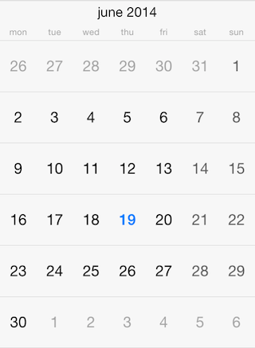
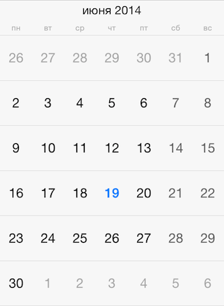

#Calendar: Localization

By defualt, <code>TKCalendar</code> uses the current system locale and calendar settings. However, it allows for specifying those settings explicitly, overriding the system settings. This article describes how to do this.

The <code>calendar</code> property of <code>TKCalendar</code> specifies the <code>NSCalendar</code> to be used. You can use this property to change the first day in week to Monday for example:

    NSCalendar *calendar = [[NSCalendar alloc] initWithCalendarIdentifier:NSGregorianCalendar];
    calendar.firstWeekday = 2;
    TKCalendar *calendarView = [[TKCalendar alloc] initWithFrame:self.view.bounds];
    calendarView.calendar = calendar;
    

Or, you can change the calendar with one specific for your users:

	calendarView.calendar = [[NSCalendar alloc] initWithCalendarIdentifier:NSChineseCalendar];
	
Month names and week day names are provided by the <code>locale</code> property. Use the following code to customize the current locale:

	calendarView.locale = [[NSLocale alloc] initWithLocaleIdentifier:@"ru_RU"];
	
After modifying the locale you should call the <code>update:</code> method for the presenter:

	[calendarView.presenter update:NO];
	

	
