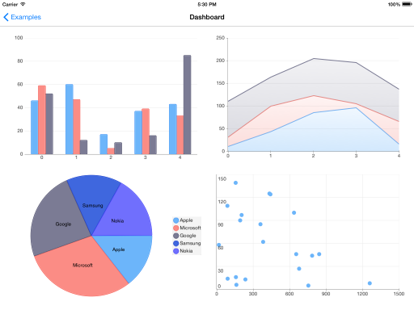

# Calendar for iOS: Overview

TKChart is a versatile charting component that offers full customization, great performance and intuitive object model. Its API allows creating complex charts with stunning animations and appearance. 

TKChart main features include:

- Various series types: bar, column, line, spline, area, pie, donut, scatter.
- Stacking of bar, column, line and area series including stack 100 mode.
- Pan/Zoom and selection functionality.
- Animations that use the CoreAnimations and UIKit dynamics.
- Multiple axes.
- Annotations.
- Trackball.

