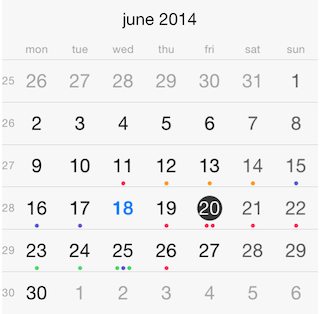

#Calendar: Populating with Data

Following the Model-View-Controller design pattern, the data source mediates between the application's data model (that is, its model objects) and the calendar view. The data source provides the calendar view object with the information it needs to display events.

 

Following this approach, the <code>TKCalendarDataSource</code> protocol should be implemnted in order to bind <code>TKCalendar</code> with data. This is easy because this protocol contains a single method <code>calendar:eventsForDate:</code>. The adopter should provide the events specific for the provided date. Here is a sample implementation of this method:

	- (NSArray *)calendar:(TKCalendar *)calendar eventsForDate:(NSDate *)date
	{
    	NSDateComponents *components = [self.calendarView.calendar components:NSCalendarUnitYear|NSCalendarUnitMonth|NSCalendarUnitDay fromDate:date];
    	components.hour = 23;
    	components.minute = 59;
    	components.second = 59;
    	NSDate *endDate = [self.calendarView.calendar dateFromComponents:components];
    	NSPredicate *predicate = [NSPredicate predicateWithFormat:@"(startDate <= %@) AND (endDate >= %@)", endDate, date];
    	return [self.events filteredArrayUsingPredicate:predicate];
	}

In most cases <code>TKCalendar</code> accesses events stored on the device where the application executes. In this scenario the *EventKit* framework should be used. <code>TKCalendar</code> provides a helper data source class which loads the events from device by using the *EventKit API*. 

As a prerequisite, the *EventKit* and *EventKitUI* frameworks should be added to the application. Now, you are ready to use the *EventKit* data source helper class for <code>TKCalendar</code>.

The simplest scenario is to create a new instance of <code>TKCalendarEventKitDataSource</code> class and set it as a data source for <code>TKCalendar</code>:

	TKCalendarEventKitDataSource *dataSource = [TKCalendarEventKitDataSource new];

	self.calendarView = [[TKCalendar alloc] initWithFrame:self.view.bounds];
    self.calendarView.autoresizingMask = UIViewAutoresizingFlexibleWidth | UIViewAutoresizingFlexibleHeight;
    self.calendarView.dataSource = dataSource;
    [self.view addSubview:self.calendarView];

However, <code>TKCalendarEventKitDataSource</code> supports event filtering. Adopt its <code>TKCalendarEventKitDataSourceDelegate</code> protocol to enable this feature:

	@interface ViewController () <TKCalendarEventKitDataSourceDelegate>
	//..
	dataSource.delegate = self;
	
In order to import only events from calendars local for the device, handle the <code>shouldImportEventsFromCalendar:</code> method:

	- (BOOL)shouldImportEventsFromCalendar:(EKCalendar *)calendar
	{
    	if (calendar.type == EKCalendarTypeLocal)
        	return YES;
	    return NO;
	}
	
In the cases when you want to filter only specific events, use the <code>shouldImportEvent:</code> method.
