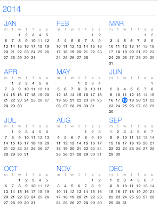
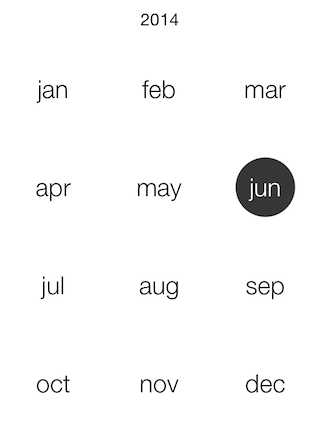

# Calendar: View Modes

TKCalendar is able to present its contents in different ways. Those include:

- A single month.
- A single week.
- A list with years, containing months and month days.
- A list with month names.
- A list with year numbers.
- A flow layout with months and month days.
- A separate view controller to allow iOS 7 calendar style like experience.

This article describes those view modes in detail.

The <code>presenter</code> property of <code>TKCalendar</code> allows customizing settings specific for the current view mode. Every view mode has its dedicated presenter class:

```Objective-C
TKCalendarYearPresenter *presenter = (TKCalendarYearPresenter*)calendarView.presenter;
presenter.columns = 3;
```
```Swift
let presenter: TKCalendarYearPresenter = calendarView.presenter() as! TKCalendarYearPresenter
presenter.columns = 3
```
```C#
TKCalendarYearPresenter presenter = (TKCalendarYearPresenter)calendarView.Presenter;
presenter.Columns = 3;
```

You can determine whether a view change occurred by implementing <code>TKCalendarDelegate</code> protocol:

```Objective-C
- (void)calendar:(TKCalendar *)calendar didChangedViewModeFrom:(TKCalendarViewMode)previousViewMode to:(TKCalendarViewMode)viewMode
{
	// Here you can perform the desired action when the selection is changed.
}
```
```Swift
func calendar(calendar: TKCalendar!, didChangedViewModeFrom previousViewMode: TKCalendarViewMode, to viewMode: TKCalendarViewMode) {
    // Here you can perform the desired action when the selection is changed
}
```
```C#
public override void DidChangedViewModeFrom (TKCalendar calendar, TKCalendarViewMode previousViewMode, TKCalendarViewMode viewMode)
{
	// Here you can perform the desired action when the selection is changed.
}
```

## Single month view mode ##


Use the <code>TKCalendarViewModeMonth</code> to enable the single month view:

```Objective-C
calendarView.viewMode = TKCalendarViewModeMonth;
```
```Swift
calendarView.viewMode = TKCalendarViewModeMonth
```
```C#
calendarView.ViewMode = TKCalendarViewMode.Month;
```

In this mode <code>TKCalendar</code> renders a single month and allows switching to a different month with a swipe gesture. This transition can be customized with different transition effects. More about this is available in this help article: [Transition effects](view-transitions)

In addition to selecting a different month with swipe, users can change the view mode to month names when the <code>allowPinchZoom</code> property is set to <code>YES</code>:

```Objective-C
calendarView.allowPinchZoom = YES;
```
```Swift
calendarView.allowPinchZoom = true
```
```C#
calendarView.AllowPinchZoom = true;
```

Dates can be selected according to the <code>selectionMode</code> property. Details about selection are available in the dedicated help article about selection: [Selection](selection)

Dates in this view mode are represented by the <code>TKCalendarCell</code> class which inherits from <code>UIView</code>. The visual appearance can be customized by creating custom cells and handling the <code>calendar:viewForCellOfKind:</code> method of <code>TKCalendarDelegate</code> protocol. This technique is described in [Calendar customizations](customizations) article.

The presenter class responsible for month view is the <code>TKCalendarMonthPresenter</code> class. It contains a style property where different UI settings can be tuned. For example:

```Objective-C
TKCalendarMonthPresenter *monthPresenter = (TKCalendarMonthPresenter*)calendarView.presenter;
monthPresenter.style.rowSpacing = 2;
monthPresenter.style.columnSpacing = 2;
monthPresenter.titleHidden = YES;
```
```Swift
let monthPresenter = calendarView.presenter() as! TKCalendarMonthPresenter
monthPresenter.style().rowSpacing = 2
monthPresenter.style().columnSpacing = 2
monthPresenter.titleHidden = true
```
```C#
TKCalendarMonthPresenter monthPresenter = (TKCalendarMonthPresenter)calendarView.Presenter;
monthPresenter.Style.RowSpacing = 2;
monthPresenter.Style.ColumnSpacing = 2;
monthPresenter.TitleHidden = true;
```

## Single week view mode ##


Set the <code>viewMode</code> property to <code>TKCalendarViewModeWeek</code> to enable this view:

```Objective-C
calendarView.viewMode = TKCalendarViewModeWeek;
```
```Swift
calendarView.viewMode = TKCalendarViewModeWeek
```
```C#
calendarView.ViewMode = TKCalendarViewMode.Week;
```

This view mode is similar to the previous one, but it displays only one week. The presenter class for this view mode is <code>TKCalendarWeekPresenter</code>, it inherits from <code>TKCalendarMonthPresenter</code> and allows the same customization and behavior features.

## List with years view mode ##



Set the <code>viewMode</code> property to <code>TKCalendarViewModeYear</code> to enable this view:

```Objective-C
calendarView.viewMode = TKCalendarViewModeYear;
```
```Swift
calendarView.viewMode = TKCalendarViewModeYear
```
```C#
calendarView.ViewMode = TKCalendarViewMode.Year;
```

This view mode displays a list of years with their months and dates. The user can select months by tapping on them.

The presenter class for this view mode is <code>TKCalendarYearPresenter</code>.

## List with month names ##



Set the <code>viewMode</code> property to <code>TKCalendarViewModeMonthNames</code> to enable this view.

```Objective-C
calendarView.viewMode = TKCalendarViewModeMonthNames;
```
```Swift
calendarView.viewMode = TKCalendarViewModeMonthNames
```
```C#
calendarView.ViewMode = TKCalendarViewMode.MonthNames;
```

The month names view is used together with the month view mode when the <code>allowPinchZoom</code> option is turned on. It allows for selecting a different month faster. Use pinch-in/out gesture to switch between single month/year numbers view mode.

The presenter class for this view mode is <code>TKCalendarMonthNamesPresenter</code>, it inherits from <code>TKCalendarMonthPresenter</code> and allows the same customization and behavior features.

## List with year numbers ##


Set the <code>viewMode</code> property to <code>TKCalendarViewModeYearNumbers</code> to enable this view.

```Objective-C
calendarView.viewMode = TKCalendarViewModeYearNumbers;
```
```Swift
calendarView.viewMode = TKCalendarViewModeYearNumbers
```
```C#
calendarView.ViewMode = TKCalendarViewMode.YearNumbers;
```

The year numbers view is used together with the month view mode when the <code>allowPinchZoom</code> option is turned on. It allows for selecting a different year faster.

The presenter class for this view mode is <code>TKCalendarYearNumbersPresenter</code>, it inherits from <code>TKCalendarMonthPresenter</code> and allows the same customization and behavior features.

## Flow layout with months and month days ##


Set the <code>viewMode</code> property to <code>TKCalendarViewModeFlow</code> to enable this view.

```Objective-C
calendarView.viewMode = TKCalendarViewModeFlow;
```
```Swift
calendarView.viewMode = TKCalendarViewModeFlow
```
```C#
calendarView.ViewMode = TKCalendarViewMode.Flow;
```

The flow view displays months with single dates. Single cells are represented by the <code>TKCalendarCell</code> class and allow customization by handling the <code>calendar:viewForCellOfKind</code> method.

Only the single selection mode is available when selecting cells in flow view.

The presenter class for this view mode is <code>TKCalendarFlowPresenter</code>.

## iOS 7 calendar style experience ##

The <code>TKCalendarYearViewController</code> class can be used to create an experience similar to the one in the built-in calendar in iOS 7. Follow these steps to add the TKCalendarYearViewController to your application:

1. Add a navigation controller
2. Use this code to show the year view controller in your application:

```Objective-C
TKCalendarYearViewController *controller = [TKCalendarYearViewController new];
[self.navigationController pushViewController:controller animated:YES];
```
```Swift
let controller = TKCalendarYearViewController()
self.navigationController?.pushViewController(controller, animated: true)
```
```C#
TKCalendarYearViewController controller = new TKCalendarYearViewController ();
this.NavigationController.PushViewController (controller, true);
```

The <code>contentView</code> property of <code>TKCalendarYearViewController</code> contains the presented <code>TKCalendar</code> object instance. Use its properties and methods to customize the calendar. For example, the following code navigates to the current date:

```Objective-C
[controller.contentView navigateToDate:[NSDate date] animated:NO];
```
```Swift
controller.contentView().navigateToDate(NSDate(), animated: false)
```
```C#
controller.ContentView.NavigateToDate (NSDate.Now, false);
```
