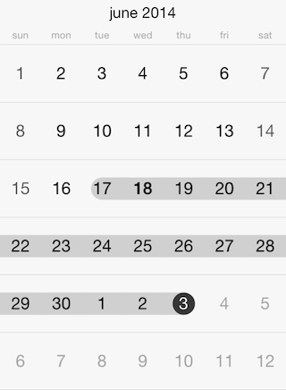

# Calendar: Selection

This article describes the different selection modes available in <code>TKCalendar</code>.

The selection mode in <code>TKCalendar</code> can be altered by using the <code>selectionMode</code> property. The available options are:

- <code>TKCalendarSelectionModeNode</code> - No selection is allowed.
- <code>TKCalendarSelectionModeSingle</code> - A single date can be selected.
- <code>TKCalendarSelectionModeMultiple</code> - Different dates can be selected by tapping on them. A second tap will deselect the date.
- <code>TKCalendarSelectionModeRange</code> - A range between two dates on the same page can be selected.



Use the <code>selectedDate</code> property to get or set the currently selected date in <code>TKCalendar</code> when the single selection mode is used.

Use the <code>selectedDates</code> property to get or set the selected dates when multiple selection mode is selected.

The <code>selectedDatesRange</code> property is used to store the date range when this selection option is used.

You can determine whether a selection is changed by adopting <code>TKCalendarDelegate</code> protocol:

```Objective-C
- (void)calendar:(TKCalendar *)calendar didSelectDate:(NSDate *)date
{
	// Here you can perform the desired action when the selection is changed.
}
```
```Swift
func calendar(calendar: TKCalendar!, didSelectDate date: NSDate!) {
    // Here you can perform the desired action when the selection is changed.
}
```
```C#
public override void DidSelectDate (TKCalendar calendar, NSDate date)
{
	// Here you can perform the desired action when the selection is changed.
}
```

You can prevent <code>TKCalendar</code> from selecting specific date by handling the <code>calendar:shouldSelectDate:</code>

```Objective-C
- (BOOL)calendar:(TKCalendar *)calendar shouldSelectDate:(NSDate *)date
{
	return ![TKCalendar isDate:[NSDate date]
    	          equalToDate:date
        	   withComponents:NSCalendarUnitYear|NSCalendarUnitMonth|NSCalendarUnitDay
            	 withCalendar:self.calendarView.calendar];
}
```
```Swift
func calendar(calendar: TKCalendar!, shouldSelectDate date: NSDate!) -> Bool {
    return TKCalendar.isDate(NSDate(), equalToDate: date, withComponents: NSCalendarUnit.YearCalendarUnit | NSCalendarUnit.MonthCalendarUnit | NSCalendarUnit.DayCalendarUnit, withCalendar: self.calendarView.calendar)
}
```
```C#
public override bool ShouldSelectDate (TKCalendar calendar, NSDate date)
{
	return !TKCalendar.IsDate (NSDate.Now, date, NSCalendarUnit.Day | NSCalendarUnit.Month | NSCalendarUnit.Year, calendar.Calendar);
}
```

Furthermore, the <code>calendar:didDeselectDate:</code> is called when using multiple selection to notify for unselected dates:

```Objective-C
- (void)calendar:(TKCalendar *)calendar didDeselectedDate:(NSDate *)date
{
	NSLog(@"deselected: %@", date);
}
```
```Swift
func calendar(calendar: TKCalendar!, didDeselectedDate date: NSDate!) {
    NSLog("deselected: %@", date)
}
```
```C#
public override void DidDeselectedDate (TKCalendar calendar, NSDate date)
{
	Console.WriteLine (String.Format ("deselected: {0}", date));
}
```