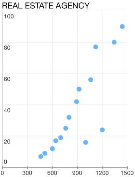
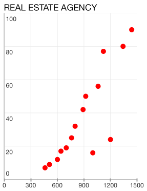

# Chart Series: Scatter

TKChartScatterSeries plots its data along two axes. Scatter series identify the position of each point using two dimentional values - XValue and YValue for the horizontal and vertical axes respectively, just like in the typical Cartesian coordinate system. Here is how to create a TKChartScatterSeries and populate them manually:

    NSArray *xValues = @[ @460, @510, @600, @640, @700, @760, @800, @890, @920, @1000, @1060, @1120, @1200, @1342, @1440];
    NSArray *yValues = @[ @7, @9, @12, @17, @19, @25, @32, @42, @50, @16, @56, @77, @24, @80, @90 ];

    NSMutableArray *array = [[NSMutableArray alloc] init];
    for (int i = 0; i<xValues.count; i++) {
        [array addObject:[[TKChartDataPoint alloc] initWithX:xValues[i] Y:yValues[i]]];
    }

    TKChartScatterSeries *series = [[TKChartScatterSeries alloc] initWithItems:array];
    [chart addSeries:series];

##Customizing the visual appearance##

In addition, you can change a point background color by using the following lines of code:

    TKChartScatterSeries *series = [[TKChartScatterSeries alloc] initWithItems:array];
    TKChartPaletteItem *palleteItem = [[TKChartPaletteItem alloc] init];
    palleteItem.fill = [TKSolidFill solidFillWithColor:[UIColor redColor]];
    series.style.palette = [[TKChartPalette alloc] init];
    [series.style.palette addPaletteItem:palleteItem];
    [chart addSeries:series];

##Configure input and selection of line series##

Here is how to configure the distance between finger touch and line to perform selection:

    TKChartScatterSeries* seriesForProfit = [[TKChartScatterSeries alloc] initWithItems:profitData];
    seriesForProfit.marginForHitDetection = 30.f;
    [chart addSeries:seriesForProfit];

