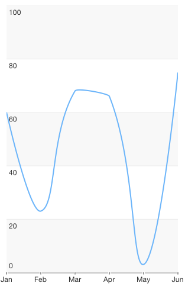

#Chart Series: Spline

<code>TKChartSpineSeries</code> is similar to the line series, but instead of straight line segments, the spline series connects its data points with smooth curves which represent rough approximations of the missing data points. Here is an example of a chart with a spline series:

	TKChartSplineSeries* seriesForAnnualRevenue = [[TKChartSplineSeries alloc] initWithItems:annualRevenueData];
	[chart addSeries:seriesForAnnualRevenue];

As TKChartSplineSeries derives from TKChartLineSeries, it shares the same functionality.