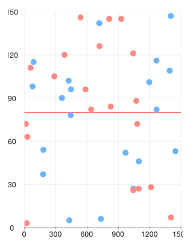

# Chart: Annotations

Annotations are visual elements that can be used to highlight certain areas on the plot area and denote statistical significance.

TKChart provides the following types of annotations:

- <code>TKChartGridLineAnnotation</code>
- <code>TKChartBandAnnotation</code>
- <code>TKChartCrossLineAnnotation</code>
- <code>TKChartBalloonAnnotation</code>
- <code>TKChartLayerAnnotation</code>
- <code>TKChartViewAnnotation</code>

## Adding annotations to the chart##

<code>TKChart</code> contains an <code>annotations</code> collection and annotations can be added to the chart by calling the <code>addAnnotation</code> method. The following code adds a horizontal grid line annotation in TKChart. The annotation requires an axis and a value in order to be initialized correctly.

```Objective-C
  [chart addAnnotation:[[TKChartGridLineAnnotation alloc] initWithValue:@80 forAxis:chart.yAxis]];
```
```Swift
chart.addAnnotation(TKChartGridLineAnnotation(value: 80, forAxis: chart.yAxis))
```
```C#
chart.AddAnnotation (new TKChartGridLineAnnotation (new NSNumber (80), chart.YAxis));
```

The annotation visibility can be controlled by setting its <code>hidden</code> property.
The annotation visual appearance can be changed by using its <code>style</code> property.

## Annotation types##

Conceptually, there are three types of annotations - grid line, band and point annotations. Below is a comparison for each one depending on the scenario.

### Grid line###

The grid line annotation represents a vertical or horizontal line which crosses the entire plot area. It is specified by using the <code>TKChartGridLineAnnotation</code>.

The line color can be customized by using the annotation initializer:

```Objective-C
TKStroke *stroke = [TKStroke strokeWithColor:[UIColor redColor] width:0.5];
[chart addAnnotation:[[TKChartGridLineAnnotation alloc] initWithValue:@80 forAxis:chart.yAxis withStroke:stroke]];
```

```Swift
let stroke = TKStroke(color: UIColor.redColor(), width:0.5)
chart.addAnnotation(TKChartGridLineAnnotation(value: 80, forAxis: chart.yAxis, withStroke: stroke))
```
```C#
var stroke = new TKStroke (UIColor.Red, 0.5f);
chart.AddAnnotation (new TKChartGridLineAnnotation (new NSNumber (80), chart.YAxis, stroke));
```



### Plot band###

The <code>TKChartBandAnnotation</code> is either horizontal or vertical strip, crossing its corresponding axis, specified by its <code>range</code> property.

```Objective-C
TKRange *range = [[TKRange alloc] initWithMinimum:@10 andMaximum:@40];
UIColor *color = [UIColor colorWithRed:1. green:0. blue:0. alpha:0.4];
TKFill *fill = [TKSolidFill solidFillWithColor:color];
[chart addAnnotation:[[TKChartBandAnnotation alloc] initWithRange:range forAxis:chart.yAxis withFill:fill withStroke:nil]];
```
```Swift
let range = TKRange(minimum: 10, andMaximum: 40)
let color = UIColor(red: 1.0, green: 0, blue: 0, alpha: 0.4)
let fill = TKSolidFill(color: color)
chart.addAnnotation(TKChartBandAnnotation(range: range, forAxis: chart.yAxis, withFill: fill, withStroke: nil))
```
```C#
var range = new TKRange (new NSNumber (10), new NSNumber (40));
var color = new UIColor(1.0f, 0f, 0f, 0.4f);
var fill = new TKSolidFill (color);
chart.AddAnnotation(new TKChartBandAnnotation(range, chart.YAxis, fill, null));
```


### Point annotations###

Point annotations render their content starting at specific position. Besides the position, a pixel based offset could be added to the point annotation by specifying the <code>offset</code> property.

### Cross line annotation###

The TKChartCrossLineAnnotation is a point annotation which represents two crossing lines with a point at the crossing position.

```Objective-C
[chart addAnnotation:[[TKChartCrossLineAnnotation alloc] initWithX:@900 Y:@60 forSeries:chart.series[0]]];
```
```Swift
chart.addAnnotation(TKChartCrossLineAnnotation(x: 900, y: 60, forSeries: chart.series()[0] as! TKChartSeries))
```
```C#
chart.AddAnnotation (new TKChartCrossLineAnnotation (new NSNumber (900), new NSNumber (60), chart.Series [0]));
```


### Balloon annotation###

The <code>TKChartBalloonAnnotation</code> displays a balloon-like shape next to the position specified by its arguments. The <code>verticalAlign</code> and <code>horizontalAlign</code> properties allow to position the annotation precisely. The balloon will correct its position automatically if there is not enough space at the specified coordinates.

The following example demonstrates different balloon positions based on the horizontal and vertical alignment:

```Objective-C
TKChartBalloonAnnotation *leftBalloon = [[TKChartBalloonAnnotation alloc] initWithX:@"NearBy" Y:@58 forSeries:chart.series[0]];
leftBalloon.text = @"left aligned";
leftBalloon.style.horizontalAlign = TKChartBalloonHorizontalAlignmentLeft;
leftBalloon.style.verticalAlign = TKChartBalloonVerticalAlignmentCenter;
[chart addAnnotation:leftBalloon];

TKChartBalloonAnnotation *bottomBalloon = [[TKChartBalloonAnnotation alloc] initWithText:@"bottom aligned" X:@"Family Store" Y:@59 forSeries:chart.series[0]];
bottomBalloon.style.verticalAlign = TKChartBalloonVerticalAlignmentBottom;
[chart addAnnotation:bottomBalloon];
```
```Swift
let leftBalloon = TKChartBalloonAnnotation(x: "NearBy", y: 58, forSeries: chart.series()[0] as! TKChartSeries)
leftBalloon.text = "left aligned"
leftBalloon.style.horizontalAlign = TKChartBalloonHorizontalAlignmentLeft
leftBalloon.style.verticalAlign = TKChartBalloonVerticalAlignmentCenter
chart.addAnnotation(leftBalloon)    

let bottomBalloon = TKChartBalloonAnnotation(text: "bottom aligned", x: "Family Store", y: 59, forSeries: chart.series()[0] as! TKChartSeries)
bottomBalloon.style.verticalAlign = TKChartBalloonVerticalAlignmentBottom
chart.addAnnotation(bottomBalloon)
```
```C#
var leftBalloon = new TKChartBalloonAnnotation (new NSString ("NearBy"), new NSNumber (58), chart.Series [0]);
leftBalloon.Text = "left aligned";
leftBalloon.Style.HorizontalAlign = TKChartBalloonHorizontalAlignment.Left;
leftBalloon.Style.VerticalAlign = TKChartBalloonVerticalAlignment.Center;
chart.AddAnnotation (leftBalloon);

var bottomBalloon = new TKChartBalloonAnnotation ("bottom aligned", new NSString ("Family Store"), new NSNumber (59), chart.Series [0]);
bottomBalloon.Style.VerticalAlign = TKChartBalloonVerticalAlignment.Bottom;
chart.AddAnnotation (bottomBalloon);
```


The <code>attributedText</code> property can be used to present formatted text with NSAttributedString. The following code demonstrates this:

```Objective-C
NSMutableParagraphStyle *paragraphStyle = [[NSParagraphStyle defaultParagraphStyle] mutableCopy];
paragraphStyle.alignment = NSTextAlignmentCenter;
NSMutableAttributedString *attributedText = [[NSMutableAttributedString alloc] initWithString:@"Important milestone:\n $55000"                                                                                    attributes:@{ NSForegroundColorAttributeName:[UIColor whiteColor],                                                                                              NSParagraphStyleAttributeName:paragraphStyle }];
[attributedText addAttribute:NSForegroundColorAttributeName value:[UIColor yellowColor] range:NSMakeRange(22, 6)];
TKChartBalloonAnnotation *balloon = [[TKChartBalloonAnnotation alloc] initWithX:@"NearBy" Y:@58 forSeries:chart.series[0]];
balloon.attributedText = attributedText;
[chart addAnnotation:balloon];
```
```Swift
var paragraphStyle: NSMutableParagraphStyle = NSParagraphStyle.defaultParagraphStyle().mutableCopy() as! NSMutableParagraphStyle
paragraphStyle.alignment = NSTextAlignment.Center
var attributedText = NSMutableAttributedString(string: "Important milestone:\n $55000",
        attributes: [NSForegroundColorAttributeName:UIColor.whiteColor(), NSParagraphStyleAttributeName:paragraphStyle,])
attributedText.addAttribute(NSForegroundColorAttributeName, value: UIColor.yellowColor(), range: NSMakeRange(22, 6))
let balloon = TKChartBalloonAnnotation(x: "NearBy", y: 58, forSeries: chart.series()[0] as! TKChartSeries)
balloon.attributedText = attributedText
chart.addAnnotation(balloon)
```
```C#
var paragraphStyle = NSParagraphStyle.Default.MutableCopy() as NSMutableParagraphStyle;
paragraphStyle.Alignment = UITextAlignment.Center;
NSMutableDictionary attributes = new NSMutableDictionary ();
attributes.SetValueForKey (UIColor.White, UIStringAttributeKey.ForegroundColor);
var attributedText = new NSMutableAttributedString ("Important milestone:\n $55000", attributes);
attributedText.AddAttribute (UIStringAttributeKey.ForegroundColor, UIColor.Yellow, new NSRange (22, 6));
var balloon = new TKChartBalloonAnnotation (new NSString ("NearBy"), new NSNumber (58), chart.Series [0]);
balloon.AttributedText = attributedText;
chart.AddAnnotation (balloon);
```

Almost every aspect of the balloon can be controlled by accessing the <code>style</code> property of the annotation. For example, the <code>arrowSize</code> and the <code>cornerRadius</code>:

```Objective-C
balloon.style.arrowSize = CGSizeMake(20, 20);
balloon.style.cornerRadius = 0;
balloon.style.fill = [[TKLinearGradientFill alloc] initWithColors:@[[UIColor grayColor], [UIColor blueColor]]];
```
```Swift
balloon.style.arrowSize = CGSizeMake(20, 20)
balloon.style.cornerRadius = 0
balloon.style.fill = TKLinearGradientFill(colors: [UIColor.grayColor(), UIColor.blueColor()])
```
```C#
balloon.Style.ArrowSize = new CGSize (20f, 20f);
balloon.Style.CornerRadius = 0f;
balloon.Style.Fill = new TKLinearGradientFill (new UIColor[] { UIColor.Gray, UIColor.Blue }, new CGPoint(0, 0), new CGPoint(1, 1));
```


### Layer and view annotations###

The <code>TKChartLayerAnnotation</code> and <code>TKChartViewAnnotations</code> are also point annotations. Those allow positioning a layer or a view inside the chart. The following code will position an image named *img* at the center of the chart:

```Objective-C
UIImage *image = [UIImage imageNamed:@"logo"];
UIImageView *imageView = [[UIImageView alloc] initWithImage:image];
imageView.bounds = CGRectMake(0, 0, image.size.width, image.size.height);
imageView.alpha = 0.7;
[chart addAnnotation:[[TKChartViewAnnotation alloc] initWithView:imageView X:@"Perfecto" Y:@55 forSeries:chart.series[0]]];
```
```Swift
let image = UIImage(named: "logo")!
let imageView = UIImageView(image: image)
imageView.bounds = CGRectMake(0, 0, image.size.width, image.size.height)
imageView.alpha = 0.7
chart.addAnnotation(TKChartViewAnnotation(view: imageView, x: "Perfecto", y: 55, forSeries: chart.series()[0] as! TKChartSeries))
```
```C#
var image = new UIImage ("logo.png");
var imageView = new UIImageView (image);
imageView.Bounds = new CGRect (0, 0, image.Size.Width, image.Size.Height);
imageView.Alpha = 0.7f;
chart.AddAnnotation (new TKChartViewAnnotation (imageView, new NSString ("Perfecto"), new NSNumber (55), chart.Series [0]));
```


