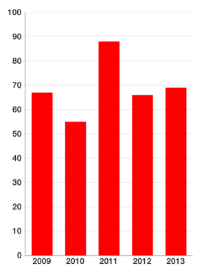
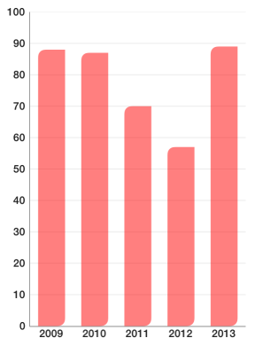
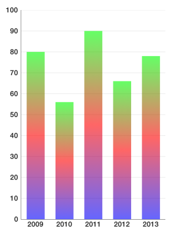
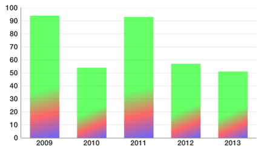
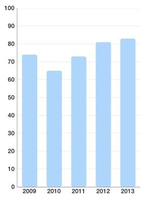
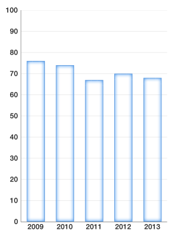
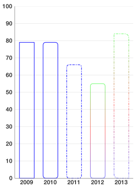
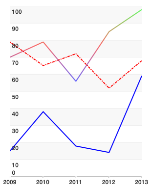

# Chart: Custom Drawing

<code>TKChart</code> has a powerful drawing engine to help you customize your chart appearance. It allows you to:

- define different kinds of fills. Solid color, Linear gradient, Radial gradient, fill with image content.
- define strokes which contain information about stroke fill, dash pattern, line width etc.
- define fill & stroke's corner radius, which corners to apply that radius to. It also supports drawing insets.

## Working with fills##

There are several kinds of fills:

### Solid fill###

<code>TKSolidFill</code> is the simplest of all fills. It paints chart items with a single color. Here is how you define it:

```Objective-C
TKSolidFill *fill = [[TKSolidFill alloc] initWithColor:[UIColor redColor]];
```
```Swift
let fill = TKSolidFill(color: UIColor.redColor())
```
```C#
var fill = new TKSolidFill (UIColor.Red);
```

or a shorter form in Objective C:

```Objective-C
TKSolidFill *fill = [TKSolidFill solidFillWithColor:[UIColor redColor]];
```

After you set it to a palette (discussed later) you get result like this:



You can also specify corner raduis:

```Objective-C
TKSolidFill *fill = [TKSolidFill solidFillWithColor:[UIColor redColor] cornerRadius:5.f];
```
```Swift
let fill = TKSolidFill(color: UIColor.redColor(), cornerRadius: 5.0)
```
```C#
var fill = new TKSolidFill (UIColor.Red, 5.0f);
```

This results in columns looking like this:


All fills and strokes allow you to specify not only corner radius, but also which corners to round. Semi-transparent red fill with only two corners rounded can be defined like this:

```Objective-C
TKSolidFill *fill = [TKSolidFill solidFillWithColor:[UIColor colorWithRed:1.f green:0.f blue:0.f alpha:0.5f] cornerRadius:8.f];
fill.corners = UIRectCornerTopLeft | UIRectCornerBottomRight;
```
```Swift
let fill = TKSolidFill(color: UIColor(red: 1.0, green: 0.0, blue: 0.0, alpha: 0.5), cornerRadius: 8.0)
fill.corners = UIRectCorner.TopLeft | UIRectCorner.BottomRight
```
```C#
var fill = new TKSolidFill (new UIColor (1.0f, 0.0f, 0.0f, 0.5f), 8.0f);
fill.Corners = UIRectCorner.TopLeft | UIRectCorner.BottomRight;
```

There you get:



### Linear gradient fill###

<code>TKLinearGradientFill</code> allows you to fill an item with color gradients. You can specify which colors to use and relative to the size positions of gradient stops.

Here is how you define linear gradient with 3 colors (green to red to blue) with transparency:

```Objective-C
TKLinearGradientFill *fill = [TKLinearGradientFill 
    linearGradientFillWithColors:@[[UIColor colorWithRed:0.f green:1.f blue:0.f alpha:0.6f],
                                   [UIColor colorWithRed:1.f green:0.f blue:0.f alpha:0.6f],
                                   [UIColor colorWithRed:0.f green:0.f blue:1.f alpha:0.6f]]];
```
```Swift
let fill = TKLinearGradientFill(colors: [UIColor(red: 0.0, green: 1.0, blue: 0.0, alpha: 0.6),
        UIColor(red: 1.0, green: 0.0, blue: 0.0, alpha: 0.6),
        UIColor(red: 0.0, green: 0.0, blue: 1.0, alpha: 0.6)])
```
```C#
var fill = new TKLinearGradientFill (new UIColor[] {
    new UIColor (0.0f, 1.0f, 0.0f, 0.6f),
    new UIColor (1.0f, 0.0f, 0.0f, 0.6f),
    new UIColor (0.0f, 0.0f, 1.0f, 0.6f)
}, 
    new CGPoint(0, 0), 
    new CGPoint(1, 1));
```



If we wish to distribute those colors unevenly and change gradient direction here is how to do it:

```Objective-C
TKLinearGradientFill *fill = [TKLinearGradientFill
    linearGradientFillWithColors:@[[UIColor colorWithRed:0.f green:1.f blue:0.f alpha:0.6f],
                                   [UIColor colorWithRed:1.f green:0.f blue:0.f alpha:0.6f],
                                   [UIColor colorWithRed:0.f green:0.f blue:1.f alpha:0.6f]]
    locations:@[@(0.6f), @(0.8f), @(1.0f)]
    startPoint:CGPointMake(0.f, 0.f)
    endPoint:CGPointMake(1.f, 1.f)];
```
```Swift
let fill = TKLinearGradientFill(colors: [UIColor(red: 0.0, green: 1.0, blue: 0.0, alpha: 0.6),
        UIColor(red: 1.0, green: 0.0, blue: 0.0, alpha: 0.6),
        UIColor(red: 0.0, green: 0.0, blue: 1.0, alpha: 0.6)],
        locations: [0.6, 0.8, 1.0],
        startPoint: CGPointMake(0, 0),
        endPoint: CGPointMake(1, 1))
```
```C#
var fill = new TKLinearGradientFill (new UIColor[] {
    new UIColor (0.0f, 1.0f, 0.0f, 0.6f),
    new UIColor (1.0f, 0.0f, 0.0f, 0.6f),
    new UIColor (0.0f, 0.0f, 1.0f, 0.6f)
},
    new NSObject[] { new NSNumber(0.6), new NSNumber(0.8), new NSNumber(1.0) },
    new CGPoint(0, 0), 
    new CGPoint(1, 1));
```

Warning: All coordinates for locations, startPoint and endPoint parameters are relative to the size of drawing surface. The values of locations array must be monotonically increasing.



### Radial gradient fill###

<code>TKRadialGradientFill</code> draws a fill with two colors using centers relative to the drawing size. Radius is set in different measures depending on radiusType parameter. It is hard to master and most of the time you can achieve the same functionality with linear gradient. Here is a possible usage:

```Objective-C
TKRadialGradientFill *fill = [[TKRadialGradientFill alloc] 
    initWithColors:@[[UIColor colorWithRed:0.f green:1.f blue:0.f alpha:0.7f],
                     [UIColor colorWithRed:1.f green:0.f blue:0.f alpha:0.0f]] 
       startCenter:CGPointMake(0.5f, 0.5f)
       startRadius:0.7f 
         endCenter:CGPointMake(0.f, 1.f) 
         endRadius:0.3f 
         radiusType:TKGradientRadiusTypeRectMax];
```
```Swift
let fill = TKRadialGradientFill(
        colors: [UIColor(red: 0.0, green: 1.0, blue: 0.0, alpha: 0.7),
        UIColor(red: 1.0, green: 0.0, blue: 0.0, alpha: 0.0)],
        startCenter: CGPointMake(0.5, 0.5),
        startRadius: 0.7,
        endCenter: CGPointMake(0, 1),
        endRadius: 0.3,
        radiusType: TKGradientRadiusType.RectMax)
```
```C#
var fill = new TKRadialGradientFill (new UIColor[] { 
    new UIColor (0.0f, 1.0f, 0.0f, 0.7f),
    new UIColor (1.0f, 0.0f, 0.0f, 0.0f) 
},
    new CGPoint (0.5f, 0.5f),
    0.7f,
    new CGPoint (0, 1),
    0.3f,
    TKGradientRadiusType.RectMax);
```

The resulting ghost column chart looks like this:


### Image fill###

<code>TKImageFill</code> fills the drawing area with the content of an image. There is also a <code>resizingMode</code> which specify how to draw image. Here is an example usage of tiled image:

```Objective-C
TKImageFill *fill = [TKImageFill imageFillWithImage:[UIImage imageNamed:@"pattern1"] cornerRadius:4.f];
fill.resizingMode = TKImageFillResizingModeTile;
```
```Swift
let fill = TKImageFill(image: UIImage(named: "pattern1"), cornerRadius: 4.0)
fill.resizingMode = TKImageFillResizingModeTile
```
```C#
var fill = new TKImageFill (new UIImage ("pattern1.png"), 4.0f);
fill.ResizingMode = TKImageFillResizingMode.Tile;
```



this is the source (pattern) image to draw:

 <= original&nbsp;&nbsp;&nbsp;&nbsp;  <= 8 times magnified version


Filling with images in stretch mode is even easier:

```Objective-C
TKImageFill *fill = [TKImageFill imageFillWithImage:[UIImage imageNamed:@"building1"] cornerRadius:4.f];
```
```Swift
let fill = TKImageFill(image: UIImage(named: "building1"), cornerRadius: 4.0)
```
```C#
var fill = new TKImageFill (new UIImage ("building1.png"), 4.0f);
```


Sometimes you like to specify your own stretchable image. Stretching this  image with your own code, leads to the following result:

```Objective-C
TKImageFill *fill = [TKImageFill imageFillWithImage:
    [[UIImage imageNamed:@"pattern2"] resizableImageWithCapInsets:UIEdgeInsetsMake(10, 10, 10, 10)]];
fill.resizingMode = TKImageFillResizingModeNone;
```
```Swift
let fill = TKImageFill(image: UIImage(named: "pattern2")!.resizableImageWithCapInsets(UIEdgeInsetsMake(10, 10, 10, 10)))
fill.resizingMode = TKImageFillResizingModeNone
```
```C#
UIImage image = new UIImage ("pattern2.png");
var fill = new TKImageFill (image.CreateResizableImage (new UIEdgeInsets (10, 10, 10, 10)));
fill.ResizingMode = TKImageFillResizingMode.None;
```


## Adding stroke##

<code>TKStroke</code> is a powerful tool which allows you to customize how you apply strokes to your charts.

You can create a simple stroke like this:

```Objective-C
TKStroke *stroke = [TKStroke strokeWithColor:[UIColor blueColor]];
```
```Swift
let stroke = TKStroke(color: UIColor.blueColor())
```
```C#
var stroke = new TKStroke (UIColor.Blue);
```

With rounded corners:

```Objective-C
TKStroke *stroke = [TKStroke strokeWithColor:[UIColor blueColor] width:1.f cornerRadius:5.0f];
```
```Swift
let stroke = TKStroke(color: UIColor.blueColor(), width: 1.0, cornerRadius: 5.0)
```
```c#
var stroke = new TKStroke (UIColor.Blue, 1.0f);
stroke.CornerRadius = 5.0f;
```

With dash pattern:

```Objective-C
TKStroke *stroke = [TKStroke strokeWithColor:[UIColor blueColor] width:1.f cornerRadius:5.0f];
stroke.dashPattern = @[@2, @2, @5, @2];
```
```Swift
let stroke = TKStroke(color: UIColor.blueColor(), width: 1.0, cornerRadius: 5.0)
stroke.dashPattern = [2, 2, 5, 2]
```
```C#
var stroke = new TKStroke (UIColor.Blue, 1.0f);
stroke.CornerRadius = 5.0f;
stroke.DashPattern = new NSNumber[] { new NSNumber(2), new NSNumber(2), new NSNumber(5), new NSNumber(2) };
```

You can fill a stroke with a gradient:

```Objective-C
TKLinearGradientFill *fill = [TKLinearGradientFill
     linearGradientFillWithColors:@[[UIColor colorWithRed:0.f green:1.f blue:0.f alpha:0.6f],
                                    [UIColor colorWithRed:1.f green:0.f blue:0.f alpha:0.6f],
                                    [UIColor colorWithRed:0.f green:0.f blue:1.f alpha:0.6f]]];
TKStroke *stroke = [TKStroke strokeWithFill:fill width:1.f cornerRadius:5.0f];
```
```Swift
let fill = TKLinearGradientFill(colors: [UIColor(red: 0.0, green: 1.0, blue: 0.0, alpha: 0.6),
        UIColor(red: 1.0, green: 0.0, blue: 0.0, alpha: 0.6),
        UIColor(red: 0.0, green: 0.0, blue: 1.0, alpha: 0.6)])
let stroke = TKStroke(fill: fill, width: 1.0, cornerRadius: 5.0)
```
```C#
var fill = new TKLinearGradientFill (new UIColor[] {
    new UIColor (0.0f, 1.0f, 0.0f, 0.6f),
    new UIColor (1.0f, 0.0f, 0.0f, 0.6f),
    new UIColor (0.0f, 0.0f, 1.0f, 0.6f)
}, new CGPoint(0, 0), new CGPoint(1, 1));
var stroke = new TKStroke (fill, 1.0f);
stroke.CornerRadius = 5.0f;
```

Or combine most of it in one place:

```Objective-C
TKLinearGradientFill *fill = [TKLinearGradientFill
     linearGradientFillWithColors:@[[UIColor colorWithRed:0.f green:1.f blue:0.f alpha:0.6f],
                                    [UIColor colorWithRed:1.f green:0.f blue:0.f alpha:0.6f],
                                    [UIColor colorWithRed:0.f green:0.f blue:1.f alpha:0.6f]]];
TKStroke *stroke = [TKStroke strokeWithFill:fill width:1.f cornerRadius:8.0f];
stroke.dashPattern = @[@2, @2, @5, @2];
stroke.corners = UIRectCornerTopRight | UIRectCornerBottomLeft;
```
```Swift
let fill = TKLinearGradientFill(colors:
        [UIColor(red: 0.0, green: 1.0, blue: 0.0, alpha: 0.6),
        UIColor(red: 1.0, green: 0.0, blue: 0.0, alpha: 0.6),
        UIColor(red: 0.0, green: 0.0, blue: 1.0, alpha: 0.6)])
let stroke = TKStroke(fill: fill, width: 1.0, cornerRadius: 5.0)
stroke.dashPattern = [2, 2, 5, 2]
stroke.corners = UIRectCorner.TopRight | UIRectCorner.BottomLeft
```
```C#
var fill = new TKLinearGradientFill(new UIColor[] {
    new UIColor (0.0f, 1.0f, 0.0f, 0.6f),
    new UIColor (1.0f, 0.0f, 0.0f, 0.6f),
    new UIColor (0.0f, 0.0f, 1.0f, 0.6f)
}, new CGPoint(0, 0), new CGPoint(1, 1));
var stroke = new TKStroke (fill, 1.0f);
stroke.CornerRadius = 5.0f;
stroke.DashPattern = new NSNumber[] { new NSNumber(2), new NSNumber(2), new NSNumber(5), new NSNumber(2) };
stroke.Corners = UIRectCorner.TopRight | UIRectCorner.BottomLeft;
```

And here is the result of all samples:



or with line chart using strokes with width = 2



## Customizing TKChart##

Customizing <code>TKChart</code> can be done using <code>TKChartPalette</code>. You can access the palette from <code>TKChartSeries</code> using series.style.palette variable. By default, palette is nil which means that <code>TKChart</code> will use its default theme. To specify your own, you need to create it:

```Objective-C
series.style.palette = [TKChartPalette new];
```
```Swift
series.style.palette = TKChartPalette()
```
```C#
series.Style.Palette = new TKChartPalette();
```

</code>TKChartPalette</code> is a collection of <code>TKChartPaletteItem</code> instances. Every item contains information about drawing the item at its index. By default, a palette item index addresses the order in which you add series. For example, you may have a palette with red and blue fills and two <code>TKChartColumnSeries</code> using this palette. The first series you add will be red and the second blue. However, <code>TKChartPieSeries</code> by default uses another mode when every palette item is used to display a data point at its index. You can explicitly set how you distribute a palette items using:

```Objective-C
series.style.paletteMode = TKChartSeriesStylePaletteModeUseItemIndex;
```
```Swift
series.style.paletteMode = TKChartSeriesStylePaletteMode.UseItemIndex
```
```C#
series.Style.PaletteMode = TKChartSeriesStylePaletteMode.UseItemIndex;
```

or

```Objective-C
series.style.paletteMode = TKChartSeriesStylePaletteModeUseSeriesIndex; 
```
```Swift
series.style.paletteMode = TKChartSeriesStylePaletteMode.UseSeriesIndex
```
```C#
series.Style.PaletteMode = TKChartSeriesStylePaletteMode.UseSeriesIndex;
```

Whenever <code>TKChartPalette</code> runs out of colors (because there are more series or more data points than <code>TKChartPaletteItem</code> items inside) it starts over effectively cycling through its items.

To illustrate the difference between palette modes, consider the following setup:

```Objective-C
TKChartColumnSeries *series = [[TKChartColumnSeries alloc] initWithItems:gdpInPoundsPoints];
series.style.palette = [TKChartPalette new];

TKSolidFill *redFill = [[TKSolidFill alloc] initWithColor:[UIColor redColor]];
[series.style.palette addPaletteItem:[[TKChartPaletteItem alloc] initWithFill:redFill]];

TKSolidFill *blueFill = [[TKSolidFill alloc] initWithColor:[UIColor blueColor]];
[series.style.palette addPaletteItem:[[TKChartPaletteItem alloc] initWithFill:blueFill]];

TKSolidFill *greenFill = [[TKSolidFill alloc] initWithColor:[UIColor greenColor]];
[series.style.palette addPaletteItem:[[TKChartPaletteItem alloc] initWithFill:greenFill]];;

series.style.paletteMode = TKChartSeriesStylePaletteModeUseItemIndex;

[chart addSeries:series];
```
```Swift
let series = TKChartColumnSeries(items: gdpInPoundsPoints)
series.style.palette = TKChartPalette()

let redFill = TKSolidFill(color: UIColor.redColor())
series.style.palette.addPaletteItem(TKChartPaletteItem(fill: redFill))
   
let blueFill = TKSolidFill(color: UIColor.blueColor())
series.style.palette.addPaletteItem(TKChartPaletteItem(fill: blueFill))
    
let greenFill = TKSolidFill(color: UIColor.greenColor())
series.style.palette.addPaletteItem(TKChartPaletteItem(fill: greenFill))

series.style.paletteMode = TKChartSeriesStylePaletteMode.UseItemIndex
chart.addSeries(series)
```
```C#
var series = new TKChartColumnSeries (gdpInPoundsPoints.ToArray());
series.Style.Palette = new TKChartPalette ();

var redFill = new TKSolidFill (UIColor.Red);
series.Style.Palette.AddPaletteItem (new TKChartPaletteItem (redFill));

var blueFill = new TKSolidFill (UIColor.Blue);
series.Style.Palette.AddPaletteItem (new TKChartPaletteItem (blueFill));

var greenFill = new TKSolidFill (UIColor.Green);
series.Style.Palette.AddPaletteItem (new TKChartPaletteItem (greenFill));

series.Style.PaletteMode = TKChartSeriesStylePaletteMode.UseItemIndex;
chart.AddSeries (series);
```

As you see we are using <code>TKChartSeriesStylePaletteModeUseItemIndex</code> palette mode and the result is:


Here the palette items are used to color the different data points. Since palette items inside are 3 and data points are 5, the palette starts over reusing the items it has. If you remove the line:

```Objective-C
series.style.paletteMode = TKChartSeriesStylePaletteModeUseItemIndex;
```
```Swift
series.style.paletteMode = TKChartSeriesStylePaletteMode.UseItemIndex
```
```C#
series.Style.PaletteMode = TKChartSeriesStylePaletteMode.UseItemIndex;
```

or change it to:

```Objective-C
series.style.paletteMode = TKChartSeriesStylePaletteModeUseSeriesIndex;
```
```Swift
series.style.paletteMode = TKChartSeriesStylePaletteMode.UseSeriesIndex
```
```C#
series.Style.PaletteMode = TKChartSeriesStylePaletteMode.UseSeriesIndex;
```

you will get:


This is because you have added only one series. Adding a second series with the same palette will make its data points blue. Adding a third series will make its data points green and fourth would be red again.

### Palette items###

<code>TKChartPaletteItem</code> is the building block of <code>TKChartPalette</code> and contains information about how to draw items. The simple way to use it is to specify a fill and/or stroke. Consider one of the following constructors:

```Objective-C
TKChartPaletteItem *paletteItem1 = [TKChartPaletteItem paletteItemWithFill:
    [TKSolidFill solidFillWithColor:[UIColor redColor]]];
    
TKChartPaletteItem *paletteItem2 = [TKChartPaletteItem paletteItemWithStroke:
    [TKStroke strokeWithColor:[UIColor blueColor]]];
    
TKChartPaletteItem *paletteItem3 = [TKChartPaletteItem 
    paletteItemWithStroke:[TKStroke strokeWithColor:[UIColor blueColor]] 
                  andFill:[TKSolidFill solidFillWithColor:[UIColor redColor]]];
```
```Swift
let paletteItem1 = TKChartPaletteItem(fill: TKSolidFill(color: UIColor.redColor()))
let paletteItem2 = TKChartPaletteItem(stroke: TKStroke(color: UIColor.blueColor()))
let plaetteItem3 = TKChartPaletteItem(stroke: TKStroke(color: UIColor.blueColor()), andFill: TKSolidFill(color: UIColor.redColor()))
```
```C#
var paletteItem1 = new TKChartPaletteItem (new TKSolidFill (UIColor.Red));
var paletteItem2 = new TKChartPaletteItem(new TKStroke(UIColor.Blue));
var plaetteItem3 = new TKChartPaletteItem(new TKStroke(UIColor.Blue), new TKSolidFill(UIColor.Red));
```

then you can add an item to a palette using code like:

```Objective-C
[series.style.palette addPaletteItem:paletteItem1];
```
```Swift
series.style.palette.addPaletteItem(paletteItem1)
```
```C#
series.Style.Palette.AddPaletteItem (paletteItem1);
```

When you initialize a palette item with stroke and fill the stroke is always drawn last.

There is also an alternative and a more flexible way to create a palette item by specifying an array of fills and strokes in the order you would like them to be drawn:

```Objective-C
series.style.palette = [TKChartPalette new];
TKSolidFill *redFill = [[TKSolidFill alloc] initWithColor:[UIColor redColor] cornerRadius:2.f];
TKStroke *stroke1 = [TKStroke strokeWithColor:[UIColor yellowColor] width:1.f cornerRadius:2.f];
stroke1.insets = UIEdgeInsetsMake(1.f, 1.f, 1.f, 1.f);
TKStroke *stroke2 = [TKStroke strokeWithColor:[UIColor blackColor] width:1.f cornerRadius:2.f];
[series.style.palette addPaletteItem:[TKChartPaletteItem paletteItemWithDrawables:@[redFill, stroke1, stroke2]]];
```
```Swift
series.style.palette = TKChartPalette()
let redFill = TKSolidFill(color: UIColor.redColor(), cornerRadius: 2.0)
let stroke1 = TKStroke(color: UIColor.yellowColor(), width: 1.0, cornerRadius: 2.0)
stroke1.insets = UIEdgeInsetsMake(1, 1, 1, 1)    
let stroke2 = TKStroke(color: UIColor.blackColor(), width: 1.0, cornerRadius: 2.0)
series.style.palette.addPaletteItem(TKChartPaletteItem(drawables: [redFill, stroke1, stroke2]))
```
```C#
series.Style.Palette = new TKChartPalette ();
var redFill = new TKSolidFill (UIColor.Red, 2.0f);
var stroke1 = new TKStroke (UIColor.Yellow, 1.0f);
stroke1.CornerRadius = 2.0f;
stroke1.Insets = new UIEdgeInsets (1, 1, 1, 1);
var stroke2 = new TKStroke (UIColor.Black, 1.0f);
stroke2.CornerRadius = 2.0f;
series.Style.Palette.AddPaletteItem(new TKChartPaletteItem(new TKDrawing[] { redFill, stroke1, stroke2 }));
```

here you create a palette item with red fill and two borders. The sample also shows another powerful feature: insets. Insets can be applied to both fills and strokes. Here is the final result:


### Customizing line series###

<code>TKChartLineSeries</code> uses only TKStroke instances of <code>TKChartPaletteItem</code> and ignores any fills. You can specify a wide first stroke and thin second stroke if you need more than one stroke.

### Customizing area series###

<code>TKChartAreaSeries</code> uses TKStroke instances of <code>TKChartPaletteItem</code> for the line and fills for area part.

### Customizing scatter series###

<code>TKChartScatterSeries</code> uses palette items to draw its shapes. However you might also change shape's type using code like:

```Objective-C
series.style.pointShape = [TKPredefinedShape shapeWithType:TKShapeTypeRhombus andSize:CGSizeMake(15.f, 15.f)];
```
```Swift
series.style.pointShape = TKPredefinedShape(type: TKShapeType.Rhombus, andSize: CGSizeMake(15, 15))
```
```C#
series.Style.PointShape = new TKPredefinedShape (TKShapeType.Rhombus, new CGSize (15, 15));
```

series.style.pointShape also applies to line and area series in case you need to show shapes on data points.

### Customizing pie series###

TKChartPieSeries always use <code>series.style.paletteMode = TKChartSeriesStylePaletteModeUseItemIndex;</code> If you have strokes with insets, only insets.top value will be used and will be applied relatively to the outer radius of the pie chart slices.

@warning Customization is a very powerful feature of TKChart. However, we recommend using that feature at an acceptable rate. Using too many fills and strokes may affect performance. Combining all features like a dashed stroke with gradient plus several semi transparent fills will draw much slower than a simple solid color fill.
