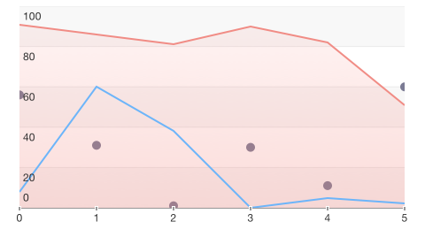

# Chart: Populating with Data

In order for <code>TKChart</code> to represents data, we should supply this data to it. Following the Model-View-Controller design pattern, the data source mediates between the application's data model (that is, its model objects) and the chart view. The data source provides the chart-view object with the information it needs to construct visualization using different chart types.

<code>TKChart</code> can be bound to a wide variety of data sources. The common way to work with chart-view' data source is to subclass the <code>UIViewController</code> and adopt the <code>TKChartDataSource</code> protocol or subclass the built-in <code>TKChartViewController</code> to manage the data source. Another way is to automate this task using the binding mechanism of <code>TKChart</code> to setup the data source.

## Configure data source using the TKChartDataSource protocol

Following this approach, we supply <code>TKChart</code> with data using a delegate. This works the same way as with <code>UITableView</code>. You should implement the <code>TKChartDataSource</code> protocol and specify the number of series, the number of points in each series, the series objects and the point objects. The <code>TKChartDataSource</code> has two required methods. The <code>numberOfSeriesForChart:</code> method tells the chart view how many series to display in the plot area, and the <code>seriesForChart:atIndex:</code> method provides the series to display. Optional methods allow the data source to configure data points for each series.

Here is a sample subclass of <code>TKChartViewController</code> which will provide TKChart with data points for one <code>TKChartLineSeries</code>:

```Objective-C
@implementation DataSourceDelegate

- (void)viewDidLoad
{
    [super viewDidLoad];
    TKChart *chart = [[TKChart alloc] initWithFrame:CGRectInset(self.view.bounds, 10, 10)];
    [self.view addSubview:chart];
    chart.dataSource = self;
    chart.autoresizingMask = UIViewAutoresizingFlexibleWidth | UIViewAutoresizingFlexibleHeight;
}

- (NSUInteger)numberOfSeriesForChart:(TKChart *)chart
{
    return 1;
}

- (TKChartSeries *)seriesForChart:(TKChart *)chart atIndex:(NSUInteger)index
{
    TKChartLineSeries *series = [chart dequeueReusableSeriesWithIdentifier:@"series1"];
    if (!series) {
        series = [[TKChartLineSeries alloc] initWithItems:nil reuseIdentifier:@"series1"];
        series.title = @"Delegate series";
    }

    return series;
}

- (NSUInteger)chart:(TKChart *)chart numberOfDataPointsForSeriesAtIndex:(NSUInteger)seriesIndex
{
    return 10;
}

- (id<TKChartData>)chart:(TKChart *)chart dataPointAtIndex:(NSUInteger)dataIndex forSeriesAtIndex:(NSUInteger)seriesIndex
{
    TKChartDataPoint *point = [[TKChartDataPoint alloc] initWithX:@(dataIndex) Y:@(arc4random() % 100)];
    return point;
}

- (void)didReceiveMemoryWarning
{
    [super didReceiveMemoryWarning];
}

@end
```
```Swift
class DataSourceDelegate: UIViewController, TKChartDataSource {
    override func viewDidLoad() {
        super.viewDidLoad()
        let chart = TKChart(frame: CGRectInset(self.view.bounds, 10, 10))
        self.view.addSubview(chart)
        chart.dataSource = self
        chart.autoresizingMask = UIViewAutoresizing.FlexibleWidth | UIViewAutoresizing.FlexibleHeight
    }

    func seriesForChart(chart: TKChart!, atIndex index: UInt) -> TKChartSeries! {
        var series = chart.dequeueReusableSeriesWithIdentifier("series1") as? TKChartSeries
        if series == nil {
            series = TKChartLineSeries(items: nil, reuseIdentifier: "series1")
            series!.title = "Series title"
        }
    
        return series
    }

    func numberOfSeriesForChart(chart: TKChart!) -> UInt {
        return 1
    }

    func chart(chart: TKChart!, numberOfDataPointsForSeriesAtIndex seriesIndex: UInt) -> UInt {
        return 10
    }


    func chart(chart: TKChart!, dataPointAtIndex dataIndex: UInt, forSeriesAtIndex seriesIndex: UInt) -> TKChartData! {
        var point = TKChartDataPoint(x: dataIndex, y: Int(arc4random_uniform(100)))
        return point
    }   

    override func didReceiveMemoryWarning() {
        super.didReceiveMemoryWarning()
    }
}
```
```C#
public class PopulatingWithData: UIViewController
{
    TKChart chart = new TKChart();

    public override void ViewDidLoad ()
    {
        base.ViewDidLoad ();

        var chart = new TKChart (CGRect.Inflate (this.View.Bounds, -10, -10));
        this.View.AddSubview (chart);
        chart.DataSource = new ChartDataSource ();
        chart.AutoresizingMask = UIViewAutoresizing.FlexibleWidth | UIViewAutoresizing.FlexibleHeight;
    }

    class ChartDataSource: TKChartDataSource
    {
        Random r = new Random();

        public override nuint NumberOfSeries (TKChart chart)
        {
            return 1;
        }
        public override nuint PointsInSeries (TKChart chart, nuint seriesIndex)
        {
            return 10;
        }

        public override TKChartSeries GetSeries (TKChart chart, nuint index)
        {
            var series = chart.DequeueReusableSeriesWithIdentifier ("series1") as TKChartSeries;
            if (series == null) {
                series = new TKChartLineSeries (null, "series1");
                series.Title = "Series title";
            }
            return series;
        }

        public override TKChartData GetPoint (TKChart chart, nuint dataIndex, nuint seriesIndex)
        {
            var point = new TKChartDataPoint (new NSNumber (dataIndex), new NSNumber(r.Next (100)));
            return point;
        }
    }
}
```

 


## Configure data source using binding to DataPoints collection

Another way to configure <code>TKChart</code> data source is to set up data points for the <code>TKChartSeries</code> object, and using the binding mechanism, the <code>TKChart</code> control will automatically create and set up the built-in <code>TKChartBindDingataSource</code> for you.


Here is a <code>TKChartColumnSeries</code> with an attached collection of data points:

```Objective-C
TKChart *chart = [[TKChart alloc] initWithFrame:CGRectInset(self.view.bounds, 10, 10)];
[self.view addSubview:chart];
chart.autoresizingMask = UIViewAutoresizingFlexibleWidth | UIViewAutoresizingFlexibleHeight;

NSArray *categories = @[ @"Greetings", @"Perfecto", @"NearBy", @"Family Store", @"Fresh & Green" ];
NSArray *values = @[ @70, @75, @58, @59, @88 ];
NSMutableArray *dataPoints = [[NSMutableArray alloc] init];
for (int i = 0; i < categories.count; i++) {
    TKChartDataPoint *dataPoint = [[TKChartDataPoint alloc] initWithX:categories[i] Y:values[i]];
    [dataPoints addObject:dataPoint];
}

TKChartColumnSeries *series = [[TKChartColumnSeries alloc] initWithItems:dataPoints];
[chart addSeries:series];
```
```Swift
let chart = TKChart(frame: CGRectInset(self.view.bounds, 10, 10))
self.view.addSubview(chart)
chart.autoresizingMask = UIViewAutoresizing.FlexibleWidth | UIViewAutoresizing.FlexibleHeight
    
let categories = ["Greetings", "Perfecto", "NearBy", "Family Store", "Fresh & Green" ];
let values = [70, 75, 58, 59, 88]
var dataPoints = TKChartDataPoint[]()
for var i = 0; i < categories.count; ++i {
    dataPoints.append(TKChartDataPoint(x: categories[i], y: values[i]))
}
    
let series = TKChartColumnSeries(items: dataPoints)
chart.addSeries(series)
```
```C#
var chart = new TKChart (CGRect.Inflate (this.View.Bounds, -10, -10));
this.View.AddSubview (chart);
chart.AutoresizingMask = UIViewAutoresizing.FlexibleWidth | UIViewAutoresizing.FlexibleHeight;

var categories = new [] { "Greetings", "Perfecto", "NearBy", "Family Store", "Fresh & Green" };
var values = new [] { 70, 75, 58, 59, 88 };
var dataPoints = new List<TKChartDataPoint> ();
for (int i = 0; i < categories.Length; ++i) {
    dataPoints.Add (new TKChartDataPoint (new NSString (categories [i]), new NSNumber (values [i])));
}

chart.AddSeries (new TKChartColumnSeries (dataPoints.ToArray ()));
```

 


## Configure data source using binding to properties of model object

In order to support full binding mechanism and minimize the amount of code used to initialize data source with model object of your application, <code>TKChart</code> supports binding to properties of the model object. To use this powerful mechanism, you should describe in pairs the names of <code>TKChartData</code> properties related to the property names of your custom object.

Binding to an array of custom object is quite easy with TKChart. Once your array is created, you just need to set the necessary members to the desired field. In the code snippet below we create one application specific custom object and bind its data to three line series:

```Objective-C
TKChart *chart = [[TKChart alloc] initWithFrame:CGRectInset(self.view.bounds, 10, 10)];
[self.view addSubview:chart];
chart.autoresizingMask = UIViewAutoresizingFlexibleWidth | UIViewAutoresizingFlexibleHeight;

NSMutableArray *dataPoints = [[NSMutableArray alloc] init];
for (int i = 0; i<=5; i++) {
    CustomObject *object = [[CustomObject alloc] initWithObjectID:i value1:arc4random() % 100 value2:arc4random() % 100 value3:arc4random() % 100];
    [dataPoints addObject:object];
}

[chart beginUpdates];
[chart addSeries:[[TKChartLineSeries alloc] initWithItems:dataPoints forKeys:@{ @"dataXValue": @"objectID", @"dataYValue": @"value1"}]];
[chart addSeries:[[TKChartAreaSeries alloc] initWithItems:dataPoints forKeys:@{ @"dataXValue": @"objectID", @"dataYValue": @"value2"}]];
[chart addSeries:[[TKChartScatterSeries alloc] initWithItems:dataPoints forKeys:@{ @"dataXValue": @"objectID", @"dataYValue": @"value3"}]];
[chart endUpdates];
```
```Swift
let chart = TKChart(frame: CGRectInset(self.view.bounds, 10, 10))
self.view.addSubview(chart)
chart.autoresizingMask = UIViewAutoresizing.FlexibleWidth | UIViewAutoresizing.FlexibleHeight
    
var dataPoints = CustomObject[]()
for i in 0...5 {
    let object = CustomObject(objectID: i, value1: Int(arc4random_uniform(100)), value2: Int(arc4random_uniform(100)), value3: Int(arc4random_uniform(100)))
    dataPoints.append(object)
}
    
chart.beginUpdates()
chart.addSeries(TKChartLineSeries(items: dataPoints, forKeys: ["dataXValue": "objectID", "dataYValue": "value1"]))
chart.addSeries(TKChartAreaSeries(items: dataPoints, forKeys: ["dataXValue": "objectID", "dataYValue": "value2"]))
chart.addSeries(TKChartScatterSeries(items: dataPoints, forKeys: ["dataXValue": "objectID", "dataYValue": "value3"]))
chart.endUpdates()
```
```C#
var chart = new TKChart (CGRect.Inflate (this.View.Bounds, -10, -10));
this.View.AddSubview (chart);
chart.AutoresizingMask = UIViewAutoresizing.FlexibleWidth | UIViewAutoresizing.FlexibleHeight;

Random r = new Random ();
var dataPoints = new List<CustomObject> ();
for (int i=0; i<5; i++) {
    CustomObject obj = new CustomObject () {
        ObjectID = i,
        Value1 = r.Next (100),
        Value2 = r.Next (100),
        Value3 = r.Next (100)
    };
    dataPoints.Add (obj);
}

chart.BeginUpdates ();
chart.AddSeries(new TKChartLineSeries(dataPoints.ToArray(), "ObjectID", "Value1"));
chart.AddSeries(new TKChartAreaSeries(dataPoints.ToArray(), "ObjectID", "Value2"));
chart.AddSeries(new TKChartScatterSeries(dataPoints.ToArray(), "ObjectID", "Value3"));
chart.EndUpdates();
```




@warning TKChart by default creates and sets up axes automatically to support this flexible and codeless binding behavior using the data types in the provided data source. You can always change or replace the axis type for TKChartSeries or change it auto-calculated default range.
