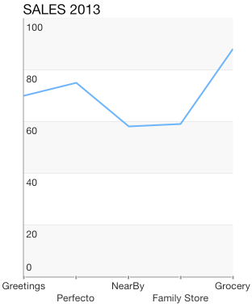

# Chart Axes: Categoric

<code>TKChart</code> uses Categoric axes to plot data that contains categoric values. The axis is valid only in the context of Cartesian series. It also introduces several important properties:

- <code>majorTickInterval</code> - defines an interval among major axis ticks.

- <code>minorTickInterval</code> - defines an interval among minor axis ticks.

- <code>baseline</code> - contains a value, which defines how the series data should be aligned. For example, The <code>TKChartBarSeries</code> might render its bars up and down depending on whether its value is greater or less than the baseline value.

- <code>offset</code> - determines an axis value where the axis is crossed with another axis.

## Configure a TKChartCategoryAxis##

You can configure a category axis by settings its categories property. You should use the following code snippet as a sample:

```Objective-C
NSArray *categories = @[ @"Greetings", @"Perfecto", @"NearBy", @"Family Store", @"Fresh & Green" ];
NSArray *values = @[ @70, @75, @58, @59, @88 ];
NSMutableArray *pointsWithCategoriesAndValues = [[NSMutableArray alloc] init];
for (int i = 0; i < categories.count; i++) {
    TKChartDataPoint *dataPoint = [[TKChartDataPoint alloc] initWithX:categories[i] Y:values[i]];
    [pointsWithCategoriesAndValues addObject:dataPoint];
}

TKChartCategoryAxis *xAxis = [[TKChartCategoryAxis alloc] initWithCategories:categories];
chart.xAxis = xAxis;
```
```Swift
let categories = ["Greetings", "Perfecto", "NearBy", "Family Store", "Fresh & Green" ];
let values = [70, 75, 58, 59, 88]
var pointsWithCategoriesAndValues = [TKChartDataPoint]()
for var i = 0; i < categories.count; ++i {
    pointsWithCategoriesAndValues.append(TKChartDataPoint(x: categories[i], y: values[i]))
}
    
let xAxis = TKChartCategoryAxis(categories: categories)
chart.xAxis = xAxis
```
```C#			
var categories = new [] { "Greetings", "Perfecto", "NearBy", "Family Store", "Fresh & Green" };
var values = new [] { 70, 75, 58, 59, 88 };
var pointsWithCategoriesAndValues = new List<TKChartDataPoint> ();
for (int i = 0; i < categories.Length; ++i) {
	pointsWithCategoriesAndValues.Add (new TKChartDataPoint (new NSString (categories [i]), new NSNumber (values [i])));
}

List<NSString> categoryObjects = new List<NSString> ();
for (int i = 0; i < categories.Length; i++) {
	categoryObjects.Add (new NSString(categories[i]));
}
chart.XAxis = new TKChartCategoryAxis (categoryObjects.ToArray());
```

You can specify the axis range by setting the minimum and maximum indexes of categories:

```Objective-C
xAxis.range = [TKRange rangeWithMinimum:@0 andMaximum:@2];
```
```Swift
xAxis.range = TKRange(minimum: 0, andMaximum: 2)
```
```C#
xAxis.Range = new TKRange (new NSNumber (0), new NSNumber (2));
```

 

## Setting the plot mode of axis##

 The <code>TKChartAxisPlotMode</code> is used by the axis to plot the data. Possible values are <code>TKChartAxisPlotModeBetweenTicks</code> and <code>TKChartAxisPlotModeOnTicks</code>. <code>TKChartAxisPlotModeBetweenTicks</code> plots points in the middle of the range, defined by two ticks. <code>OnTicks</code> plots the points over each tick.

 You should use the following lines of code to alter this behavior:

```Objective-C
xAxis.plotMode = TKChartAxisPlotModeBetweenTicks;
```
```Swift
xAxis.setPlotMode(TKChartAxisPlotMode.BetweenTicks)
```
```C#
xAxis.PlotMode = TKChartAxisPlotMode.BetweenTicks;
```



```Objective-C
xAxis.plotMode = TKChartAxisPlotModeOnTicks;
```
```Swift
xAxis.setPlotMode(TKChartAxisPlotMode.OnTicks)
```
```C#
xAxis.PlotMode = TKChartAxisPlotMode.OnTicks;
```


