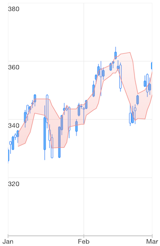
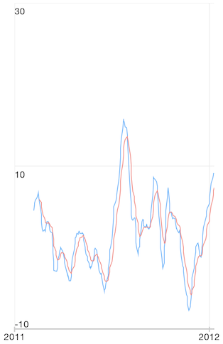

# Chart Series: Financial Indicators

This article provides a brief description and a list of the impotant properties of each indicator supported by TKChart. The indicators are divided in two groups - Technical Overlays and Technical Indicators. To set up a financial indicator, you have to initialize it with <code>TKChartCandlestickSeries</code> or <code>TKChartOhlcSeries</code> containing financial data.

## Technical Overlays##

Here is an example how to create a **Bollinger Band** indicator:

```Objective-C
TKChartCandlestickSeries *candlesticks = [[TKChartCandlestickSeries alloc] initWithItems:financialData];
TKChartBollingerBandIndicator *bollingerBands = [[TKChartBollingerBandIndicator alloc] initWithSeries:candlesticks];
[financialChart addSeries:candlesticks];
[financialChart addSeries:bollingerBands];
```
```Swift
let candlesticks = TKChartCandlestickSeries(items: financialDataPoints)
let bollingerBands = TKChartBollingerBandIndicator(series: candlesticks)
financialChart.addSeries(candlesticks)
financialChart.addSeries(bollingerBands)
```
```C#
var candlesticks = new TKChartCandlestickSeries (financialDataPoints.ToArray ());
var bollingerBands = new TKChartBollingerBandIndicator (candlesticks);
financialChart.AddSeries (candlesticks);
financialChart.AddSeries (bollingerBands);
```



And here are the rest of the available Technical Overlays

- Simple Moving Average (SMA)
- Exponential Moving Average (EMA)
- Weighted Moving Average
- Triangular Moving Average
- Modified Moving Average
- TKChartAdaptiveMovingAverage
- Bollinger Bands
- Moving Average Envelopes
- Typical Price
- Weighted Close
- Median Price

## Technical Indicators##
Here is an example how to set up **Moving Average Convergence Divergence** indicator:

```Objective-C
TKChartCandlestickSeries *candlesticks = [[TKChartCandlestickSeries alloc] initWithItems:_financialData];
TKChartMACDIndicator *macdIndicator = [[TKChartMACDIndicator alloc] initWithSeries:candlesticks];
macdIndicator.longPeriod = 26;
macdIndicator.shortPeriod = 12;
macdIndicator.signalPeriod = 9;
[financialChart addSeries:macdIndicator];
```
```Swift
let candlesticks = TKChartCandlestickSeries(items: financialDataPoints)
let macdIndicator = TKChartMACDIndicator(series: candlesticks)
macdIndicator.longPeriod = 26
macdIndicator.shortPeriod = 12
macdIndicator.signalPeriod = 9
financialChart.addSeries(macdIndicator)
```
```C#
var candlesticks = new TKChartCandlestickSeries (financialDataPoints.ToArray());
var macdIndicator = new TKChartMACDIndicator (candlesticks);
macdIndicator.LongPeriod = 26;
macdIndicator.ShortPeriod = 12;
macdIndicator.SignalPeriod = 9;
financialChart.AddSeries (macdIndicator);
```



And here are the rest of the available Technical Indicators

- Moving Average Convergence Divergence
- Percentage Price Oscillator
- Percentage Volume Oscillator
- Absolute Volume Oscillator
- Relative Strength Index
- Relative Momentum Index
- Accumulation Distribution Line
- True Range
- Average True Range
- Commodity Channel Inde
- Fast Stochastic Indicator
- Slow Stochastic Indicator
- Full Stochastic Indicators
- Rate Of Change
- TRIX
- Williams %R Indicator
- Ease Of Movement
- Detrended Price Oscillator
- Force Index
- Rapid Adaptive Variance Indicator
- Standard Deviation
- On Balance Volume
- Price Volume Trend
- Positive Volume Index
- Negative Volume Index
- Money Flow Index
- Ultimate Oscillator
- Market Facilitation Index
- Chaikin Oscillator


