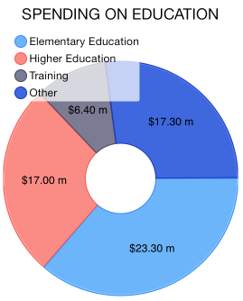
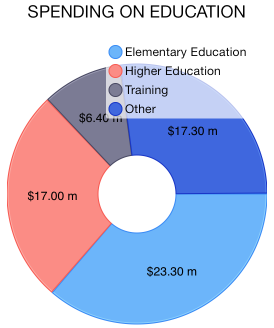

Legend
======

##Overview##

TKChart has built-in support for legends – descriptions about the charts on the plot. The items displayed in the legend are series specific i.e. for the pie chart the data points are shown in the legend, whereas for line series only one item is shown for each series.

##Configure legend##

If you would like to show the legend in TKChart, you should set its hidden property to NO. The default value is YES. The legend supports showing a series title.

    chart.legend.hidden = NO;

You can alter the position and offset origin of legend by setting its position:

    chart.legend.style.position = TKChartLegendPositionBottom;

The legend can be anchored to concrete side by using the following values *TKChartLegendPositionLeft*, *TKChartLegendPositionRight*, *TKChartLegendPositionTop* and *TKChartLegendPositionBottom*. 

It can float by using *TKChartLegendPositionFloat* value. In this case, you can offset its origin manually by setting its offset and offsetOrigin properties:

    chart.legend.style.position = TKChartLegendPositionFloating;
    chart.legend.style.offsetOrigin = TKChartLegendOffsetOriginTopLeft;
    chart.legend.style.offset = UIOffsetMake(10, 10);

##Customize legend##

You can alter visibility of the legend's title by changing **showTitle** property.

    chart.legend.showTitle = NO;

In addition, you can disable the series selection via legend by setting **allowSelection** property to NO.

The legend can be customized by using its style object. It contains the following properties:

- **position** - Determines where the legend should be placed.
- **offset** - Determines the offset at which to place the legend, according to the specified offsetOrigin.
- **offsetOrigin** - Determines the starting point for the offset property.
- **fill** - Gets or sets the fill color to be used as a background.
- **stroke** -  Gets or sets stroke color to be used for the legend frame.

##Embeding legend outside TKChart##

You can use the legend outside the chart view. You should create an instance of TKChartLegendView and add it as subview to desired view.

    TKChartLegendView *legendView = [[TKChartLegendView alloc] initWithChart:chart];
    legendView.frame = CGRectMake(0, 0, 320, 100);
    [self.view addSubview:legendView];
    [legendView reloadItems];

