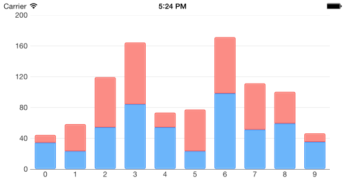

## Chart structure ##

TKChart consists of the following elements:

- **plot area** - this is the area where chart data is drawn. 

- **series** - chart data is represented by series objects. Each series object defines the chart type and contains a set of points to be drawn. The chart can display different series object simultaneously. 

- **axes** - there are four axes areas that surround the plot area. The axes define the dimensions in which data is drawn inside the plot area. Each axis can be attached to a single or many series.

- **title** - this is the chart title. Its style and position can be customized. The chart title is hidden by default.

- **legend** - the chart legend displays additional information about series objects. Its style and position can be customized. The chart legend is hidden by default.

In addition to these visual objects, TKChart uses the following protocols:

- **dataSource** - The chart data source is used to supply the chart with data. Setting this property is optional, as you can assign data directly to the series object. In case you decide to use this property, you have to implement the TKChartDataSource* protocol.

- **delegate** - The chart delegate is an optional protocol that allows chart consumers to receive notifications from TKChart. It allows also customizing chart appearance and animations.

## Axes ##

TKChart renders its points in a coordinate system defined by its axes. To do this, axes specify the minimum and maximum values that can be presented on the plot area. There are a few different types of axes that can be used with TKChart. They include: numeric, date/time and categorical. You can assign each axis to different series and you can show multiple axes in a chart. Axes contain various properties to control their position, style and behavior. All chart axes subclass from TKChartAxis.

- Use TKChartNumericAxis to present numeric values.
- Use TKChartDateTimeAxis to present date/time values.
- Use TKChartCategoryAxis to present categorical values.

In order to show multiple axes in TKChart, create several axes and customize their position. Then use the **xAxis** and **yAxis** properties of the series to assign them:

    TKChartNumericAxis *xAxis = [[TKChartNumericAxis alloc] init];
    xAxis.position = TKChartAxisPositionBottom;
    [chart addAxis:xAxis];
    
    TKChartNumericAxis *yAxis1 = [[TKChartNumericAxis alloc] initWithMinimum:@0 andMaximum:@100];
    yAxis1.majorTickInterval = @50;
    yAxis1.position = TKChartAxisPositionLeft;
    [chart addAxis:yAxis1];
    
    TKChartNumericAxis *yAxis2 = [[TKChartNumericAxis alloc] initWithMinimum:@0 andMaximum:@200];
    yAxis2.majorTickInterval = @50;
    yAxis2.position = TKChartAxisPositionRight;
    [chart addAxis:yAxis2];
    
    TKChartLineSeries *series = [[TKChartLineSeries alloc] initWithItems:randomData];
    [chart addSeries:series];
    series.xAxis = xAxis;
    series.yAxis = yAxis1;
   
The result from this setup is:
 

Find further details about chart axes in [this article](chart-axes-axes.html).

## Series ##

Series define how data should be visually presented on the plot area. Each series has a collection of data points, which it displays according to the series type. TKChart supports several series out of the box. These include: bar, column, line, area, scatter and pie. The base class for all series in TKChart is TKChartSeries.

- [TKChartColumnSeries](chart-series-column.html) is used to present points as columns (vertical rectangles).
- [TKChartBarSeries](chart-series-bar.html) is used to present points as bars (horizontal rectangles).
- [TKChartLineSeries](chart-series-line.html) is used to present points as line/spline.
- [TKChartAreaSeries](chart-series-area.html) is used to present points in filled areas.
- [TKChartPieSeries](chart-series-pie.html) is used to present data as pie or donut.
- [TKChartScatterSeries](chart-series-scatter.html) is used to present data as separate points.

When TKChart contains more than one series of type bar or column, it clusters the series in groups. You can choose also to show the same information as stacked bars/columns. This is done by setting the **stackInfo** property of the series:

    TKChartStackInfo *stackInfo = [[TKChartStackInfo alloc] initWithID:@(1) withStackMode:TKChartStackModeStack];

    TKChartSeries *series1 = [[TKChartColumnSeries alloc] initWithItems:points1];
    series1.title = @"Series 1";
    series1.stackInfo = stackInfo;
    [chart addSeries:series1];

    TKChartSeries *series2 = [[TKChartColumnSeries alloc] initWithItems:points2];
    series2.title = @"Series 2";
    series2.stackInfo = stackInfo;
    [chart addSeries:series2];

The result from this setup is:

Line and area series also allow stacking by using the **stackInfo** property.

Series appearance can be changed by using the **style** property. 

## Interaction ##

TKChart is an interactive component that supports gestures like touch, pan and rotate. The main actions that are supported are selection and pan/zoom interaction. 

The **allowPan** and **allowZoom** properties of TKChartSeries should be set to **YES** in order to allow pan/zoom functionality.

The **selectionMode** property of TKChartSeries should be set to TKChartSelectionModeSeries or TKChartSelectionModeDataPoint in order to allow selection for the sepcified series.

Find further details about selection and pan/zoom functionality in the corresponding articles.

## Animations ##

TKChart allows animating chart points by using the CoreAnimation framework. There are built-in animations specific for every series type and you can define your own animations by implementing methods in the chart delegate. 

You can customize the default animation by implementing the TKChartDelegate interface and overriding its **chart:animationForSeries:withState:inRect:** method:

The **allowAnimations** property of TKChart should be set to **YES** in order to work with animations.

    - (CAAnimation *)chart:(TKChart *)chart animationForSeries:(TKChartSeries *)series withState:(TKChartSeriesRenderState *)state inRect:(CGRect)rect
    {
        CFTimeInterval duration = 0;
        NSMutableArray *animations = [[NSMutableArray alloc] init];
        
        for (int i = 0; i<state.points.count; i++) {
            NSString *keyPath = [NSString stringWithFormat:@"%@.x", [state animationKeyPathForPointAtIndex:i]];
            TKChartVisualPoint *point = [state.points objectAtIndex:i];
            CABasicAnimation *animation = [CABasicAnimation animationWithKeyPath:keyPath];
            animation.duration = (arc4random() % 100) / 100.;
            animation.fromValue = @0;
            animation.toValue = @(point.x);
            [animations addObject:animation];
            duration = MAX(animation.duration, duration);
        }
        
        CAAnimationGroup *group = [[CAAnimationGroup alloc] init];
        group.duration = duration;
        group.animations = animations;
        
        return group;
    }

This method returns a single animation, therefore if you create multiple animations, you should group them inside CAAnimationGroup.

Besides the CoreAnimation framework, TKChart allows animating its points by adding real world physics by using the new UIKitDynamics framework introduced in iOS 7. With this framework you can add different behaviors like gravity, elasticity and forces. Read further details about this advanced topic in [this article](chart-animations-customuikitdynamics.html).

