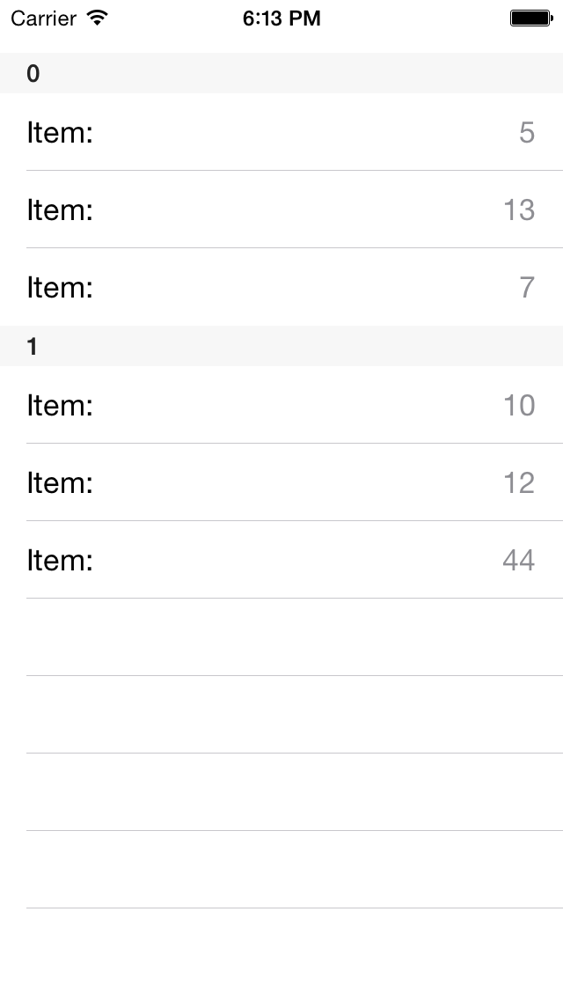
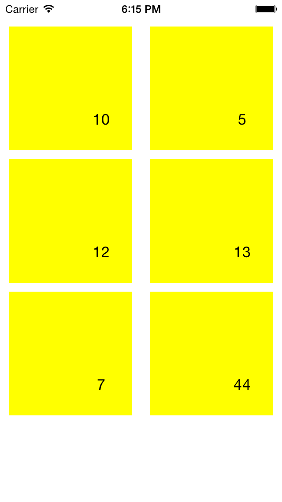
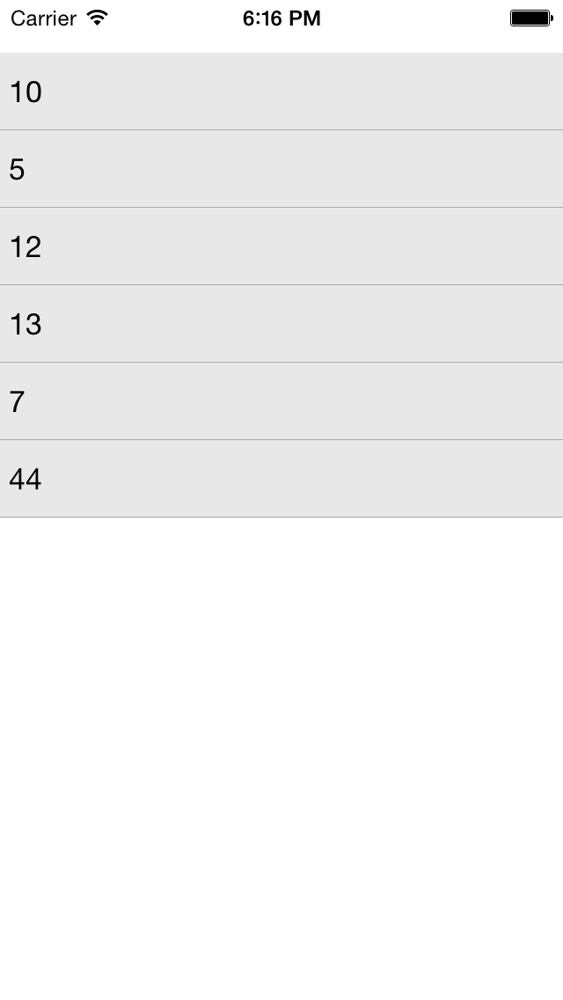

# DataSource: Binding with UI Controls

<code>TKDataSource</code> works well with data enabled controls and provides an easy way to shape and present your data. The currently supported UI controls are:

- UITableView
- UICollectionView
- TKListView
- TKChart
- TKCalendar

This article describes how to bind <code>TKDataSource</code> and customize those controls.

## UITableView ##



Setting the <code>dataSource</code> property is enough in order to present data in <code>UITableView</code>. <code>TKDataSource</code> will take care of the implementation of all methods in <code>UITableViewDataSource</code> protocol:

```Objective-C
self.dataSource = [[TKDataSource alloc] initWithArray:@[ @10, @5, @12, @13, @7, @44 ]];

UITableView *tableView = [[UITableView alloc] initWithFrame:CGRectInset(self.view.bounds, 0, 30)];
tableView.autoresizingMask = UIViewAutoresizingFlexibleWidth | UIViewAutoresizingFlexibleHeight;
tableView.dataSource = self.dataSource;
[self.view addSubview:tableView];
```
```Swift
self.dataSource = TKDataSource(array: [ 10, 5, 12, 13, 7, 44 ])

let tableView = UITableView(frame: CGRectInset(self.view.bounds, 0, 30))
tableView.autoresizingMask = UIViewAutoresizing.FlexibleWidth | UIViewAutoresizing.FlexibleHeight
tableView.dataSource = self.dataSource
self.view.addSubview(tableView)
```
```C#
NSObject[] array = new NSObject[] {
    NSObject.FromObject (10),
    NSObject.FromObject (5),
    NSObject.FromObject (12),
    NSObject.FromObject (13),
    NSObject.FromObject (7),
    NSObject.FromObject (44)
};

this.dataSource = new TKDataSource (array);

CGRect rect = this.View.Bounds;
rect.Inflate (0, -30);
UITableView table = new UITableView (rect);
table.AutoresizingMask = UIViewAutoresizing.FlexibleWidth | UIViewAutoresizing.FlexibleHeight;
table.DataSource = this.dataSource;
this.View.AddSubview (table);
```

You can specify <code>displayKey</code> and <code>valueKey</code> properties to specify what to display in table view cells:

```Objective-C
NSMutableArray *items = [NSMutableArray new];
[items addObject:[[DataSourceItem alloc] initWithName:@"John" value:50 group:@"A"]];
[items addObject:[[DataSourceItem alloc] initWithName:@"Abby" value:33 group:@"A"]];
[items addObject:[[DataSourceItem alloc] initWithName:@"Smith" value:42 group:@"B"]];
[items addObject:[[DataSourceItem alloc] initWithName:@"Peter" value:28 group:@"B"]];
[items addObject:[[DataSourceItem alloc] initWithName:@"Paula" value:25 group:@"B"]];

self.dataSource.displayKey = @"name";
self.dataSource.valueKey = @"value";
self.dataSource.itemSource = items;

NSLog(@"%@", [self.dataSource textFromItem:self.dataSource.items[0] inGroup:nil]);
```
```Swift
var items = [DataSourceItem]()
items.append(DataSourceItem(name: "John", value: 50, group:"A"))
items.append(DataSourceItem(name: "Abby", value: 33, group:"A"))
items.append(DataSourceItem(name: "Smith", value: 42, group:"B"))
items.append(DataSourceItem(name: "Peter", value: 28, group:"B"))
items.append(DataSourceItem(name: "Paula", value: 25, group:"B"))

if let dataSource = self.dataSource {
    dataSource.displayKey = "name"
    dataSource.valueKey = "value"
    dataSource.itemSource = items
}

println(self.dataSource?.textFromItem(self.dataSource?.items[0], inGroup: nil))
```
```C#
NSMutableArray items = new NSMutableArray ();
items.Add (new DataSourceItem () { Name = "John", Value = 50, Group = "A" });
items.Add (new DataSourceItem () { Name = "Abby", Value = 33, Group = "A" });
items.Add (new DataSourceItem () { Name = "Smith", Value = 42, Group = "B" });
items.Add (new DataSourceItem () { Name = "Peter", Value = 28, Group = "B" });
items.Add (new DataSourceItem () { Name = "Paula", Value = 25, Group = "B" });

this.dataSource.ItemSource = items;
this.dataSource.DisplayKey = "Name";
this.dataSource.ValueKey = "Value";

Console.WriteLine (this.dataSource.TextFromItem(this.dataSource.Items[0], null));
```

In the majority of the scenarios you will also need to customize the cells. In this case you can implement the <code>initCell</code> block from <code>TKDataSourceTableViewSettings</code> class:

```Objective-C
[self.dataSource.settings.tableView initCell:^(UITableView *tableView, NSIndexPath *indexPath, UITableViewCell *cell, id item) {
    cell.textLabel.text = @"Item:";
    cell.detailTextLabel.text = [self.dataSource textFromItem:item inGroup:nil];
}];
```
```Swift
self.dataSource?.settings.tableView .initCell({ (UITableView tableView, NSIndexPath indexPath, UITableViewCell cell, id item) -> Void in
    cell.textLabel?.text = "Item:"
    cell.detailTextLabel?.text = self.dataSource?.textFromItem(item, inGroup: nil)
});
```
```C#
this.dataSource.Settings.TableView.InitCell ((UITableView tableView, NSIndexPath indexPath, UITableViewCell cell, NSObject item) => {
    cell.TextLabel.Text = "Item:";
    cell.DetailTextLabel.Text = this.dataSource.TextFromItem(item, null);
});
```

If this is not enough to achieve to look you want, you can create your custom cells by using the <code>createCell</code> block function:

```Objective-C
[self.dataSource.settings.tableView createCell:^UITableViewCell *(UITableView *tableView, NSIndexPath *indexPath, id item) {
    UITableViewCell *cell = [tableView dequeueReusableCellWithIdentifier:@"cell"];
    if (cell == nil) {
        cell = [[UITableViewCell alloc] initWithStyle:UITableViewCellStyleValue1 reuseIdentifier:@"cell"];
    }
    return cell;
}];
```
```Swift
self.dataSource?.settings.tableView.createCell { (UITableView tableView, NSIndexPath indexPath, AnyObject item) -> UITableViewCell in
    var cell = tableView.dequeueReusableCellWithIdentifier("cell") as UITableViewCell?
    if cell == nil {
        cell = UITableViewCell(style:UITableViewCellStyle.Value1, reuseIdentifier:"cell")
    }
    return cell!
}
```
```C#
this.dataSource.Settings.TableView.CreateCell ((UITableView tableView, NSIndexPath indexPath, NSObject item) => {
	UITableViewCell cell = tableView.DequeueReusableCell("cell");
	if (cell == null) {
		cell = new UITableViewCell(UITableViewCellStyle.Value1, "cell");
	}
	return cell;
});
```

<code>TKDataSource</code> will take care of everything and no code is necessary even when your data is grouped:


```Objective-C
[self.dataSource group:^id(id item) {
    return @([item intValue] % 2 == 0);
}];
```
```Swift
self.dataSource?.group({ (NSNumber item) -> AnyObject! in
    return item.intValue % 2 == 0;
})
```
```C#
this.dataSource.Group ((NSObject item) => {
	return NSObject.FromObject(((NSNumber)item).Int32Value % 2 == 0);
});
```

## UICollectionView ##



<code>TKDataSource</code> integrates well with <code>UICollectionView</code>. Just set the <code>dataSource</code> property and prepare the collection view:

```Objective-C
UICollectionViewFlowLayout *layout = [UICollectionViewFlowLayout new];
layout.itemSize = CGSizeMake(140, 140);

UICollectionView *collectionView = [[UICollectionView alloc] initWithFrame:CGRectInset(self.view.bounds, 0, 30) collectionViewLayout:layout];
collectionView.autoresizingMask = UIViewAutoresizingFlexibleWidth | UIViewAutoresizingFlexibleHeight;
collectionView.dataSource = self.dataSource;
collectionView.backgroundColor = [UIColor whiteColor];
[self.view addSubview:collectionView];
```
```Swift
let layout = UICollectionViewFlowLayout()
layout.itemSize = CGSizeMake(140, 140)

let collectionView = UICollectionView(frame:CGRectInset(self.view.bounds, 0, 30), collectionViewLayout:layout)
collectionView.autoresizingMask = UIViewAutoresizing.FlexibleWidth | UIViewAutoresizing.FlexibleHeight
collectionView.dataSource = self.dataSource
collectionView.backgroundColor = UIColor.whiteColor()
self.view.addSubview(collectionView)
```
```C#
var layout = new UICollectionViewFlowLayout();
layout.ItemSize = new CGSize (140, 140);

CGRect rect = this.View.Bounds;
rect.Inflate (0, -30);
var collectionView = new UICollectionView (rect, layout);
collectionView.AutoresizingMask = UIViewAutoresizing.FlexibleWidth | UIViewAutoresizing.FlexibleHeight;
collectionView.DataSource = this.dataSource;
collectionView.BackgroundColor = UIColor.White;
this.View.AddSubview(collectionView);
```

Use the collection view settings class and its <code>initCell</code> in case you want to customize the cell appearance:

```Objective-C
[self.dataSource.settings.collectionView initCell:^(UICollectionView *collectionView, NSIndexPath *indexPath, UICollectionViewCell *cell, id item) {
    TKCollectionViewCell *tkcell = (TKCollectionViewCell*)cell;
    tkcell.label.text = [self.dataSource textFromItem:item inGroup:nil];
    tkcell.backgroundColor = [UIColor yellowColor];
}];
```
```Swift
self.dataSource?.settings.collectionView.initCell({ (UICollectionView collectionView, NSIndexPath indexPath,
    UICollectionViewCell cell, AnyObject item) -> Void in
    let tkCell = cell as TKCollectionViewCell
    tkCell.label.text = self.dataSource?.textFromItem(item, inGroup: nil)
    tkCell.backgroundColor = UIColor.yellowColor()
})
```
```C#
this.dataSource.Settings.CollectionView.InitCell ((UICollectionView collection, NSIndexPath indexPath, UICollectionViewCell cell, NSObject item) => {
	var tkCell = cell as TKCollectionViewCell;
	tkCell.Label.Text = this.dataSource.TextFromItem(item, null);
    tkCell.BackgroundColor = UIColor.Yellow;
});
```

## TKListView ##



You can also easily use <code>TKListView</code> with <code>TKDataSource</code>:

```Objective-C
TKListView *listView = [[TKListView alloc] initWithFrame:CGRectInset(self.view.bounds, 0, 30)];
listView.autoresizingMask = UIViewAutoresizingFlexibleWidth | UIViewAutoresizingFlexibleHeight;
listView.dataSource = self.dataSource;
[self.view addSubview:listView];
```
```Swift
let listView = TKListView(frame:CGRectInset(self.view.bounds, 0, 30))
listView.autoresizingMask = UIViewAutoresizing.FlexibleWidth | UIViewAutoresizing.FlexibleHeight
listView.dataSource = self.dataSource
self.view.addSubview(listView)
```
```C#
CGRect rect = this.View.Bounds;
rect.Inflate (0, -30);
var listView = new TKListView (rect);
listView.AutoresizingMask = UIViewAutoresizing.FlexibleWidth | UIViewAutoresizing.FlexibleHeight;
this.dataSource.SetDataSourceFor (listView);
this.View.AddSubview (listView);
```

The <code>initCell</code> and <code>createCell</code> methods can be used to customize the cell appearance:

```Objective-C
[self.dataSource.settings.listView createCell:^TKListViewCell *(TKListView *listView, NSIndexPath *indexPath, id item) {
    return [listView dequeueReusableCellWithReuseIdentifier:@"myCustomCell" forIndexPath:indexPath];
}];

[self.dataSource.settings.listView initCell:^(TKListView *listView, NSIndexPath *indexPath, TKListViewCell *cell, id item) {
    cell.textLabel.text = [self.dataSource textFromItem:item inGroup:nil];
    ((TKView*)cell.backgroundView).fill = [TKSolidFill solidFillWithColor:[UIColor colorWithWhite:0.1 alpha:0.1]];
}];

//...

[listView registerClass:[CustomListViewCell class] forCellWithReuseIdentifier:@"myCustomCell"];
```
```Swift
self.dataSource?.settings.listView.createCell({ (TKListView listView, NSIndexPath indexPath, AnyObject item) -> TKListViewCell! in
    return listView.dequeueReusableCellWithReuseIdentifier("myCustomCell", forIndexPath:indexPath) as TKListViewCell
})

self.dataSource?.settings.listView.initCell({ (TKListView listView, NSIndexPath indexPath, TKListViewCell cell, AnyObject item) -> Void in
    cell.textLabel.text = self.dataSource?.textFromItem(item, inGroup:nil)
    (cell.backgroundView as TKView).fill = TKSolidFill(color: UIColor(white: 0.1, alpha: 0.1))
})

//...

listView.registerClass(CustomListViewCell.self, forCellWithReuseIdentifier: "myCustomCell")
```
```C#
this.dataSource.Settings.ListView.CreateCell ((TKListView list1, NSIndexPath indexPath, NSObject item) => {
    return list1.DequeueReusableCell("myCustomCell", indexPath) as TKListViewCell;
});

this.dataSource.Settings.ListView.InitCell ((TKListView list2, NSIndexPath indexPath, TKListViewCell cell, NSObject item) => {
    cell.TextLabel.Text = this.dataSource.TextFromItem(item, null);
    (cell.BackgroundView as TKView).Fill = new TKSolidFill(new UIColor(0.1f, 0.1f, 0.1f, 0.1f));
});

//...

listView.RegisterClassForCell(new ObjCRuntime.Class(typeof(CustomListViewCell)), "myCustomCell");
```

## TKChart ##


In order to present data in <code>TKChart</code>, you need to set the <code>displayKey</code> and <code>valueKey</code> properties. The <code>displayKey</code> defines the x-axis values, and the <code>valueKey</code> defines the y-axis values:

```Objective-C
NSMutableArray *items = [NSMutableArray new];

[items addObject:[[DataSourceItem alloc] initWithName:@"John" value:50 group:@"A"]];
[items addObject:[[DataSourceItem alloc] initWithName:@"Abby" value:33 group:@"A"]];
[items addObject:[[DataSourceItem alloc] initWithName:@"Paula" value:33 group:@"A"]];

[items addObject:[[DataSourceItem alloc] initWithName:@"John" value:42 group:@"B"]];
[items addObject:[[DataSourceItem alloc] initWithName:@"Abby" value:28 group:@"B"]];
[items addObject:[[DataSourceItem alloc] initWithName:@"Paula" value:25 group:@"B"]];

self.dataSource.displayKey = @"name";
self.dataSource.valueKey = @"value";
self.dataSource.itemSource = items;

TKChart *chart = [[TKChart alloc] initWithFrame:self.view.bounds];
chart.autoresizingMask = UIViewAutoresizingFlexibleWidth | UIViewAutoresizingFlexibleHeight;
chart.dataSource = self.dataSource;
[self.view addSubview:chart];
```
```Swift
items.append(DataSourceItem(name: "John", value: 50, group:"A"))
items.append(DataSourceItem(name: "Abby", value: 33, group:"A"))
items.append(DataSourceItem(name: "Paula", value: 33, group:"A"))

items.append(DataSourceItem(name: "John", value: 42, group:"B"))
items.append(DataSourceItem(name: "Abby", value: 28, group:"B"))
items.append(DataSourceItem(name: "Paula", value: 25, group:"B"))

self.dataSource?.displayKey = "name"
self.dataSource?.valueKey = "value"
self.dataSource?.itemSource = items

let chart = TKChart(frame:self.view.bounds)
chart.autoresizingMask = UIViewAutoresizing.FlexibleWidth | UIViewAutoresizing.FlexibleHeight
chart.dataSource = self.dataSource
self.view.addSubview(chart)
```
```C#
NSMutableArray items = new NSMutableArray ();
items.Add (new DataSourceItem () { Name = "John", Value = 50, Group = "A" });
items.Add (new DataSourceItem () { Name = "Abby", Value = 33, Group = "A" });
items.Add (new DataSourceItem () { Name = "Paula", Value = 33, Group = "A" });

items.Add (new DataSourceItem () { Name = "John", Value = 42, Group = "B" });
items.Add (new DataSourceItem () { Name = "Abby", Value = 28, Group = "B" });
items.Add (new DataSourceItem () { Name = "Paula", Value = 25, Group = "B" });

this.dataSource.DisplayKey = "Name";
this.dataSource.ValueKey = "Value";
this.dataSource.ItemSource = items;

var chart = new TKChart(this.View.Bounds);
chart.AutoresizingMask = UIViewAutoresizing.FlexibleWidth | UIViewAutoresizing.FlexibleHeight;
chart.DataSource = this.dataSource;
this.View.AddSubview(chart);
```

In order to present different series the data should be grouped. When this is done the <code>createSeries</code> method can be used to customize the series that should be created:

```Objective-C
[self.dataSource groupWithKey:@"group"];

[self.dataSource.settings.chart createSeries:^TKChartSeries *(TKDataSourceGroup *group) {
    TKChartColumnSeries *series = [TKChartColumnSeries new];
    return series;
}];
```
```Swift
self.dataSource?.groupWithKey("group")

self.dataSource?.settings.chart.createSeries({ (TKDataSourceGroup group) -> TKChartSeries! in
    let series = TKChartColumnSeries()
    return series
})
```
```C#
this.dataSource.GroupWithKey ("Group");

this.dataSource.Settings.Chart.CreateSeries ((TKDataSourceGroup group) => {
	var series = new TKChartColumnSeries();
	return series;
});
```

## TKCalendar ##


<code>TKDataSource</code> is able to represent your data as calendar events. In this scenario you should set the <code>startDateKey</code> and <code>endDateKey</code> properties:

```Objective-C
self.dataSource.displayKey = @"name";
self.dataSource.settings.calendar.startDateKey = @"startDate";
self.dataSource.settings.calendar.endDateKey = @"endDate";
self.dataSource.settings.calendar.defaultEventColor = [UIColor redColor];
self.dataSource.itemSource = items;

TKCalendar *calendar = [[TKCalendar alloc] initWithFrame:CGRectInset(self.view.bounds, 0, 30)];
calendar.autoresizingMask = UIViewAutoresizingFlexibleWidth | UIViewAutoresizingFlexibleHeight;
calendar.dataSource = self.dataSource;
[self.view addSubview:calendar];
```
```Swift
self.dataSource?.displayKey = "name"
self.dataSource?.settings.calendar.startDateKey = "startDate"
self.dataSource?.settings.calendar.endDateKey = "endDate"
self.dataSource?.settings.calendar.defaultEventColor = UIColor.redColor()
self.dataSource?.itemSource = items

let calendar = TKCalendar(frame:CGRectInset(self.view.bounds, 0, 30))
calendar.autoresizingMask = UIViewAutoresizing.FlexibleWidth | UIViewAutoresizing.FlexibleHeight
calendar.dataSource = self.dataSource
self.view.addSubview(calendar)
```
```C#
this.dataSource.DisplayKey = "Name";
this.dataSource.Settings.Calendar.StartDateKey = "StartDate";
this.dataSource.Settings.Calendar.EndDateKey = "EndDate";
this.dataSource.Settings.Calendar.DefaultEventColor = UIColor.Red;
this.dataSource.ItemSource = items;

var calendar = new TKCalendar (this.View.Bounds);
calendar.AutoresizingMask = UIViewAutoresizing.FlexibleWidth | UIViewAutoresizing.FlexibleHeight;
this.dataSource.SetDataSourceFor (calendar);
this.View.AddSubview (calendar);
```

