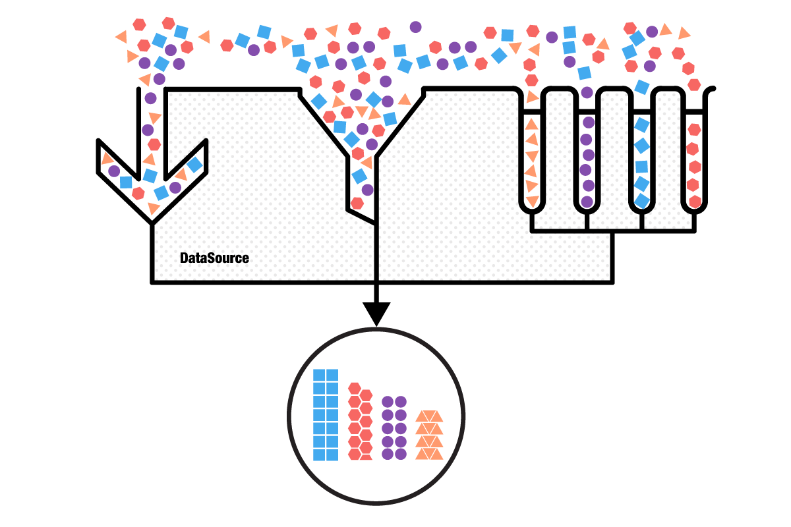

# DataSource: Getting Started

This quick start tutorial demonstrates how to create a simple iOS application with <code>TKDataSource</code>.



## Prerequisites

In order to start using <code>TKDataSource</code>, you have to first install the latest version of Telerik UI for iOS. You can download it from: [http://www.telerik.com/download/ios-ui](http://www.telerik.com/download/ios-ui). The file that you should download is the installation package - Telerik UI for iOS.pkg. Just double click the package icon and the installer will guide you through the installation process. When done, it will open the newly created folder in your Documents folder. This folder contains everything necessary in order to start using <code>TKDataSource</code>.


## Setting up the project

After installing Telerik UI, you can proceed with the following steps:

<ol>
    <li>Open Xcode and choose <i>"Create a new Xcode project"</i>.</li>
    <li>Choose <i>"Single View Application"</i> from the <i>"Choose a template for your new project"</i> dialog.</li>
    <li>Give your project a name and click <i>Next</i>.</li>
    <li>Complete the process of creating a project by specifying the location for your project and clicking <i>Create</i>.</li>
    <li>Scroll down to the <i>Linked Frameworks and Libraries</i> section in your project settings and click on the <i>"+"</i> button. <br/>
    </li>
    <li>Type <i>telerik</i> in the popup, select the <i>TelerikUI.framework</i> and click <i>Add</i>. <br/>
    </li>
    <li>This is it, now you are ready to start working with Telerik Chart.</li>
</ol>

## Setting up TKDataSource

Now that our project is created and the TelerikUI.framework is added, we can start referencing and using the TelerikUI types:

Open your **ViewController.m** file and add a reference to the chart header file:

    #import <TelerikUI/TelerikUI.h>

Note that starting with Xcode 6 Apple doesn't generate the precompiled headers file automatically. That is why you should add references to Foundation and UIKit frameworks before importing TelerikUI:

    #import <Foundation/Foundation.h>
    #import <UIKit/UIKit.h>

If you are writing Swift, add the same line in your bridging header.

If you are using Xamarin, add a reference to TelerikUI.dll in your project and use the <code>using</code> directive:

    using TelerikUI;
    
The simplest way to use <code>TKDataSource</code> is to initialize it with an array. The following code creates a new instance of <code>TKDataSource</code> and loads it with a numeric array:

```Objective-C
TKDataSource *dataSource = [[TKDataSource alloc] initWithArray:@[ @10, @5, @12, @13, @7, @44 ]];
```
```Swift
let dataSource = TKDataSource(array: [ 10, 5, 12, 13, 7, 44 ])
```
```C#
NSObject[] array = new NSObject[] {
    NSObject.FromObject (10),
    NSObject.FromObject (5),
    NSObject.FromObject (12),
    NSObject.FromObject (13),
    NSObject.FromObject (7),
    NSObject.FromObject (44)
};

TKDataSource dataSource = new TKDataSource (array);
```

<br>
<code>TKDataSource</code> supports a full range of data shaping operations including filtering, sorting and grouping. In the code snippet below, we first filter the numbers smaller than 5, then sort the rest and finally group the sorted values depending on whether they are even or odd:

```Objective-C
[dataSource filter:^BOOL(id item) { return [item intValue] > 5; }];

[dataSource sort:^NSComparisonResult(id obj1, id obj2) {
    int a = [obj1 intValue];
    int b = [obj2 intValue];
    if (a < b) { return NSOrderedAscending; }
    else if (a > b) { return NSOrderedDescending; }
    return NSOrderedSame;
}];

[dataSource group:^id(id item) { return @([item intValue] % 2 == 0); }];
```
```Swift
dataSource.filter { $0 as Int > 5 }

dataSource.sort {
    let a = $0 as Int
    let b = $1 as Int
    if a < b { return NSComparisonResult.OrderedDescending }
    else if a > b { return NSComparisonResult.OrderedAscending }
    return NSComparisonResult.OrderedSame
}

dataSource.group { ($0 as Int) % 2 == 0 }
```
```C#
dataSource.Filter ((NSObject obj) => { return ((NSNumber)obj).Int32Value > 5; });

dataSource.Sort ((NSObject obj1, NSObject obj2) => {
    int a = ((NSNumber)obj1).Int32Value;
    int b = ((NSNumber)obj2).Int32Value;
    if (a<b) return NSComparisonResult.Descending;
    else if (a>b) return NSComparisonResult.Ascending;
    return NSComparisonResult.Same;
});

dataSource.Group ((NSObject obj) => { return NSObject.FromObject( ((NSNumber)obj).Int32Value % 2 == 0 ); });
```

<br>
<code>TKDataSource</code> is an independent component and you can use it without connecting it to a UI control. To show the result just iterate the items:

```Objective-C
[dataSource enumerate:^(id item) {
    if ([item isKindOfClass:[TKDataSourceGroup class]]) {
        NSLog(@"Group: %@", ((TKDataSourceGroup*)item).key);
    }
    else {
        NSLog(@"%d", [item intValue]);
    }
}];
```
```Swift
dataSource.enumerate {
    if $0.isKindOfClass(TKDataSourceGroup) {
        let group = $0 as TKDataSourceGroup
        println("Group: \(group.key)")
    }
    else {
        println($0)
    }
}
```
```C#
dataSource.Enumerate ((NSObject obj) => {
    if (obj is TKDataSourceGroup) {
        var group = obj as TKDataSourceGroup;
        Console.WriteLine("Group: {0}", group.Key);
    }
    else {
        Console.WriteLine(obj);
    }
});
```

<br>
Or, you can create a table view and set its data source property:

```Objective-C
UITableView *tableView = [[UITableView alloc] initWithFrame:self.view.bounds];
tableView.dataSource = dataSource;
[self.view addSubview:tableView];
```
```Swift
let tableView = UITableView(frame: self.view.bounds)
self.view.addSubview(tableView)
tableView.dataSource = dataSource
```
```C#
UITableView tableView = new UITableView (this.View.Bounds);
tableView.DataSource = dataSource;
this.View.Add (tableView);
```

Note that the <code>dataSource</code> property of <code>UITableView</code> is weak and you should assign the <code>dataSource</code> instance to a class variable in order to persist its value!

```Objective-C
_dataSource = dataSource;
```
```Swift
self.dataSource = dataSource
```
```C#
this.dataSource = dataSource;
```

<br>
Here is the full code of this example:


```Objective-C
{
    TKDataSource *_dataSource;
}

- (void)viewDidLoad {
    [super viewDidLoad];
    // Do any additional setup after loading the view.
    
    TKDataSource *dataSource = [[TKDataSource alloc] initWithArray:@[ @10, @5, @12, @13, @7, @44 ]];
    
    [dataSource filter:^BOOL(id item) { return [item intValue] > 5; }];

    [dataSource sort:^NSComparisonResult(id obj1, id obj2) {
        int a = [obj1 intValue];
        int b = [obj2 intValue];
        if (a < b) { return NSOrderedAscending; }
        else if (a > b) { return NSOrderedDescending; }
        return NSOrderedSame;
    }];
    
    [dataSource group:^id(id item) { return @([item intValue] % 2 == 0); }];
 
    [dataSource enumerate:^(id item) {
        if ([item isKindOfClass:[TKDataSourceGroup class]]) {
            NSLog(@"Group: %@", ((TKDataSourceGroup*)item).key);
        }
        else {
            NSLog(@"%d", [item intValue]);
        }
    }];
    
    UITableView *tableView = [[UITableView alloc] initWithFrame:self.view.bounds];
    tableView.dataSource = dataSource;
    [self.view addSubview:tableView];
    
    _dataSource = dataSource;
}
```
```Swift
var dataSource: TKDataSource?

override func viewDidLoad() {
    super.viewDidLoad()

    // Do any additional setup after loading the view.
    
    let dataSource = TKDataSource(array: [ 10, 5, 12, 13, 7, 44 ])
    
    dataSource.filter { $0 as Int > 5 }
    
    dataSource.sort {
        let a = $0 as Int
        let b = $1 as Int
        if a < b { return NSComparisonResult.OrderedDescending }
        else if a > b { return NSComparisonResult.OrderedAscending }
        return NSComparisonResult.OrderedSame
    }
    
    dataSource.group { ($0 as Int) % 2 == 0 }
    
    dataSource.enumerate {
        if $0.isKindOfClass(TKDataSourceGroup) {
            let group = $0 as TKDataSourceGroup
            println("Group: \(group.key)")
        }
        else {
            println($0)
        }
    }
    
    let tableView = UITableView(frame: self.view.bounds)
    self.view.addSubview(tableView)
    tableView.dataSource = dataSource
    
    self.dataSource = dataSource
}
```
```C#
TKDataSource dataSource;

public override void ViewDidLoad ()
{
    base.ViewDidLoad();

    NSObject[] array = new NSObject[] {
        NSObject.FromObject (10),
        NSObject.FromObject (5),
        NSObject.FromObject (12),
        NSObject.FromObject (13),
        NSObject.FromObject (7),
        NSObject.FromObject (44)
    };

    TKDataSource dataSource = new TKDataSource (array);

    dataSource.Filter ((NSObject obj) => { return ((NSNumber)obj).Int32Value > 5; });

    dataSource.Sort ((NSObject obj1, NSObject obj2) => {
        int a = ((NSNumber)obj1).Int32Value;
        int b = ((NSNumber)obj2).Int32Value;
        if (a<b) return NSComparisonResult.Descending;
        else if (a>b) return NSComparisonResult.Ascending;
        return NSComparisonResult.Same;
    });

    dataSource.Group ((NSObject obj) => { return NSObject.FromObject( ((NSNumber)obj).Int32Value % 2 == 0 ); });

    dataSource.Enumerate ((NSObject obj) => {
        if (obj is TKDataSourceGroup) {
            var group = obj as TKDataSourceGroup;
            Console.WriteLine("Group: {0}", group.Key);
        }
        else {
            Console.WriteLine(obj);
        }
    });

    UITableView tableView = new UITableView (this.View.Bounds);
    tableView.DataSource = dataSource;
    this.View.Add (tableView);

    this.dataSource = dataSource;
}
```

<br>
You can easily switch the UI control used to present data coming from <code>TKDataSource</code>. It supports the most common data enabled UI controls, so you can use it the same way with <code>UICollectionView</code>, <code>TKChart</code>, <code>TKListView</code>, or <code>TKCalendar</code>. The following article demonstates how to initialize and customize the UI controls supported by <code>TKDataSource</code>:
[Binding with UI controls](binding-with-ui)

<code>TKDataSource</code> supports also different data inputs. This article demonstrates how to load data comming from files or a web service.
[Loading with data](populating-with-data)

Data shaping operations are described in detail in this article:
[Data shaping operations](data-shaping)
