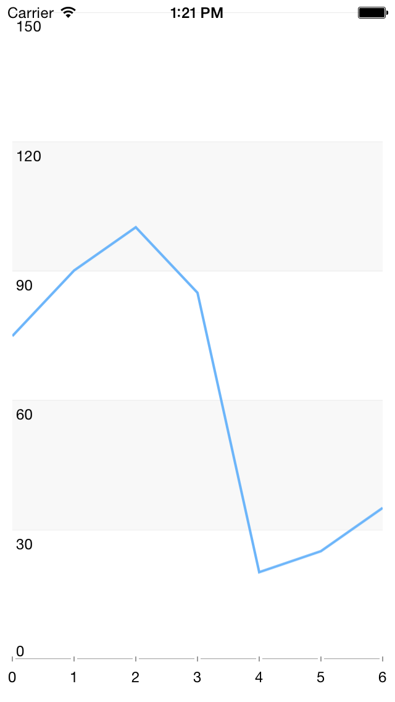

# DataSource: Populating with Data

TKDataSource can consume data coming from various sources. 



The simplest way to load data in <code>TKDataSource</code> is to use an array with numbers or strings:

```Objective-C
TKDataSource *dataSource = [TKDataSource new];
dataSource.itemSource = @[ @"apple", @"bannana", @"orange", @"cherry" ];
```
```Swift
let dataSource = TKDataSource()
dataSource.itemSource = [ "apple", "bannana", "orange", "cherry" ]
```
```C#
NSMutableArray items = new NSMutableArray ();
items.Add (new NSString ("Apple"));
items.Add (new NSString ("Bannana"));
items.Add (new NSString ("Orange"));
items.Add (new NSString("Cherry"));

TKDataSource dataSource = new TKDataSource (items);
```

It also supports arrays of business objects. In this scenario you can use <code>displayKey</code> and <code>valueKey</code> properties to define how to present the data:

```Objective-C
@interface DataSourceItem : NSObject

@property (nonatomic, copy) NSString *name;
@property (nonatomic, copy) NSString *content;
@property (nonatomic) CGFloat value;

@end

//...

NSMutableArray *items = [NSMutableArray new];
[items addObject:[[DataSourceItem alloc] initWithName:@"John" value:50]];
[items addObject:[[DataSourceItem alloc] initWithName:@"Abby" value:33]];
[items addObject:[[DataSourceItem alloc] initWithName:@"Smith" value:42]];
[items addObject:[[DataSourceItem alloc] initWithName:@"Peter" value:28]];
[items addObject:[[DataSourceItem alloc] initWithName:@"Paula" value:25]];

TKDataSource *dataSource = [TKDataSource new];
dataSource.itemSource = items;
dataSource.displayKey = @"name";
dataSource.valueKey = @"value";

[dataSource enumerate:^(id item) {
    NSLog(@"%@", [dataSource textFromItem:item inGroup:nil]);
}];
```
```Swift
class DataSourceItem: NSObject
{
    var name:String = ""
    var content:String = ""
    var value:Float = 0
    
    init(name: String, value: Float) {
        self.name = name
        self.value = value
    }
}

//...

var items = [DataSourceItem]()
items.append(DataSourceItem(name: "John", value: 50))
items.append(DataSourceItem(name: "Abby", value: 33))
items.append(DataSourceItem(name: "Smith", value: 42))
items.append(DataSourceItem(name: "Peter", value: 28))
items.append(DataSourceItem(name: "Paula", value: 25))

let dataSource = TKDataSource()
dataSource.itemSource = items
dataSource.displayKey = "name"
dataSource.valueKey = "value"

dataSource.enumerate { (DataSourceItem item) -> Void in
    println(dataSource.textFromItem(item, inGroup: nil))
}
```
```C#
class DataSourceItem: NSObject
{
	[Export("Name")]
	public String Name { get; set; }

	[Export("Content")]
	public String Content { get; set; }

	[Export("Value")]
	public nfloat Value { get; set; }
}

//...

NSMutableArray items = new NSMutableArray ();
items.Add (new DataSourceItem () { Name = "John", Value = 50 });
items.Add (new DataSourceItem () { Name = "Abby", Value = 33 });
items.Add (new DataSourceItem () { Name = "Smith", Value = 42 });
items.Add (new DataSourceItem () { Name = "Peter", Value = 28 });
items.Add (new DataSourceItem () { Name = "Paula", Value = 25 });

TKDataSource dataSource = new TKDataSource ();
dataSource.ItemSource = items;
dataSource.DisplayKey = "Name";
dataSource.ValueKey = "Value";

dataSource.Enumerate ((NSObject item) => {
	Console.WriteLine(dataSource.TextFromItem(item, null));
});

```

If a greater precision is necessary, you can implement the <code>formatText</code> block to define how the data will be presented:

```Objective-C
[dataSource formatText:^NSString *(id item, TKDataSourceGroup *group) {
    DataSourceItem *dsItem = (DataSourceItem*)item;
    return [NSString stringWithFormat:@"%@ has %f points", dsItem.name, dsItem.value];
}];
```
```Swift
dataSource.formatText { (AnyObject item, TKDataSourceGroup group) -> String! in
    let dsItem = item as DataSourceItem
    return "\(dsItem.name) has \(dsItem.value) points"
}
```
```C#
dataSource.FormatText ((NSObject item, TKDataSourceGroup group) => {
	DataSourceItem dsItem = (DataSourceItem)item;
	return new NSString(string.Format("{0} has {1} points", dsItem.Name, dsItem.Value));
});
```

When using <code>NSDictionary</code> as a data provider for TKDataSource, its <code>items</code> property contains the keys collection of the dictionary and the <code>itemSource</code> property contains the dictionary itself. The following code manipulates the dictionary by applying sorting and filtering methods and then presents the data:

```Objective-C
NSDictionary *dict = @{ @"John": @50, @"Abby": @33, @"Smith": @42, @"Peter": @28, @"Paula": @25 };
TKDataSource *dataSource = [[TKDataSource alloc] initWithItemSource:dict];
[dataSource sortWithKey:@"" ascending:YES];
[dataSource filter:^BOOL(id item) {
    return [dict[item] intValue] > 30;
}];
```
```Swift
let dictionary:NSDictionary = [ "John": 50, "Abby": 33, "Smith": 42, "Peter": 28, "Paula": 25 ]
let dataSource = TKDataSource(itemSource: dictionary)
dataSource.sortWithKey("", ascending: true)
dataSource.filter { (String name) -> Bool in
    return (dictionary.objectForKey(name) as Int) > 30
}
```
```C#
NSMutableDictionary dict = new NSMutableDictionary();
dict.Add (new NSString ("John"), NSObject.FromObject (50));
dict.Add (new NSString ("Abby"), NSObject.FromObject (33));
dict.Add (new NSString ("Smith"), NSObject.FromObject (42));
dict.Add (new NSString ("Peter"), NSObject.FromObject (28));
dict.Add (new NSString ("Paula"), NSObject.FromObject (25));

TKDataSource dataSource = new TKDataSource ();
dataSource.ItemSource = dict;
dataSource.SortWithKey ("", true);
dataSource.Filter ((NSObject item) => {
	return ((NSNumber)dict.ObjectForKey(item)).Int32Value > 30;
});
```

<code>TKDataSource</code> is handy when loading data from resources. With a simple method call it loads a JSON formatted file, parses its data and is ready to present or shape the data:

```Objective-C
TKDataSource *dataSource = [TKDataSource new];
[dataSource loadDataFromJSONResource:@"PhotosWithNames" ofType:@"json" rootItemKeyPath:@"photos"];
```
```Swift
let dataSource = TKDataSource()
dataSource.loadDataFromJSONResource("PhotosWithNames", ofType: "json", rootItemKeyPath: "photos")
```
```C#
TKDataSource dataSource = new TKDataSource();
dataSource.LoadDataFromJSONResource ("PhotosWithNames", "json", "photos");
```

It can load also data coming from a web service. The following code downloads a JSON formatted data from a web service, groups its items and presents the result in TKChart:

```Objective-C
TKChart *chart = [[TKChart alloc] initWithFrame:self.view.bounds];
chart.autoresizingMask = UIViewAutoresizingFlexibleWidth | UIViewAutoresizingFlexibleHeight;
[self.view addSubview:chart];

self.dataSource = [TKDataSource new];
NSString *url = @"http://www.telerik.com/docs/default-source/ui-for-ios/weather.json?sfvrsn=2";
[self.dataSource loadDataFromURL:url dataFormat:TKDataSourceDataFormatJSON rootItemKeyPath:@"dayList" completion:^(NSError *error) {
    
    if (error) {
        NSLog(@"Can't connect with the server");
        return;
    }
    
    self.dataSource.valueKey = @"humidity";
    chart.dataSource = dataSource;
}];
```
```Swift
let chart = TKChart(frame:self.view.bounds)
chart.autoresizingMask = UIViewAutoresizing.FlexibleWidth | UIViewAutoresizing.FlexibleHeight
self.view.addSubview(chart)

self.dataSource = TKDataSource()
let url = "http://www.telerik.com/docs/default-source/ui-for-ios/weather.json?sfvrsn=2"
self.dataSource?.loadDataFromURL(url, dataFormat: TKDataSourceDataFormat.JSON, rootItemKeyPath: "dayList", completion: { (NSError err) -> Void in

    if err != nil {
        println("Can't connect with the server")
        return
    }
    self.dataSource?.valueKey = "humidity"
    chart.dataSource = self.dataSource
    
})
```
```C#
TKChart chart = new TKChart(this.View.Bounds);
chart.AutoresizingMask = UIViewAutoresizing.FlexibleWidth | UIViewAutoresizing.FlexibleHeight;
this.View.AddSubview (chart);

this.dataSource = new TKDataSource ();
NSString url = new NSString ("http://www.telerik.com/docs/default-source/ui-for-ios/weather.json?sfvrsn=2");
this.dataSource.LoadDataFromURL (url, TKDataSourceDataFormat.JSON, "dayList", (NSError err) => {
	if (err != null) {
		Console.WriteLine("Can't connect with the server");
		return;
	}
	this.dataSource.ValueKey = "humidity";
	chart.DataSource = dataSource;
});
```
