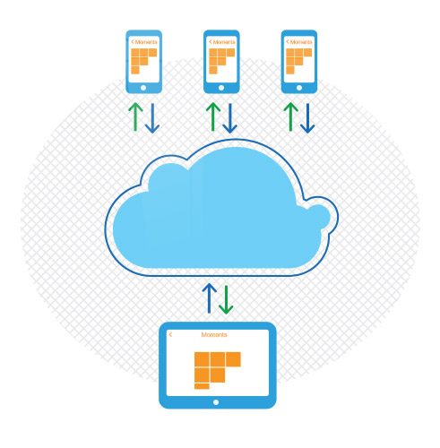

The Data Sync component (Beta) is a powerful solution for persisting application data locally and/or synchronizing it with across all devices and the cloud. Its smart syncing algorithms that take place on the device ensure that the changes made to data while offline, are synced with the cloud once your app is connected again. Here are the features at a glance:

- **Local data persistence with SQLite**. The Data Sync component embeds a lightweight ORM that allows you to easily transform your data classes into tables in SQLite, thus saving you a lot of time to create the appropriate schema in SQLite on your own. You can use the **DataSync** component for a complex combination of data persistence and synchronization between different instances of your application or for local storage only.
- **Smart synching algorithm**. The synchronization algorithm of the Data-sync component allows for determining if the data should be synced over 3G or WiFi connection. You can also determine whether the cloud or the client data should prevail if a conflict appears. Or, you may decide to use your own custom logic for conflict resolving by handling a method from the TKDataSyncDelegate.
- **Integrated with Telerik Backend Services**. On the cloud side, the Data Sync component is backed up by Telerik BaaS completing your data user story from the start to the end.*

*UI for iOS does not grant you a license for the Telerik Backend Services. You need to obtain such separately.

