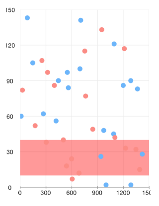
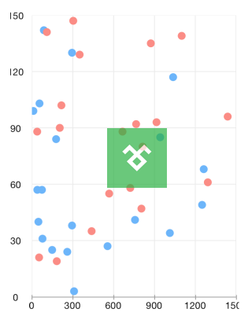

# Chart: Annotations

Annotations are visual elements that can be used to highlight certain areas on the plot area and denote statistical significance.

TKChart provides the following types of annotations: 

- TKChartGridLineAnnotation
- TKChartBandAnnotation
- TKChartCrossLineAnnotation
- TKChartBalloonAnnotation
- TKChartLayerAnnotation
- TKChartViewAnnotation

##Adding annotations to the chart##

TKChart contains an **annotations** collection and annotations can be added to the chart by calling the **addAnnotation** method. The following code adds a horizontal grid line annotation in TKChart. The annotation requires an axis and a value in order to be initialized correctly.

    [chart addAnnotation:[[TKChartGridLineAnnotation alloc] initWithValue:@80 forAxis:yAxis]];

The anotation visibility can be controlled by setting its **hidden** property. 
The annotation visual appearance can be changed by using its **style** property.

##Annotation types##

Conceptualy there are three types of annotations - grid line, band and point annotations. Below is comparison for each one depending on the scenario.

###Grid line###

The grid line annotation represents a vertical or horizontal line which crosses the entire plot area. It is specified by using the TKChartGridLineAnnotation. 

The line color can be customized by using the annotation initializer:

	TKStroke *stroke = [TKStroke strokeWithColor:[UIColor redColor] width:0.5];
    [_chart addAnnotation:[[TKChartGridLineAnnotation alloc] initWithValue:@80
                                                                   forAxis:_chart.yAxis
                                                                withStroke:stroke]];

###Plot band###

The TKChartBandAnnotation is either horizontal or vertical stripe, crossing its corresponding axis, specified by its **range** property. 

    TKRange *range = [[TKRange alloc] initWithMinimum:@10 andMaximum:@40];
    UIColor *color = [UIColor colorWithRed:1. green:0. blue:0. alpha:0.4];
    TKFill *fill = [TKSolidFill solidFillWithColor:color];
    [_chart addAnnotation:[[TKChartBandAnnotation alloc] initWithRange:range
                                                               forAxis:_chart.yAxis
                                                              withFill:fill
                                                            withStroke:nil]];

###Point annotations###

Point annotations render their content starting at specific position. Besides the position, a pixel based offset could be added to the point annotation by specifying the **offset** property.

###Cross line annotation###

The TKChartCrossLineAnnotation is a point annotation which represents two crossing lines with a point at the crossing position.

    [_chart addAnnotation:[[TKChartCrossLineAnnotation alloc] initWithX:@900 Y:@60
                                                              forSeries:_chart.series[0]]];
    

###Balloon annotation###

The TKChartBalloonAnnotation displays a balloon like shape around the position specified by its arguments. The **verticalAlign** and **horizontalAlign** properties allow to position the annotation precisely. The balloon will correct its position automatically if there is no enough space at the specified coordinates.

The following example demonstrates different balloon positions based on the horizontal and vertical alignment:

    TKChartBalloonAnnotation *balloon = [[TKChartBalloonAnnotation alloc] initWithX:@"Mar" Y:@55
                                                                          forSeries:series];
    balloon.text = @"left aligned";
    balloon.style.horizontalAlign = TKChartBalloonHorizontalAlignmentLeft;
    balloon.style.verticalAlign = TKChartBalloonVerticalAlignmentCenter;
    [_chart addAnnotation:balloon];
    
    balloon = [[TKChartBalloonAnnotation alloc] initWithText:@"bottom aligned" X:@"Apr" Y:@30
                                                   forSeries:series];
    balloon.style.verticalAlign = TKChartBalloonVerticalAlignmentBottom;
    [_chart addAnnotation:balloon];

 
The **attributedText** property can be used to present formatted text with NSAttributedString. The following code demonstrates this:

    NSMutableParagraphStyle *paragraphStyle = [[NSParagraphStyle defaultParagraphStyle] mutableCopy];
    paragraphStyle.alignment = NSTextAlignmentCenter;
    NSMutableAttributedString *attributedText = [[NSMutableAttributedString alloc] 
          initWithString:@"Important milestone:\n $55000"
              attributes:@{ NSForegroundColorAttributeName:[UIColor whiteColor],
                            NSParagraphStyleAttributeName:paragraphStyle }];
    [attributedText addAttribute:NSForegroundColorAttributeName value:[UIColor yellowColor] range:NSMakeRange(22, 6)];
    
    TKChartBalloonAnnotation *balloon = [[TKChartBalloonAnnotation alloc] initWithX:@"Mar" Y:@55 forSeries:series];
    balloon.attributedText = attributedText;
    [_chart addAnnotation:balloon];

Almost every aspect of the balloon can be controled by accessing the **style** property of the annotation. For example the **arrowSize** and the **cornerRadius**:

    balloon.style.arrowSize = CGSizeMake(20, 20);
    balloon.style.cornerRadius = 0;
	balloon.style.fill = [[TKLinearGradientFill alloc] initWithColors:@[[UIColor grayColor], [UIColor blueColor]]];
	    

	
###Layer and view annotations###
	
The TKChartLayerAnnotation and TKChartViewAnnotations are also point annotations. Those allow positioning a layer or a view inside the chart. The following code will position an image named *img* at the center of the chart:

	UIImage *image = [UIImage imageNamed:@"logo"];
    UIImageView *imageView = [[UIImageView alloc] initWithImage:image];
    imageView.bounds = CGRectMake(0, 0, image.size.width, image.size.height);
    imageView.alpha = 0.7;
    [_chart addAnnotation:[[TKChartViewAnnotation alloc] initWithView:imageView X:@550 Y:@90 forSeries:_chart.series[0]]];
	

	