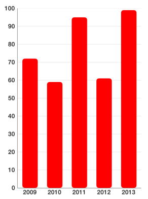
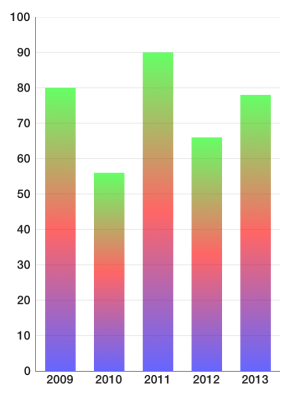
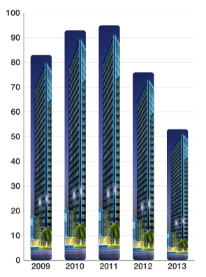
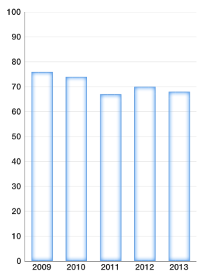
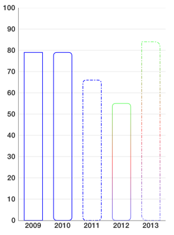
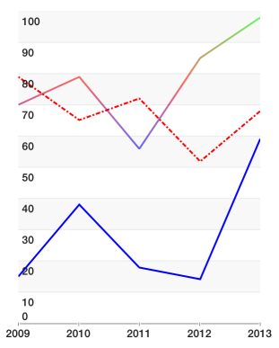

##Overview##

TKChart has a powerful drawing engine to help you customize your chart appearance. It allows you to:

- define different kinds of fills. Solid color, Linear gradient, Radial gradient, fill with image content.
- define strokes which contain information about stroke fill, dash pattern, line width etc.
- define fill & stroke's corner radius, which corners to apply that radius to. It also supports drawing insets.

##Working with fills##

There are several kinds of fills:

###Solid fill###

TKSolidFill is the simplest of all fills. It paints chart items with a single color. Here is how you define it:

    TKSolidFill *fill = [[TKSolidFill alloc] initWithColor:[UIColor redColor]];
    
or a shorter form

    TKSolidFill *fill = [TKSolidFill solidFillWithColor:[UIColor redColor]];
    
After you set it to a palette (discussed later) you get result like this:

You can also specify corner raduis:

    TKSolidFill *fill = [TKSolidFill solidFillWithColor:[UIColor redColor] cornerRadius:5.f];

This results in columns looking like this:

All fills and strokes allow you to specify not only corner radius, but also which corners to round. Semi-transparent red fill with only two corners rounded can be defined like this:

    TKSolidFill *fill = [TKSolidFill solidFillWithColor:[UIColor colorWithRed:1.f green:0.f blue:0.f alpha:0.5f] cornerRadius:8.f];
    fill.corners = UIRectCornerTopLeft | UIRectCornerBottomRight;

There you get:

###Linear gradient fill###

TKLinearGradientFill allows you to fill an item with color gradients. You can specify which colors to use and relative to the size positions of gradient stops.

Here is how you define linear gradient with 3 colors (green to red to blue) with transparency:

    TKLinearGradientFill *fill = [TKLinearGradientFill 
        linearGradientFillWithColors:@[[UIColor colorWithRed:0.f green:1.f blue:0.f alpha:0.6f],
                                       [UIColor colorWithRed:1.f green:0.f blue:0.f alpha:0.6f],
                                       [UIColor colorWithRed:0.f green:0.f blue:1.f alpha:0.6f]]];

If we wish to distribute those colors unevenly and change gradient direction here is how to do it:

    TKLinearGradientFill *fill = [TKLinearGradientFill
        linearGradientFillWithColors:@[[UIColor colorWithRed:0.f green:1.f blue:0.f alpha:0.6f],
                                       [UIColor colorWithRed:1.f green:0.f blue:0.f alpha:0.6f],
                                       [UIColor colorWithRed:0.f green:0.f blue:1.f alpha:0.6f]]
        locations:@[@(0.6f), @(0.8f), @(1.0f)]
        startPoint:CGPointMake(0.f, 0.f)
        endPoint:CGPointMak0e(1.f, 1.f)];
       
Warning: All coordinates for locations, startPoint and endPoint parameters are relative to the size of drawing surface. The values of locations array must be monotonically increasing.

###Radial gradient fill###

TKRadialGradientFill draws a fill with two colors using centers relative to the drawing size. Radius is set in different measures depending on radiusType parameter. It is hard to master and most of the time you can achieve the same functionality with linear gradient. Here is a possible usage:

    TKRadialGradientFill *fill = [[TKRadialGradientFill alloc] 
        initWithColors:@[[UIColor colorWithRed:0.f green:1.f blue:0.f alpha:0.7f],
                         [UIColor colorWithRed:1.f green:0.f blue:0.f alpha:0.0f]] 
           startCenter:CGPointMake(0.5f, 0.5f)
           startRadius:0.7f 
             endCenter:CGPointMake(0.f, 1.f) 
             endRadius:0.3f 
             radiusType:TKGradientRadiusTypeRectMax];

The resulting ghost column chart looks like this:

###Image fill###

TKImageFill fills the drawing area with the content of an image. There is also a **resizingMode** which specify how to draw image. Here is an example usage of tiled image:

    TKImageFill *fill = [TKImageFill imageFillWithImage:[UIImage imageNamed:@"pattern1"] cornerRadius:4.f];
    fill.resizingMode = TKImageFillResizingModeTile;

this is the source (pattern) image to draw:

 <= original&nbsp;&nbsp;&nbsp;&nbsp;  <= 8 times magnified version

Filling with images in stretch mode is even easier:

    TKImageFill *fill = [TKImageFill imageFillWithImage:[UIImage imageNamed:@"building1"] cornerRadius:4.f];

Sometimes you like to specify your own stretchable image. Stretching this  image with your own code, leads to the following result:

    TKImageFill *fill = [TKImageFill imageFillWithImage:
    	[[UIImage imageNamed:@"pattern2"] resizableImageWithCapInsets:UIEdgeInsetsMake(10, 10, 10, 10)]];
    fill.resizingMode = TKImageFillResizingModeNone;

##Adding stroke##

TKStroke is a powerful tool which allows you to customize how you apply strokes to your charts.

You can create a simple stroke like this:

    TKStroke *stroke = [TKStroke strokeWithColor:[UIColor blueColor]];
    
With rounded corners:

    TKStroke *stroke = [TKStroke strokeWithColor:[UIColor blueColor] width:1.f cornerRadius:5.0f];

With dash pattern:

    TKStroke *stroke = [TKStroke strokeWithColor:[UIColor blueColor] width:1.f cornerRadius:5.0f];
    stroke.dashPattern = @[@2, @2, @5, @2];

You can fill a stroke with a gradient:

    TKLinearGradientFill *fill = [TKLinearGradientFill
         linearGradientFillWithColors:@[[UIColor colorWithRed:0.f green:1.f blue:0.f alpha:0.6f],
                                        [UIColor colorWithRed:1.f green:0.f blue:0.f alpha:0.6f],
                                        [UIColor colorWithRed:0.f green:0.f blue:1.f alpha:0.6f]]];
    TKStroke *stroke = [TKStroke strokeWithFill:fill width:1.f cornerRadius:5.0f];
    
Or combine most of it in one place:

    TKLinearGradientFill *fill = [TKLinearGradientFill
         linearGradientFillWithColors:@[[UIColor colorWithRed:0.f green:1.f blue:0.f alpha:0.6f],
                                        [UIColor colorWithRed:1.f green:0.f blue:0.f alpha:0.6f],
                                        [UIColor colorWithRed:0.f green:0.f blue:1.f alpha:0.6f]]];
    TKStroke *stroke = [TKStroke strokeWithFill:fill width:1.f cornerRadius:8.0f];
    stroke.dashPattern = @[@2, @2, @5, @2];
    stroke.corners = UIRectCornerTopRight | UIRectCornerBottomLeft;

And here is the result of all samples:

or with line chart using strokes with width = 2

##Customizing TKChart##

Customizing TKChart can be done using TKChartPalette. You can access the palette from TKChartSeries using series.style.palette variable. By default, palette is nil which means that TKChart will use its default theme. To specify your own, you need to create it:

    series.style.palette = [TKChartPalette new];
    
TKChartPalette is a collection of TKChartPaletteItem instances. Every item contains information about drawing the item at its index. By default, a palette item index addresses the order in which you add series. For example, you may have a palette with red and blue fills and two TKChartColumnSeries using this palette. The first series you add will be red and the second blue. However, TKChartPieSeries by default uses another mode when every palette item is used to display a data point at its index. You can explicitly set how you distribute a palette items using:

    series.style.paletteMode = TKChartSeriesStylePaletteModeUseItemIndex;
    
or 

    series.style.paletteMode = TKChartSeriesStylePaletteModeUseSeriesIndex; // this is the default
    
Whenever TKChartPalette runs out of colors (because there are more series or more data points than TKChartPaletteItem items inside) it starts over effectively cycling through its items.

To illustrate the difference between palette modes, consider the following setup:

    // … there is more setup code above creating TKChart, settings up axes and preparing the data points
    TKChartSeries *series = [[TKChartColumnSeries alloc] init];
    series.style.palette = [TKChartPalette new];
    
    TKSolidFill *redFill = [[TKSolidFill alloc] initWithColor:[UIColor redColor]];
    [series.style.palette addPaletteItem:[[TKChartPaletteItem alloc] initWithDrawables:@[redFill]]];
    TKSolidFill *blueFill = [[TKSolidFill alloc] initWithColor:[UIColor blueColor]];
    [series.style.palette addPaletteItem:[[TKChartPaletteItem alloc] initWithDrawables:@[blueFill]]];
    TKSolidFill *greenFill = [[TKSolidFill alloc] initWithColor:[UIColor greenColor]];
    [series.style.palette addPaletteItem:[[TKChartPaletteItem alloc] initWithDrawables:@[greenFill]]];

    series.style.paletteMode = TKChartSeriesStylePaletteModeUseItemIndex;

    [_chart addSeries:series withItems:array];

As you see we are using TKChartSeriesStylePaletteModeUseItemIndex palette mode and the result is:

Here the palette items are used to color the different data points. Since palette items inside are 3 and data points are 5, the palette starts over reusing the items it has. If you remove the line:

    series.style.paletteMode = TKChartSeriesStylePaletteModeUseItemIndex;

or change it to:

    series.style.paletteMode = TKChartSeriesStylePaletteModeUseSeriesIndex;

you will get:

This is because you have added only one series. Adding a second series with the same palette will make its data points blue. Adding a third series will make its data points green and fourth would be red again.

###Palette items###

TKChartPaletteItem is the building block of TKChartPalette and contains information about how to draw items. The simple way to use it is to specify a fill and/or stroke. Consider one of the following constructors:

    TKChartPaletteItem *paletteItem1 = [TKChartPaletteItem paletteItemWithFill:
    	[TKSolidFill solidFillWithColor:[UIColor redColor]]];
    	
    TKChartPaletteItem *paletteItem2 = [TKChartPaletteItem paletteItemWithStroke:
    	[TKStroke strokeWithColor:[UIColor blueColor]]];
    	
    TKChartPaletteItem *paletteItem3 = [TKChartPaletteItem 
    	paletteItemWithStroke:[TKStroke strokeWithColor:[UIColor blueColor]] 
    	              andFill:[TKSolidFill solidFillWithColor:[UIColor redColor]]];

then you can add an item to a palette using code like:

    [series.style.palette addPaletteItem:paletteItem1];

When you initialize a palette item with stroke and fill the stroke is always drawn last.    

There is also an alternative and a more flexible way to create a palette item by specifying an array of fills and strokes in the order you would like them to be drawn:

    series.style.palette = [TKChartPalette new];
    TKSolidFill *redFill = [[TKSolidFill alloc] initWithColor:[UIColor redColor] cornerRadius:2.f];
    TKStroke *stroke1 = [TKStroke strokeWithColor:[UIColor yellowColor] width:1.f cornerRadius:2.f];
    stroke1.insets = UIEdgeInsetsMake(1.f, 1.f, 1.f, 1.f);
    TKStroke *stroke2 = [TKStroke strokeWithColor:[UIColor blackColor] width:1.f cornerRadius:2.f];
    [series.style.palette addPaletteItem:[TKChartPaletteItem paletteItemWithDrawables:@[redFill, stroke1, stroke2]]];

here you create a palette item with red fill and two borders. The sample also shows another powerful feature: insets. Insets can be applied to both fills and strokes. Here is the final result:

###Customizing line series###

TKChartLineSeries uses only TKStroke instances of TKChartPaletteItem and ignores any fills. You can specify a wide first stroke and thin second stroke if you need more than one stroke.

###Customizing area series###

TKChartAreaSeries uses TKStroke instances of TKChartPaletteItem for the line and fills for area part.

###Customizing scatter series###

TKChartScatterSeries uses palette items to draw its shapes. However you might also change shape's type using code like:

    series.style.pointShape = [TKShape shapeWithType:TKShapeTypeDiamond andSize:15.f];

series.style.pointShape also applies to line and area series in case you need to show shapes on data points.

###Customizing pie series###

TKChartPieSeries always use series.style.paletteMode = TKChartSeriesStylePaletteModeUseItemIndex; If you have strokes with insets, only insets.top value will be used and will be applied relatively to the outer radius of the pie chart slices.

@warning Customization is a very powerful feature of TKChart. However, we recommend using that feature at an acceptable rate. Using too many fills and strokes may affect performance. Combining all features like a dashed stroke with gradient plus several semi transparent fills will draw much slower than a simple solid color fill.
