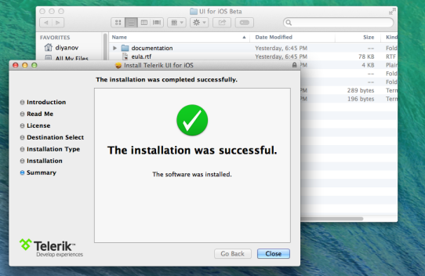

# Chart: Getting Started

This quick start tutorial demonstrates how to create a simple iOS application with TKChart. 

##Prerequisites

In order to start using <code>TKChart</code>, you have first to install the latest version Telerik UI for iOS. You can download it from: [www.telerik.com](http://www.telerik.com). The file that you should download is the installation package - Telerik UI for iOS.pkg. Just double click the package icon and the installer will guide you trough the installation process. When done it will open the newly created folder in your Documents folder. This folder contains everything necessary in order to start using TKChart.

##Setting up the project

After installing <code>TKChart</code>, you can proceed with the following steps:

<ol>
    <li>Open Xcode and choose <i>"Create a new Xcode project"</i>.</li>
    <li>Choose <i>"Single View Application"</i> from the <i>"Choose a template for your new project"</i> dialog.</li>
    <li>Give your project a name and click <i>Next</i>.</li>
    <li>Complete the process of creating a project by specifying the location for your project and clicking <i>Create</i>.</li>
    <li>Scroll down to the <i>Linked Frameworks and Libraries</i> section in your project settings and click on the <i>"+"</i> button.  
    </li>
    <li>Type <i>telerik</i> in the popup, select the <i>TelerikUI.framework</i> and click <i>Add</i>.  
    </li>
    <li>This is it, now you are ready to start working with Telerik Chart.</li>
</ol>

##Setting up TKChart

Now that our project is created and the TelerikUI.framework is added, we can start referencing and using the TelerikUI types:

Open your **ViewController.m** file and add a reference to the chart header file:

    #import <TelerikUI/TelerikUI.h>

Type the following code in <code>viewDidLoad</code> method:

	TKChart *chart = [[TKChart alloc] initWithFrame:CGRectInset(self.view.bounds, 15, 15)];
    chart.autoresizingMask = UIViewAutoresizingFlexibleWidth | UIViewAutoresizingFlexibleHeight;
    [self.view addSubview:chart];

This code creates a new instance of TKChart and adds it as a subview of the ViewController's main view. The <code>autoresizingMask</code> property is set in order to allow correct resizing of the chart when the device is rotated in landscape mode. 

The next step is to create some random data that will be consumed by the chart. You can use the following code:

    NSMutableArray *randomData = [[NSMutableArray alloc] init];
    for (int i=0; i<10; i++) {
        [randomData addObject:[[TKChartDataPoint alloc] initWithX:@(i) Y:@(arc4random()%100)]];
    }

In this case we use the *i* variable as an x value, and we generate a random number in the range between 0 and 100 as an y value.

Now let's add this random data to the chart and present it. This is done by the following code:

    [chart addSeries:[[TKChartLineSeries alloc] initWithItems:randomData]];

For more information about populating TKChart with data, please refer to the following article:

- [Populating with Data](populating-with-data)

The TKChartLineSeries tells the chart to present its data as a line chart and initializes it with the already created points. 

Let's add a title and a legend to our chart. We can do so by setting the corresponding properties to NO:

    chart.title.hidden = NO;
    chart.title.text = @"This is a chart demo";
    chart.legend.hidden = NO;

Finally, we can easily employ the built-in animations support to create some fancy animations. To do so, we should set the <code>allowAnimations</code> property to *YES*:

    chart.allowAnimations = YES;

For more information about customizing animations, please refer to the following articles:

- [Custom Animations](animations/custom)
- [Custom UIKit Dynamics Animations](animations/custom-uikit-dynamics)

Here is the full code of this example:

	#import "ViewController.h"
	#import <TelerikUI/TelerikUI.h>

	@implementation ViewController

    - (void)viewDidLoad
    {
        [super viewDidLoad];
    
        TKChart *chart = [[TKChart alloc] initWithFrame:CGRectInset(self.view.bounds, 15, 15)];
        chart.autoresizingMask = UIViewAutoresizingFlexibleWidth | UIViewAutoresizingFlexibleHeight;
        [self.view addSubview:chart];
    
        NSMutableArray *randomData = [[NSMutableArray alloc] init];
        for (int i=0; i<10; i++) {
            [randomData addObject:[[TKChartDataPoint alloc] initWithX:@(i) Y:@(arc4random()%100)]];
        }
    
        [chart addSeries:[[TKChartLineSeries alloc] initWithItems:randomData]];
    
        chart.title.hidden = NO;
        chart.title.text = @"This is a chart demo";
        chart.legend.hidden = NO;
    
        chart.allowAnimations = YES;
    
        [chart addSeries:[[TKChartColumnSeries alloc] initWithItems:randomData]];
    }

	@end
	
You can easily change the way data is presented in chart by changing the series type:

	[chart addSeries:[[TKChartColumnSeries alloc] initWithItems:randomData]];

	
For more information about series types, please refer to the following articles:

- [Area](series/area)
- [Bar](series/bar)
- [Column](series/column)
- [Line](series/line)
- [Pie](series/pie)
- [Scatter](series/scatter)
- [Point Customization](series/point-customization)