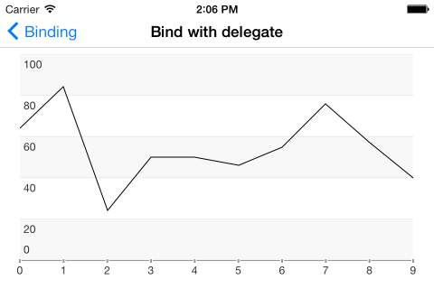
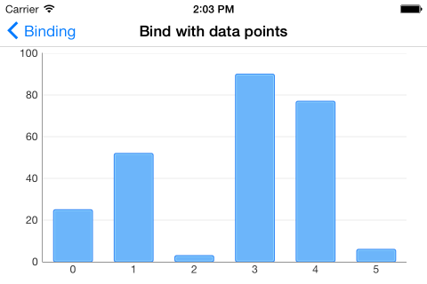
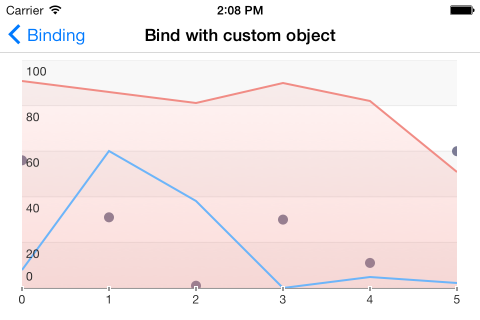

##Overview

In order for TKChart to represents data, we should supply this data to it. Following the Model-View-Controller design pattern, the data source mediates between the application's data model (that is, its model objects) and the chart view. The data source provides the chart-view object with the information it needs to construct visualization using different chart types.

TKChart can be bound to a wide variety of data sources. The common way to work with chart-view' data source is to subclass the UIViewController and adopt the TKChartDataSource protocol or subclass the built-in TKChartViewController to manage the data source. Another way is to automate this task using the binding mechanism of TKChart to setup the data source.

##Configure data source using the TKChartDataSource protocol

Following this approach, we supply TKChart with data using a delegate. This works the same way as with UITableView. You should implement the TKChartDataSource protocol and specify the number of series, the number of points in each series, the series objects and the point objects. The TKChartDataSource has two required methods. The numberOfSeriesForChart: method tells the chart view how many series to display in the plot area, and the seriesForChart:atIndex: method provides the series to display. Optional methods allow the data source to configure data points for each series. 

Here is a sample subclass of **TKChartViewController** which will provide TKChart with data points for one TKChartLineSeries:

    @implementation CustomChartViewController

    - (id)initWithNibName:(NSString *)nibNameOrNil bundle:(NSBundle *)nibBundleOrNil
    {
        self = [super initWithNibName:nibNameOrNil bundle:nibBundleOrNil];
        if (self) {
            // Custom initialization
            self.title = @"Subclass ChartViewController";
        }
        return self;
    }

    - (NSUInteger)numberOfSeriesForChart:(TKChart *)chart
    {
        return 1;
    }

    - (TKChartSeries *)seriesForChart:(TKChart *)chart atIndex:(NSUInteger)index
    {
        TKChartLineSeries *series = [chart dequeueReusableSeriesWithIdentifier:@"series1"];
        if (!series) {
            series = [[TKChartLineSeries alloc] initWithItems:nil reuseIdentifier:@"series1"];
            series.spline = YES;
            series.title = @"Delegate series";
        }
    
        return series;
    }

    - (NSUInteger)chart:(TKChart *)chart numberOfDataPointsForSeriesAtIndex:(NSUInteger)seriesIndex
    {
        return 10;
    }

    - (id<TKChartData>)chart:(TKChart *)chart dataPointAtIndex:(NSUInteger)dataIndex forSeriesAtIndex:(NSUInteger)seriesIndex
    {
        TKChartDataPoint *point = [[TKChartDataPoint alloc] init];
        point.dataXValue = @(dataIndex);
        point.dataYValue = @(arc4random() % 100);
        return point;
    }

    @end
    
    
 

##Configure data source using binding to DataPoints collection

Another way to configure TKChart data source is to set up data points for the *TKChartSeries* object, and using the binding mechanism, the TKChart control will automatically create and set up the built-in *TKChartBindDingataSource* for you.

Here is a *TKChartColumnSeries* with an attached collection of data points:

    TKChart *chart = [[TKChart alloc] initWithFrame:CGRectInset(self.view.bounds, 30, 30)];
    chart.autoresizingMask = ~UIViewAutoresizingNone;
    chart.title.text = @"MONTHLY SALES REVENUE, 2013";
    [self.view addSubview:chart];
    
    NSArray *categories = @[ @"Greetings", @"Perfecto", @"NearBy", @"Family Store", @"Fresh & Green" ];
    NSArray *values = @[ @70, @75, @58, @59, @88 ];
    NSMutableArray *array = [[NSMutableArray alloc] init];
    for (int i = 0; i<values.count; i++) {
        [array addObject:[[TKChartDataPoint alloc] initWithX:categories[i] Y:values[i]]];
    }
    
    TKChartSeries *series = [[TKChartColumnSeries alloc] initWithItems:array];
    [chart addSeries:series];
    
    
    
 

##Configure data source using binding to properties of model object

In order to support full binding mechanism and minimize the amount of code used to initialize data source with model object of your application, TKChart supports binding to properties of the model object. To use this powerful mechanism, you should describe in pairs the names of *TKChartData* properties related to the property names of your custom object.

Binding to an array of custom object is quite easy with TKChart. Once your array is created, you just need to set the necessasry members to the desired field. In the code snippet below we create one application specific custom object and bind its data to three line series:

    TKChart *chart = [[TKChart alloc] initWithFrame:BOUNDS_WITH_MARGIN(self.view.bounds, 15)];
    chart.autoresizingMask = ~UIViewAutoresizingNone;
    [self.view addSubview:chart];
    
    NSMutableArray *data = [[NSMutableArray alloc] init];
    for (int i = 0; i<=5; i++) {
        CustomObject *obj = [[CustomObject alloc] init];
        obj.objectID = i;
        obj.value1 = arc4random() % 100;
        obj.value2 = arc4random() % 100;
        obj.value3 = arc4random() % 100;
        [data addObject:obj];
    }

    [chart beginUpdates];
    [chart addSeries:[[TKChartLineSeries alloc] init] withItems:data forKeys:@{ @"dataXValue": @"objectID",
                                                                                  @"dataYValue": @"value1"}];
    
    [chart addSeries:[[TKChartAreaSeries alloc] init] withItems:data forKeys:@{ @"dataXValue": @"objectID",
                                                                                  @"dataYValue": @"value2"}];
    
    [chart addSeries:[[TKChartScatterSeries alloc] init] withItems:data forKeys:@{ @"dataXValue": @"objectID",
                                                                                  @"dataYValue": @"value3"}];
    
    [chart endUpdates];
    
    
 

  
@warning TKChart by default creates and sets up axes automatically to support this flexible and codeless binding behavior using the data types in the provided data source. You can always change or replace the axis type for TKChartSeries or change it auto-calculated default range.