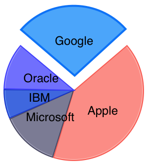

##Overview##

This help topic demonstrates how you can make your charts more interactive by enabling a selection behavior. 

##Configure##

You can alter the selection mode for each series by altering its **selectionMode** property with the following value:

- *TKChartSelectionModeNone* - No selection
- *TKChartSelectionModeSeries* - Select a whole series
- *TKChartSelectionModeDataPoint* - Select a data point

You can determine whether a selection is changed by implementing **TKChartDelegate** protocol:

	- (void)chart:(TKChart *)chart selectedSeries:(TKChartSeries *)series dataPoint:(id<TKChartData>)dataPoint dataIndex:(NSInteger)dataIndex
	{
		// Here you can perform the desired action when the selection is changed.
	}

In addition, you can change the selection programmatically by calling the **select** method in the following manner:

	series.selectionMode = TKChartSelectionModeDataPoint;

	- (void)viewDidAppear:(BOOL)animated
	{
    	[super viewDidAppear:animated];
    	[_pieChart select:[[TKChartSelectionInfo alloc] initWithSeries:_pieChart.series[0] dataPointIndex:0]];
	}

Note that you can clear the selection by passing *nil* value.