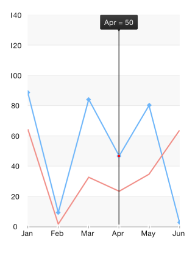

# Chart: Trackball

TKChart provides a trackball behavior through the TKChartTrackball class. The trackball can be used to display a vertical (or horizontal) line across the chart plot area and also to display little visual indicators (circles by default) at points where the trackball line crosses the visualization of a series object. For example when the trackball line crosses a line series line segment, a small circle is drawn highlighting the value of the series at this point. A screenshot should best explain this:

The last capability of the trackball is to display a small tooltip, in order to provide more detailed information about the closest points to the trackball line's cross section, as can be seen in the screenshot above.

The trackball behavior is activated by setting the **allowTrackball** property of TKChart to **YES**. The trackball is accessible by using the **trackball** property of TKChart. It activates automatically when you touch the chart for a few seconds, however it can be shown/hidden programmatically by calling its **showAtPoint:** and **hide** methods.

The trackball exposes four properties that could be used to control its appearance and behavior. These are:

**snapMode** 

The **snapMode** property determines how the trackball line will be snapped to the chart's data points. Valid property values are **TKChartTrackballSnapModeClosestPoint** and **TKChartTrackballSnapModeAllClosestPoints** with **TKChartTrackballSnapModeClosestPoint** snapping to the closest point of all data points in the chart and **TKChartTrackballSnapModeAllClosestPoints** snapping to the closest point from each series object in the chart, that is, it snaps to multiple data points at once. Again, a few screenshots will best describe the different values of **snapMode**:

**TKChartTrackballSnapModeClosestPoint**:

**TKChartTrackballSnapModeAllClosestPoints**:

**orientation**

The **orientation** property determines whether the trackball will track points horizontally or vertically. When the orientation is set to **TKChartTrackballOrientationVertical**, which is the default option, it will search within the touched area for points with similar x-coordinates by different y-coordinate and the trackball line will be vertical. If the property is set to **TKChartTrackballOrientationVertical**, the trackball will compare y-coordinates instead and the trackball line will be horizontal.

**line** 

The **line** property represents the trackball line. Its **style** property could be used to customize the line appearance. For example, its color and crossing point shape:

	UIColor *color = [UIColor redColor];
	CGSize size = CGSizeMake(20, 20);
	TKPredefinedShape *shape = [[TKPredefinedShape alloc] initWithType:TKShapeTypeRhombus andSize:size];
	chart.trackball.line.style.verticalLineStroke = [TKStroke strokeWithColor:color width:2];
	chart.trackball.line.style.pointShape = shape;

The result is the following:

**tooltip**

The **tooltip** property represents the tooltip that shows information about the crossing points. As usual its **style** property could be used to customize its appearance. The **pinPosition** property determines where the trackball tooltip should be located. The available pin positions are specified below:
 
- **TKChartTrackballPinPositionNone** - The tooltip will appear next to the selected point.
- **TKChartTrackballPinPositionLeft** - The tooltip will appear on the left side of the plot area.
- **TKChartTrackballPinPositionRight** - The tooltip will appear on the right side of the plot area.
- **TKChartTrackballPinPositionTop** - The tooltip will appear on the top side of the plot area.
- **TKChartTrackballPinPositionBottom** - The tooltip will appear on the bottom side of the plot area.

The **chart:trackballDidTrackSelection:** method of the chart delegate will be called as the users drag their finger across the chart area. The selection argument of this method contains information about the selected points for every touch position. This method could be used to customize the tooltip text, for example:

    chart.delegate = self;
    //...
	- (void)chart:(TKChart *)chart trackballDidTrackSelection:(NSArray *)selection
	{
    	if (selection.count>0) {
        	id value = ((TKChartSelectionInfo*)selection[0]).dataPoint.dataXValue;
        	NSString *str = [NSString stringWithFormat:@"Pos = %@", value];
	        chart.trackball.tooltip.text = str;
    	}
	}

