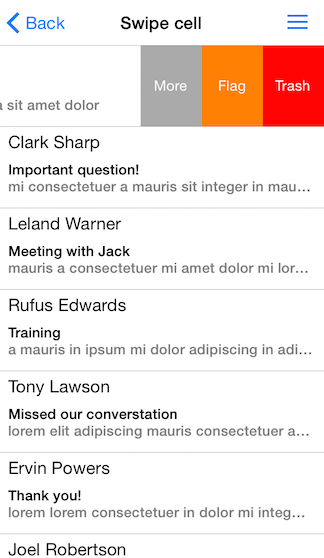

# ListView: Cell swipe gesture


When enabled this feature allows end users to use swipe gesture on cells. When users swipes the content view will move revealing a designated swipe background view where you can place custom views ready for interaction e.g. buttons images etc.



## Enabling cell swipe gesture ##
Use the <code>allowsCellSwipe</code> property to allow the user to perform swipe gesture on cells.

```Objective-C
listView.allowsCellSwipe = YES;
```
```Swift
listView.allowsCellSwipe = true
```
```C#
listView.AllowsCellSwipe = true;
```


## Configuring cell swipe gesture ##
Use the <code>cellSwipeLimits</code>  property to set how far the cell may be swiped.

```Objective-C
listView.cellSwipeLimits = UIEdgeInsetsMake(0, 60, 0, 180);
```
```Swift
listView.cellSwipeLimits = UIEdgeInsetsMake(0, 60, 0, 180)
```
```C#
listView.CellSwipeLimits = new UIEdgeInsets (0, 60, 0, 180);
```

Use the <code>cellSwipeTreshold</code> property to se the minimum distance the user needs to swipe before the gesture is considered effective. If the user swipes bellow the treshold the cell will auto revert to its original state.

```Objective-C
listView.cellSwipeTreshold = 30;
```
```Swift
listView.cellSwipeTreshold = 30
```
```C#
listView.CellSwipeTreshold = 30;
```


Use the <code>cellSwipeAnimationDuration</code> property to set the cell swipe animation duration 

## Responding to swipe interactions##
In order to respond programatically to a swipe gesture performed by user you will need to implement one or more of the following methods from the TKListViewDelegate protocol.
- listView:shouldSwipeCell:atIndexPath:
- listView:didSwipeCell:atIndexPath:withOffset:
- listView:didFinishSwipeCell:atIndexPath:withOffset:

```Objective-C
- (BOOL)listView:(TKListView *)listView shouldSwipeCell:(TKListViewCell *)cell atIndexPath:(NSIndexPath *)indexPath
{
    NSLog(@"Should swipe cell at row:%d in section:%d.", indexPath.row, indexPath.section);
    return YES;
}

- (void)listView:(TKListView *)listView didSwipeCell:(TKListViewCell *)cell atIndexPath:(NSIndexPath *)indexPath withOffset:(CGPoint)offset
{
    NSLog(@"Did swipe cell at row:%d in section:%d.", indexPath.row, indexPath.section);
}

- (void)listView:(TKListView *)listView didFinishSwipeCell:(TKListViewCell *)cell atIndexPath:(NSIndexPath *)indexPath withOffset:(CGPoint)offset
{
    NSLog(@"Did finish swipe cell at row:%d in section:%d.", indexPath.row, indexPath.section);
}
```
```Swift
func listView(listView: TKListView!, shouldSwipeCell cell: TKListViewCell!, atIndexPath indexPath: NSIndexPath!) -> Bool {
    println("Should swipe cell at row:\(indexPath.row) in section:\(indexPath.section).")
    return true
}
    
func listView(listView: TKListView!, didSwipeCell cell: TKListViewCell!, atIndexPath indexPath: NSIndexPath!, withOffset offset: CGPoint) {
    println("Did swipe cell at row:\(indexPath.row) in section:\(indexPath.section).")
}
    
func listView(listView: TKListView!, didFinishSwipeCell cell: TKListViewCell!, atIndexPath indexPath: NSIndexPath!, withOffset offset: CGPoint) {
    println("Did finish swipe cell at row:\(indexPath.row) in section:\(indexPath.section).")
}
```
```C#
public override bool ShouldSwipeCell (TKListView listView, TKListViewCell cell, NSIndexPath indexPath)
{
	Console.WriteLine ("Should swipe cell at row:{0} in section:{1}.", indexPath.Row, indexPath.Section);
	return true;
}

public override void DidSwipeCell (TKListView listView, TKListViewCell cell, NSIndexPath indexPath, CGPoint offset)
{
	Console.WriteLine ("Did swipe cell at row:{0} in section:{1}.", indexPath.Row, indexPath.Section);
}

public override void DidFinishSwipeCell (TKListView listView, TKListViewCell cell, NSIndexPath indexPath, CGPoint offset)
{
	Console.WriteLine ("Did finish swipe cell at row:{0} in section:{1}.", indexPath.Row, indexPath.Section);
}
```