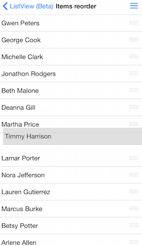

# ListView: Reordering

TKListView supports cells reordering. When reordering is enabled a drag handle appears in each cell. Using this handle cells can be dragged thus changing the order of items.


## Enable cell reorder ##
Use the <code>allowsCellReorder</code> property to enable user to reorder cells. When reordering is allowed cells will display a draggable reorder handle as a visual hint.
```Objective-C

    _listView.allowsCellReorder = YES;
```
```Swift

self.listView.allowsCellReorder = true

```
```C#

this.listView.AllowsCellReorder = true;
```
## Responding to cell reorder interaction ##

After the user performs a reorder gesture the following delegate method from the TKListViewDelegate protocol will be called - listView:didReorderItemFromIndexPath:toIndexPath:

This is the place where you get information which item was reordered from what position and to what position. There you need to reorder your source data. 

```Objective-C

    -(void) listView:(TKListView *)listView didReorderItemFromIndexPath:(NSIndexPath *)originalIndexPath toIndexPath:(NSIndexPath *)targetIndexPath{
    NSLog(@"Item moved to section: %d, Row: %d", targetIndexPath.section, targetIndexPath.row);
    }   
```

```Swift

func listView(listView: TKListView!, didReorderItemFromIndexPath originalIndexPath: NSIndexPath!, toIndexPath targetIndexPath: NSIndexPath!) {
       NSLog("Item moved to section:\(targetIndexPath.section) row: \(targetIndexPath.row)")
    }

```

*In case you are using TKDataSource you may set it as delegate for TKListView. With such setup you will not need to reorder your data manually .TKDataSource will handle that for you.

```Objective-C

  _listView.dataSource = _dataSource;
  _dataSource.allowItemsReorder = YES;
```

```Swift

 self.listView.dataSource = self.dataSource
 self.dataSource.allowItemsReorder = true
``` 

```C#

this.listView.WeakDelegate = this.dataSource;
this.dataSource.AllowItemsReorder = true;
```

