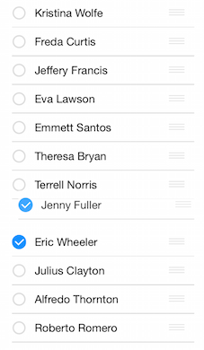

# ListView: Getting Started

This quick start tutorial demonstrates how to create a simple iOS application with <code>TKListView</code>.


## Prerequisites

In order to start using <code>TKListView</code>, you have first to install the latest version Telerik UI for iOS. You can download it from: [http://www.telerik.com/download/ios-ui](http://www.telerik.com/download/ios-ui). The file that you should download is the installation package - Telerik UI for iOS.pkg. Just double click the package icon and the installer will guide you trough the installation process. When done, it will open the newly created folder in your Documents folder. This folder contains everything necessary in order to start using <code>TKListView</code>.


## Setting up the project

After installing Telerik UI, you can proceed with the following steps:

<ol>
    <li>Open Xcode and choose <i>"Create a new Xcode project"</i>.</li>
    <li>Choose <i>"Single View Application"</i> from the <i>"Choose a template for your new project"</i> dialog.</li>
    <li>Give your project a name and click <i>Next</i>.</li>
    <li>Complete the process of creating a project by specifying the location for your project and clicking <i>Create</i>.</li>
    <li>Scroll down to the <i>Linked Frameworks and Libraries</i> section in your project settings and click on the <i>"+"</i> button. <br/>
    </li>
    <li>Type <i>telerik</i> in the popup, select the <i>TelerikUI.framework</i> and click <i>Add</i>. <br/>
    </li>
    <li>This is it, now you are ready to start working with Telerik Chart.</li>
</ol>

## Setting up TKListView

Now that our project is created and the TelerikUI.framework is added, we can start referencing and using the TelerikUI types:

Open your <code>ViewController.m</code> file and add a reference to Telerik UI header file:

    #import <TelerikUI/TelerikUI.h>

If you are writing Swift, add the same line in your bridging header.

Type the following code in <code>viewDidLoad</code> method of your view controller:

```Objective-C
    [super viewDidLoad];
    _sampleArrayOfStrings =@[@"Kristina Wolfe",@"Freda Curtis",@"Jeffery Francis",@"Eva Lawson",@"Emmett Santos", @"Theresa	Bryan", @"Jenny Fuller", @"Terrell Norris", @"Eric Wheeler", @"Julius Clayton", @"Alfredo Thornton", @"Roberto Romero",@"Orlando Mathis",@"Eduardo Thomas",@"Harry Douglas"];
    
    _dataSource = [[TKDataSource alloc] initWithArray:_sampleArrayOfStrings];
    
    TKListView *_listView = [[TKListView alloc] initWithFrame: CGRectMake(20, 20, self.view.bounds.size.width-40,self.view.bounds.size.height-40)];
    _listView.autoresizingMask = UIViewAutoresizingFlexibleWidth | UIViewAutoresizingFlexibleHeight;
    _listView.dataSource = _dataSource;
    
    [self.view addSubview:_listView];
```
```Swift
        super.viewDidLoad()
        self.sampleArrayOfStrings = ["Kristina Wolfe","Freda Curtis","Jeffery Francis","Eva Lawson","Emmett Santos", "Theresa Bryan", "Jenny Fuller", "Terrell Norris", "Eric Wheeler", "Julius Clayton", "Alfredo Thornton", "Roberto Romero","Orlando Mathis","Eduardo Thomas","Harry Douglas"]
        dataSource = TKDataSource(array:sampleArrayOfStrings)
        let listView = TKListView(frame: CGRectMake(20, 20, self.view.bounds.size.width-40,self.view.bounds.size.height-40))
        listView.dataSource = dataSource
        self.view.addSubview(listView)
```


This code prepares a small array of sample data to be presented in <code>TKListView</code>. Then we create an instance of the TKDataSourceClass. We use that instance to feed our data to <code>TKListVIew</code>. We create a new instance of <code>TKListView</code> and add it as a subview of the ViewController's main view. The <code>autoresizingMask</code> property is set in order to allow correct resizing of the list view  when the device is rotated in landscape mode.So far we have got the following view: 


Now lets enable multiple selectioon: 

```Objective-C
	_listView.allowsMultipleSelection = YES;
```

```Swift
	listView.allowsMultipleSelection = true
```

After runnuing this samlple code we may try to select a few items such as:


Adding a single line of code should allow the user to reorder items by dragging a handle.

```Objective-C
	_listView.allowsCellReorder = YES;
```

```Swift
	listView.allowsCellReorder = true;
```



And here is the full code of our view controller 

```Objective-C
#import "ViewController.h"
#import <TelerikUI/TelerikUI.h>

@implementation ViewController
{
    NSArray *_sampleArrayOfStrings;
    TKDataSource *_dataSource;
}
- (void)viewDidLoad
{
    [super viewDidLoad];
    
    _sampleArrayOfStrings =@[@"Kristina Wolfe",@"Freda Curtis",@"Jeffery Francis",@"Eva Lawson",@"Emmett Santos", @"Theresa	Bryan", @"Jenny Fuller", @"Terrell Norris", @"Eric Wheeler", @"Julius Clayton", @"Alfredo Thornton", @"Roberto Romero",@"Orlando Mathis",@"Eduardo Thomas",@"Harry Douglas"];
    
    _dataSource = [[TKDataSource alloc] initWithArray:_sampleArrayOfStrings];
    
    TKListView *_listView = [[TKListView alloc] initWithFrame: CGRectMake(20, 20, self.view.bounds.size.width-40,self.view.bounds.size.height-40)];
    _listView.autoresizingMask = UIViewAutoresizingFlexibleWidth | UIViewAutoresizingFlexibleHeight;
    _listView.dataSource = _dataSource;
    _listView.allowsMultipleSelection = YES;
    _listView.allowsCellReorder = YES;
    [self.view addSubview:_listView];
}
```

```Swift
class ViewController: UIViewController {
    var dataSource: TKDataSource?
    var sampleArrayOfStrings: NSArray = []
    override func viewDidLoad() {
        super.viewDidLoad()
        self.sampleArrayOfStrings = ["Kristina Wolfe","Freda Curtis","Jeffery Francis","Eva Lawson","Emmett Santos", "Theresa Bryan", "Jenny Fuller", "Terrell Norris", "Eric Wheeler", "Julius Clayton", "Alfredo Thornton", "Roberto Romero","Orlando Mathis","Eduardo Thomas","Harry Douglas"]
        dataSource = TKDataSource(array:sampleArrayOfStrings)
        let listView = TKListView(frame: CGRectMake(20, 20, self.view.bounds.size.width-40,self.view.bounds.size.height-40))
        listView.dataSource = dataSource
        listView.allowsMultipleSelection = true
        listView.allowsCellReorder = true;
        self.view.addSubview(listView)
    }
}
```


