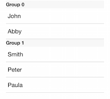

# ListView: Grouping 
ListView may be set up to display items in groups divided visually by section headers and footers.
There are two ways to implement grouping with TKListView - manually implementing the required methods of the TKListViewDataSource delegate or using TKDataSource and let it do the dirty work for you.



## Displaying grouped data using TKDataSource##

In case you need more flexibility you may implement grouping manualy as follows.

```Objective-C
- (void)viewDidLoad
{
    [super viewDidLoad];
    
    NSMutableArray *items = [NSMutableArray new];
    [items addObject:[[DataSourceItem alloc] initWithName:@"John" value:50 group:@"A"]];
    [items addObject:[[DataSourceItem alloc] initWithName:@"Abby" value:33 group:@"A"]];
    [items addObject:[[DataSourceItem alloc] initWithName:@"Smith" value:42 group:@"B"]];
    [items addObject:[[DataSourceItem alloc] initWithName:@"Peter" value:28 group:@"B"]];
    [items addObject:[[DataSourceItem alloc] initWithName:@"Paula" value:25 group:@"B"]];
    
    dataSource = [TKDataSource new];
    dataSource.itemSource = items;
    [dataSource groupWithKey:@"group"];
    dataSource.displayKey = @"name";

    TKListView *_listView = [[TKListView alloc] initWithFrame: CGRectMake(20, 20, self.view.bounds.size.width-40,self.view.bounds.size.height-40)];
    _listView.dataSource = dataSource;
    TKListViewLinearLayout *layout = (TKListViewLinearLayout*)_listView.layout;
    layout.headerReferenceSize = CGSizeMake(200, 22);

    [self.view addSubview:_listView];
}
```
```Swift
var dataSource: TKDataSource?

override func viewDidLoad() {
    super.viewDidLoad()
    var items = [DataSourceItem]()
    items.append(DataSourceItem(name: "John", value: 50, group: "A"))
    items.append(DataSourceItem(name: "Abby", value: 33, group: "A"))
    items.append(DataSourceItem(name: "Smith", value: 42, group: "B"))
    items.append(DataSourceItem(name: "Peter", value: 28, group: "B"))
    items.append(DataSourceItem(name: "Paula", value: 25, group: "B"))

    dataSource = TKDataSource()
    dataSource?.itemSource = items
    dataSource?.groupWithKey("group")
    dataSource?.displayKey = "name"
    let listView = TKListView(frame: CGRectMake(20, 20, self.view.bounds.size.width-40,self.view.bounds.size.height-40))        
    listView.dataSource = dataSource
    let layout = listView.layout as! TKListViewLinearLayout
    layout.headerReferenceSize = CGSizeMake(200, 22)
    self.view.addSubview(listView)
}
```
```C#
NSMutableArray items = new NSMutableArray ();
items.Add (new DSItem ("John", 50f, "A"));
items.Add (new DSItem ("Abby", 33f, "A"));
items.Add (new DSItem ("Smith", 42f, "B"));
items.Add (new DSItem ("Peter", 28f, "B"));
items.Add (new DSItem ("Paula", 25f, "B"));

this.dataSource = new TKDataSource ();
this.dataSource.ItemSource = items;
this.dataSource.GroupWithKey ("Group");
dataSource.DisplayKey = "Name";

TKListView listView = new TKListView (new CGRect (20, 20, this.View.Bounds.Size.Width - 40, this.View.Bounds.Size.Height - 40));
listView.WeakDataSource = dataSource;
listView.Layout.HeaderReferenceSize = new CGSize (200, 22);
this.View.AddSubview (listView);
```
## Displaying grouped data using a TKListViewDataSource delegate methods ##

```Objective-C
- (void)viewDidLoad
{
    [super viewDidLoad];
    
    _groups= @[@[@"John",@"Abby"],@[@"Smith",@"Peter",@"Paula"]];
    

    TKListView *_listView = [[TKListView alloc] initWithFrame: CGRectMake(20, 20, self.view.bounds.size.width-40,self.view.bounds.size.height-40)];
    [_listView registerClass:[TKListViewCell class] forCellWithReuseIdentifier:@"cell"];
    
    [_listView registerClass:[TKListViewHeaderCell class] forSupplementaryViewOfKind:TKListViewElementKindSectionHeader withReuseIdentifier:@"header"];
    _listView.dataSource = self;
    _listView.layout.headerReferenceSize = CGSizeMake(200, 22);

    [self.view addSubview:_listView];
}

-(NSInteger) numberOfSectionsInListView:(TKListView *)listView
{
    return _groups.count;
}

-(NSInteger) listView:(TKListView *)listView numberOfItemsInSection:(NSInteger)section
{
    return ((NSArray*)_groups[section]).count;
}

-(TKListViewCell*) listView:(TKListView *)listView cellForItemAtIndexPath:(NSIndexPath *)indexPath
{
    TKListViewCell *cell = [listView dequeueReusableCellWithReuseIdentifier:@"cell" forIndexPath:indexPath];
    cell.textLabel.text = _groups[indexPath.section][indexPath.row];
    
    return cell;
}

-(TKListViewReusableCell*) listView:(TKListView *)listView viewForSupplementaryElementOfKind:(NSString *)kind atIndexPath:(NSIndexPath *)indexPath
{
    TKListViewReusableCell *headerCell = [listView dequeueReusableSupplementaryViewOfKind:kind withReuseIdentifier:@"header" forIndexPath:indexPath];
    headerCell.textLabel.text = [NSString stringWithFormat:@"Group %li",indexPath.section];
    return headerCell;
}

```
```Swift
let groups = [["John","Abby"],["Smith","Peter","Paula"]]
override func viewDidLoad() {
    super.viewDidLoad()
    
    let groups = [["John","Abby"],["Smith","Peter","Paula"]]
    let listView = TKListView(frame: CGRectMake(20, 20, self.view.bounds.size.width-40,self.view.bounds.size.height-40))
    listView.registerClass(TKListViewCell.self, forCellWithReuseIdentifier: "cell")
    listView.registerClass(TKListViewHeaderCell.self, forSupplementaryViewOfKind: TKListViewElementKindSectionHeader, withReuseIdentifier: "header")
    listView.dataSource = self
    listView.layout.headerReferenceSize = CGSizeMake(200, 22)
    self.view.addSubview(listView)
}
    
func numberOfSectionsInListView(listView: TKListView!) -> Int {
    return groups.count
}

func listView(listView: TKListView!, numberOfItemsInSection section: Int) -> Int {
    return groups[section].count
}

func listView(listView: TKListView!, cellForItemAtIndexPath indexPath: NSIndexPath!) -> TKListViewCell! {
	let cell = listView.dequeueReusableCellWithReuseIdentifier("cell", forIndexPath: indexPath) as! TKListViewCell
    cell.textLabel.text = groups[indexPath.section][indexPath.row]
        
    return cell
}
    
func listView(listView: TKListView!, viewForSupplementaryElementOfKind kind: String!, atIndexPath indexPath: NSIndexPath!) -> TKListViewReusableCell! {
	let headerCell = listView.dequeueReusableSupplementaryViewOfKind(TKListViewElementKindSectionHeader, withReuseIdentifier: "header", forIndexPath: indexPath) as! TKListViewHeaderCell
	headerCell.textLabel.text = "Group \(indexPath.section)"
	
	return headerCell
}
```
```C#
groups = new NSMutableArray ();
groups.Add (NSArray.FromStrings (new string[] { "John", "Abby" }));
groups.Add(NSArray.FromStrings (new string[] { "Smith", "Peter", "Paula" }));

TKListView listView = new TKListView (new CGRect (20, 20, this.View.Bounds.Size.Width - 40, this.View.Bounds.Size.Height - 40));
listView.RegisterClassForCell (new Class (typeof(TKListViewCell)), "cell");

listView.RegisterClassForSupplementaryView (new Class (typeof(TKListViewHeaderCell)), TKListViewElementKindSectionKey.Header, new NSString("header"));
listView.DataSource = new ListViewDataSource (this);
listView.Layout.HeaderReferenceSize = new CGSize (200, 22);

this.View.AddSubview (listView);

class ListViewDataSource : TKListViewDataSource
{
	ListViewGroups owner;

	public ListViewDataSource (ListViewGroups owner)
	{
		this.owner = owner;
	}

	public override int NumberOfSectionsInListView (TKListView listView)
	{
		return (int)this.owner.groups.Count;
	}

	public override int NumberOfItemsInSection (TKListView listView, int section)
	{
		return (int)this.owner.groups.GetItem<NSArray>((uint)section).Count;
	}

	public override TKListViewCell CellForItem (TKListView listView, NSIndexPath indexPath)
	{
		TKListViewCell cell = listView.DequeueReusableCell("cell", indexPath) as TKListViewCell;
		cell.TextLabel.Text = this.owner.groups.GetItem<NSArray> ((uint)indexPath.Section).GetItem<NSString> ((uint)indexPath.Row);
		return cell;
	}

	public override TKListViewReusableCell ViewForSupplementaryElementOfKind (TKListView listView, NSString kind, NSIndexPath indexPath)
	{
		TKListViewReusableCell headerCell = listView.DequeueReusableSupplementaryView(kind, "header", indexPath) as TKListViewReusableCell;
		headerCell.TextLabel.Text = String.Format ("Group {0}", indexPath.Section);
		return headerCell;
	}
}
```
