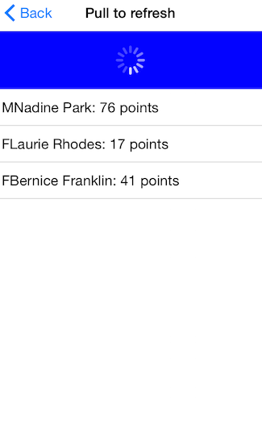

# ListView: Pull to refresh

TKListView may be refreshed by a pull-to-refresh gesture. If enabled the feature allows the user to refresh data by swiping his finger down when the content is scrolled up to the top. This will trigger an animated activity indicator which will stay visible until data is refreshed.




## Allowing pull to refresh##
Use the <code>allowsPullToRefresh</code> property  to enable the feature.

```Objective-C
listView.allowsPullToRefresh = YES;
```

```Swift
listView.allowsPullToRefresh = true
```

```C#
listView.AllowsPullToRefresh = true;
```

## Responding to the pull to refresh gesture##
To be able to respond to the pull-to-refresh gesture you will need to implement the <code>listViewShouldRefreshOnPull:</code method from the <code>TKListViewDelegate</code>protocol. After fresh data is available you will need notify TKListView by calling the <code>didRefreshOnPull</code> method.Calling this method will allow TKListView to hide the activity indicator and display the fresh data. 

```Objective-C
- (BOOL)listViewShouldRefreshOnPull:(TKListView *)listView
{
	// call logic to update the data here. After data is updated notify the listview
	// by calling     [listView didRefreshOnPull];
	
    return YES; //return NO here if no more data is available.
}
```

```Swift
func listViewShouldRefreshOnPull(listView: TKListView!) -> Bool {
        
    // call logic to update the data here. After data is updated notify the listview
	// by calling     listView.didRefreshOnPull()
	
    return true //return false here if no more data is available.
}
```

```C#
public override bool ListViewShouldRefreshOnPull (TKListView listView)
{
	// call logic to update the data here. After data is updated notify the listview
	// by calling     listView.DidRefreshOnPull();

	return true; //return false here if no more data is available.
}
```


