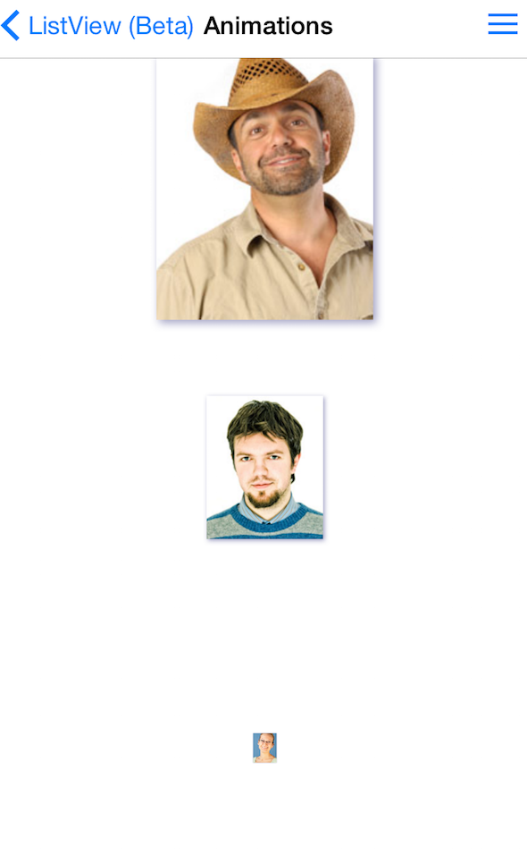

# ListView: Scroll animations

TKListView may animate items on scrolling. It provides several animations effects for items appearing in the viewport while user scrolls - fade-in, slide-in, scale-in. Those can be combined.



## Adding animation behavior for cells 


To add animation behavior for cells use the <code>TKListViewCellAppearBehavior</code> property. 

```Objective-C

	 _listView.cellAppearBehavior = [[TKListViewCellScaleInBehavior alloc] init];
```

```Swift

 self.listView.cellAppearBehavior = TKListViewCellAppearBehavior()
```

```C#

this.listView.CellAppearBehavior = new TKListViewCellScaleInBehavior ();
```


## Combining cell animation behaviors 
Animation behaviors may be combined as follows : 

```Objective-C

	_listView.cellAppearBehavior = [[TKListViewCellFadeInBehavior alloc] init];
    [_listView.cellAppearBehavior addChildBehavior:[[TKListViewCellScaleInBehavior alloc] init]];
```

```Swift

  self.listView.cellAppearBehavior = TKListViewCellFadeInBehavior()
        self.listView.cellAppearBehavior.addChildBehavior(TKListViewCellScaleInBehavior())
```

```C#

this.listView.CellAppearBehavior = new TKListViewCellFadeInBehavior ();
			this.listView.CellAppearBehavior.AddChildBehavior (new TKListViewCellScaleInBehavior ());
```
