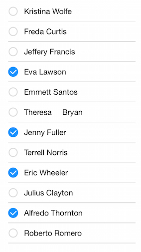

# ListView: Selection

TKListView supports different selection modes and two different gestures to trigger cell selection. Those include:

- Single selection
- Multiple selection
- Selection on press.
- Selection on hold (long press).

Additionaly TKListView provides a few methods to programatically control selection state as well as delegate methods to react to user interactions related to selection.

This article describes the selection API of TKListView in details.

The <code>allowsMultipleSelection</code> property of <code>TKListView</code> allows defines whether the user is allowed to select multiple items at the same time. It also affects the default appearance of selected items.

## Single seletion mode ##


The default value of the <code>allowsMultipleSelection</code> property is <code>NO (false)</code> 

```Objective-C
	_listView.allowsMultipleSelection = NO;
```
```Swift
	listView.allowsMultipleSelection = false
```

## Multiple selection mode##



Set the <code>allowsMultipleSelection</code> property to <code>YES (true)</code> to enable this view:

```Objective-C
_listView.allowsMultipleSelection = YES;
```
```Swift
	listView.allowsMultipleSelection = true	
```

## Selection on press##

By default TKListView will allow user to select on press.

```Objective-C
    _listView.selectionBehavior = TKListViewSelectionBehaviorPress;
```
```Swift
	listView.selectionBehavior = TKListViewSelectionBehavior.Press
```

## Selection on hold (long press)##

In this mode a long-press gesture is required in order to select a cell.

```Objective-C
	_listView.selectionBehavior = TKListViewSelectionBehaviorLongPress;
```
```Swift
	listView.selectionBehavior = TKListViewSelectionBehavior.LongPress
```
## Disable selection##
In order to disable selection you need to set the <code>_listView.selectionBehavior</code> property to  <code>TKListViewSelectionBehaviorNone</code>
```Objective-C
    _listView.selectionBehavior = TKListViewSelectionBehaviorNone;
```
```Swift
	listView.selectionBehavior = TKListViewSelectionBehavior.None
```
## Programatically selecting items##

Cells can be selected programatically as well.

```Objective-C
	NSIndexPath *indexPath = [NSIndexPath indexPathForRow:1 inSection:0];
	[_listView selectItemAtIndexPath:indexPath animated:NO scrollPosition:UICollectionViewScrollPositionNone];
```
```Swift
	let indexPath = NSIndexPath(forRow: 1, inSection: 0)
	listView.selectItemAtIndexPath(indexPath, animated: false, scrollPosition: UICollectionViewScrollPosition.None)
```
## Programatically deselecting items##

To deselected a cell programatically:

```Objective-C
	NSIndexPath *indexPath = [NSIndexPath indexPathForRow:1 inSection:0];
	[_listView deselectItemAtIndexPath:indexPath animated:false];
```
```Swift
	let indexPath = NSIndexPath(forRow: 1, inSection: 0)
	listView.deselectItemAtIndexPath(indexPath, animated: false)
```

## TKListViewDelegate methods

The <code>TKListViewDelegate</code> protocol provides a few handy delegate methods to be used to control and respond to selection events triggered by user. In order to take advantage of these methods you should set the delegate proeprty of <code>TKListView</code> to a class adopting the <code>TKListViewDelegate</code> protocol. For example:

```Objective-C
	//assuming your view controller adopts the TKListViewdelegate protocol
    _listView.delegate = self;
```
```Swift
	//assuming your view controller adopts the TKListViewdelegate protocol
	listView.delegate = self
```
Bellow you can find some details on how you can use the delegate methods from TKListViewDelegate.

## Responding to user triggered cell selection / deselection

If you need to perform a specific action after user selects or deselects a cell you can use the following methods from TKListViewDelegate protocol:

```Objective-C
- (void)listView:(TKListView *)listView didSelectItemAtIndexPath:(NSIndexPath *)indexPath
{
    NSLog(@"Did select item at row: %i in section: %i", indexPath.row,indexPath.section);
}

- (void)listView:(TKListView *)listView didDeselectItemAtIndexPath:(NSIndexPath *)indexPath
{
        NSLog(@"Did deselect item at row: %i in section: %i", indexPath.row,indexPath.section);
}
```
```Swift
func listView(listView: TKListView!, didSelectItemAtIndexPath indexPath: NSIndexPath!) {
	println("Did select item at row: \(indexPath.row )  in section \(indexPath.section)")
	}
    
    func listView(listView: TKListView!, didDeselectItemAtIndexPath indexPath: NSIndexPath!){
    println("Did deselect item at row: \(indexPath.row )  in section \(indexPath.section)")
    }
```


