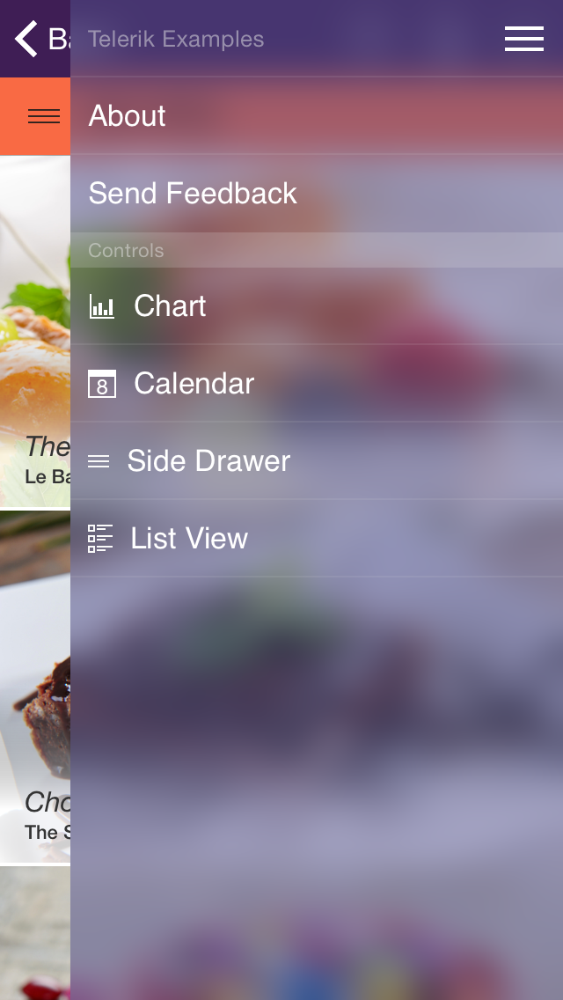

# SideDrawer: Getting Started

This quick start tutorial demonstrates how to create a simple iOS application with <code>TKSideDrawer</code>.



## Prerequisites

This article assumes that you have followed the *Downloading UI for iOS*, *Installing UI for iOS* and *Setting Up the project* steps from [the common Getting Started article](../getting-started).

## Setting up TKSideDrawer with TKSideDrawerController

Now that our project is created and the TelerikUI.framework is added, we can start referencing and using the TelerikUI types:

Open your **ViewController.m** file and add a reference to the TelerikUI header file:

    #import <TelerikUI/TelerikUI.h>

Note that starting with Xcode 6 Apple doesn't generate the precompiled headers file automatically. That is why you should add import the UIKit framework before importing TelerikUI:

    #import <UIKit/UIKit.h>

If you are writing Swift, add the same line in your bridging header.

If you are using Xamarin, add a reference to TelerikUI.dll in your project and use the <code>using</code> directive:

    using TelerikUI;
    
Open the **AppDelegate.h** file and add references to the ViewController and TKSideDrawerController header files:

	#import "ViewController.h"
	#import <TelerikUI/TKSideDrawerController.h>

Type the following code in your <code>AppDelegate</code> implementation class, replacing the didFinishLaunchingWithOptions method (FinishedLaunching for C#):

```Objective-C
@implementation AppDelegate

	- (BOOL)application:(UIApplication *)application didFinishLaunchingWithOptions:(NSDictionary *)launchOptions
	{
	    // Override point for customization after application launch.
	    
	      //For the SideDrawer GettingStarted
	//    SideDrawerGettingStarted *main = [[SideDrawerGettingStarted alloc] init];
	//    TKSideDrawerController *sideDrawerController = [[TKSideDrawerController alloc] initWithContent:main];
	//    [self.window setRootViewController:sideDrawerController];

	    return YES;
	}

	//..
@end
```
```Swift
class AppDelegate: UIResponder, UIApplicationDelegate {
                            
    var window: UIWindow?

    func application(application: UIApplication, didFinishLaunchingWithOptions launchOptions: [NSObject : AnyObject]?) -> Bool {
        // Override point for customization after application launch.
        
        let sideDrawerGettingStarted = SideDrawerGettingStartedViewController()
        let sideDrawerController = TKSideDrawerController(content: sideDrawerGettingStarted)
        self.window?.rootViewController = sideDrawerController
        
        return true
    }

    //..
}
```
```C#
[Register ("AppDelegate")]
public partial class AppDelegate : UIApplicationDelegate
{
	// class-level declarations
	
	public override UIWindow Window {
		get;
		set;
	}

	public override bool FinishedLaunching (UIApplication application, NSDictionary launchOptions)
	{
		SideDrawerGettingStarted main = new SideDrawerGettingStarted ();
		TKSideDrawerController sideDrawerController = new TKSideDrawerController (main);
		this.Window.RootViewController = sideDrawerController;

		return true;
	}

	//..
}
```

This code creates an instance of <code>TKSideDrawerController</code> and sets it as a root view controller. <code>TKSideDrawerController</code> is a containter controller that has an <code>TKSideDrawer</code> instance embedded inside. The instance is then used by the content controllers of the TKSideDrawerController.

The next step is to add UINavigationBar, and items to our SideDrawer. You can get the <code>TKSideDrawer</code> instance from the <code>TKSideDrawerController</code> using the <code>sideDrawer</code> property. 

Or, instead of using the <code>sideDrawer</code> property, you can call the <code>TKSideDrawer</code> class method <code>findSideDrawerForViewController:</code> (especially useful and necessary for the C# implementation).

Type the following code in the <code>viewDidLoad</code> method of the content controller:

```Objective-C
@implementation SideDrawerGettingStarted
{
}

- (void)viewDidLoad {
    [super viewDidLoad];
    
    self.view.backgroundColor = [UIColor grayColor];
    
    UINavigationBar *navBar = [[UINavigationBar alloc] initWithFrame:CGRectMake(0, 0, self.view.frame.size.width, 64)];
    UINavigationItem *navItem = [[UINavigationItem alloc] initWithTitle:@"Getting Started"];
    UIBarButtonItem *showSideDrawerButton = [[UIBarButtonItem alloc] initWithTitle:@"Show"  style:UIBarButtonItemStylePlain target:self action:@selector(showSideDrawer)];
    navItem.leftBarButtonItem = showSideDrawerButton;
    navBar.items = @[navItem];
    [self.view addSubview:navBar];
    
    TKSideDrawerSection *sectionPrimary = [self.sideDrawer addSectionWithTitle:@"Primary"];
    [sectionPrimary addItemWithTitle:@"Social"];
    [sectionPrimary addItemWithTitle:@"Promotions"];
    
    TKSideDrawerSection *sectionLabels = [self.sideDrawer addSectionWithTitle:@"Labels"];
    [sectionLabels addItemWithTitle:@"Important"];
    [sectionLabels addItemWithTitle:@"Starred"];
    [sectionLabels addItemWithTitle:@"Sent Mail"];
    [sectionLabels addItemWithTitle:@"Drafts"];
}

- (void)showSideDrawer
{
    [self.sideDrawer show];
}

- (void)didReceiveMemoryWarning {
    [super didReceiveMemoryWarning];
    // Dispose of any resources that can be recreated.
}

@end

```
```Swift
class SideDrawerGettingStartedViewController: UIViewController {
    
    override func viewDidLoad() {
        super.viewDidLoad()
        
        self.view.backgroundColor = UIColor.grayColor()
        
        let navBar = UINavigationBar(frame: CGRectMake(0, 0, self.view.frame.size.width, 64))
        let navItem = UINavigationItem(title: "Getting Started")
        let showSideDrawerButton = UIBarButtonItem(title: "Show", style: UIBarButtonItemStyle.Plain, target: self, action: "showSideDrawer")
        navItem.leftBarButtonItem = showSideDrawerButton
        navBar.items = [navItem]
        self.view.addSubview(navBar)
        
        let sectionPrimary = self.sideDrawer.addSectionWithTitle("Primary")
        sectionPrimary.addItemWithTitle("Social")
        sectionPrimary.addItemWithTitle("Promotions")

        let sectionLabels = self.sideDrawer.addSectionWithTitle("Primary")
        sectionLabels.addItemWithTitle("Social")
        sectionLabels.addItemWithTitle("Promotions")
        sectionLabels.addItemWithTitle("Sent Mail")
        sectionLabels.addItemWithTitle("Drafts")
    }
    
    func showSideDrawer() {
        self.sideDrawer.show()
    }

    override func didReceiveMemoryWarning() {
        super.didReceiveMemoryWarning()
        // Dispose of any resources that can be recreated.
    }
}
```
```C#
public class SideDrawerGettingStarted : UIViewController
{
	TKSideDrawer SideDrawer;

	public override void ViewDidLoad ()
	{
		base.ViewDidLoad ();

		this.View.BackgroundColor = UIColor.Gray;

		UINavigationBar navBar = new UINavigationBar (new CGRect (0, 0, this.View.Frame.Size.Width, 64));
		UINavigationItem navItem = new UINavigationItem ("Getting Started");
		UIBarButtonItem showSideDrawerButton = new UIBarButtonItem ("Show", UIBarButtonItemStyle.Plain, this, new Selector ("ShowSideDrawer"));
		navItem.LeftBarButtonItem = showSideDrawerButton;
		navBar.Items = new UINavigationItem[]{ navItem };
		this.View.AddSubview (navBar);

		this.SideDrawer = TKSideDrawer.FindSideDrawer (this);
		TKSideDrawerSection sectionPrimary = this.SideDrawer.AddSection ("Primary");
		sectionPrimary.AddItem ("Social");
		sectionPrimary.AddItem ("Promotions");

		TKSideDrawerSection sectionLabels = this.SideDrawer.AddSection ("Labels");
		sectionLabels.AddItem ("Important");
		sectionLabels.AddItem ("Starred");
		sectionLabels.AddItem ("Sent Mail");
		sectionLabels.AddItem ("Drafts");
	}

	[Export ("ShowSideDrawer")]
	public void ShowSideDrawer ()
	{
		this.SideDrawer.Show ();
	}
}
```

## Attaching TKSideDrawer to UIViewController

<code>TKSideDrawer</code> can be attached to your view controllers without <code>TKSideDrawerController</code>. In such a scenario, you should initialize <code>TKSideDrawerView</code> that should be added as subview to your UIViewController's view and use its <code>mainView</code> property to set up the content of the view.

```Objective-C
@implementation SideDrawerGettingStarted
{
    TKSideDrawerView *_sideDrawerView;
}

- (void)viewDidLoad {
    [super viewDidLoad];
    
    _sideDrawerView = [[TKSideDrawerView alloc] initWithFrame:self.view.bounds];
    [self.view addSubview:_sideDrawerView];
    
    self.view.backgroundColor = [UIColor grayColor];
    
    UINavigationBar *navBar = [[UINavigationBar alloc] initWithFrame:CGRectMake(0, 0, self.view.frame.size.width, 64)];
    UINavigationItem *navItem = [[UINavigationItem alloc] initWithTitle:@"Getting Started"];
    UIBarButtonItem *showSideDrawerButton = [[UIBarButtonItem alloc] initWithTitle:@"Show"  style:UIBarButtonItemStylePlain target:self action:@selector(showSideDrawer)];
    navItem.leftBarButtonItem = showSideDrawerButton;
    navBar.items = @[navItem];
    [_sideDrawerView.mainView addSubview:navBar];
    
    TKSideDrawerSection *sectionPrimary = [_sideDrawerView.sideDrawer addSectionWithTitle:@"Primary"];
    [sectionPrimary addItemWithTitle:@"Social"];
    [sectionPrimary addItemWithTitle:@"Promotions"];
    
    TKSideDrawerSection *sectionLabels = [_sideDrawerView.sideDrawer addSectionWithTitle:@"Labels"];
    [sectionLabels addItemWithTitle:@"Important"];
    [sectionLabels addItemWithTitle:@"Starred"];
    [sectionLabels addItemWithTitle:@"Sent Mail"];
    [sectionLabels addItemWithTitle:@"Drafts"];
}

- (void)showSideDrawer
{
    [_sideDrawerView.sideDrawer show];
}

- (void)didReceiveMemoryWarning {
    [super didReceiveMemoryWarning];
    // Dispose of any resources that can be recreated.
}

@end
```

```Swift
class SideDrawerGettingStartedViewController: UIViewController {

    var sideDrawerView: TKSideDrawerView? = nil
    
    override func viewDidLoad() {
        super.viewDidLoad()
        
        self.view.backgroundColor = UIColor.grayColor()
        
        sideDrawerView = TKSideDrawerView(frame: self.view.bounds)
        self.view.addSubview(sideDrawerView!)
        
        let navBar = UINavigationBar(frame: CGRectMake(0, 0, self.view.frame.size.width, 64))
        let navItem = UINavigationItem(title: "Getting Started")
        let showSideDrawerButton = UIBarButtonItem(title: "Show", style: UIBarButtonItemStyle.Plain, target: self, action: "showSideDrawer")
        navItem.leftBarButtonItem = showSideDrawerButton
        navBar.items = [navItem]
        sideDrawerView!.mainView.addSubview(navBar)
        
        let sectionPrimary = sideDrawerView!.sideDrawer.addSectionWithTitle("Primary")
        sectionPrimary.addItemWithTitle("Social")
        sectionPrimary.addItemWithTitle("Promotions")
        
        let sectionLabels = sideDrawerView!.sideDrawer.addSectionWithTitle("Labels")
        sectionLabels.addItemWithTitle("Social")
        sectionLabels.addItemWithTitle("Promotions")
        sectionLabels.addItemWithTitle("Sent Mail")
        sectionLabels.addItemWithTitle("Drafts")
    }

    func showSideDrawer() {
        self.sideDrawerView!.sideDrawer.show()
    }

    override func didReceiveMemoryWarning() {
        super.didReceiveMemoryWarning()
        // Dispose of any resources that can be recreated.
    }
}
```

```C#
public class SideDrawerGettingStarted : UIViewController
{
	TKSideDrawerView sideDrawerView;

	public override void ViewDidLoad ()
	{
		base.ViewDidLoad ();

		this.View.BackgroundColor = UIColor.Gray;

		sideDrawerView = new TKSideDrawerView (this.View.Bounds);
		this.View.AddSubview (sideDrawerView);

		UINavigationBar navBar = new UINavigationBar (new CGRect (0, 0, this.View.Frame.Size.Width, 64));
		UINavigationItem navItem = new UINavigationItem ("Getting Started");
		UIBarButtonItem showSideDrawerButton = new UIBarButtonItem ("Show", UIBarButtonItemStyle.Plain, this, new Selector ("ShowSideDrawer"));
		navItem.LeftBarButtonItem = showSideDrawerButton;
		navBar.Items = new UINavigationItem[]{ navItem };
		sideDrawerView.MainView.AddSubview (navBar);

		TKSideDrawerSection sectionPrimary = sideDrawerView.SideDrawer.AddSection ("Primary");
		sectionPrimary.AddItem ("Social");
		sectionPrimary.AddItem ("Promotions");

		TKSideDrawerSection sectionLabels = sideDrawerView.SideDrawer.AddSection ("Labels");
		sectionLabels.AddItem ("Important");
		sectionLabels.AddItem ("Starred");
		sectionLabels.AddItem ("Sent Mail");
		sectionLabels.AddItem ("Drafts");
	}

	[Export ("ShowSideDrawer")]
	public void ShowSideDrawer ()
	{
		this.sideDrawerView.SideDrawer.Show ();
	}
}
```
