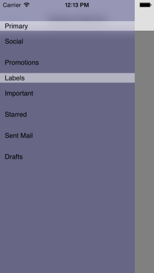
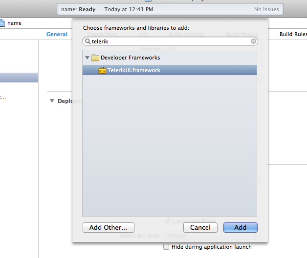

# SideDrawer: Getting Started

This quick start tutorial demonstrates how to create a simple iOS application with <code>TKSideDrawer</code>.



## Prerequisites

In order to start using <code>TKSideDrawer</code>, you have to first install the latest version of Telerik UI for iOS. You can download it from: [http://www.telerik.com/download/ios-ui](http://www.telerik.com/download/ios-ui). The file that you should download is the installation package - Telerik UI for iOS.pkg. Just double click the package icon and the installer will guide you through the installation process. When done, it will open the newly created folder in your Documents folder. This folder contains everything necessary in order to start using <code>TKSideDrawer</code>.


## Setting up the project

After installing Telerik UI, you can proceed with the following steps:

<ol>
    <li>Open Xcode and choose <i>"Create a new Xcode project"</i>.</li>
    <li>Choose <i>"Single View Application"</i> from the <i>"Choose a template for your new project"</i> dialog.</li>
    <li>Give your project a name and click <i>Next</i>.</li>
    <li>Complete the process of creating a project by specifying the location for your project and clicking <i>Create</i>.</li>
    <li>Scroll down to the <i>Linked Frameworks and Libraries</i> section in your project settings and click on the <i>"+"</i> button. <br/>
    </li>
    <li>Type <i>telerik</i> in the popup, select the <i>TelerikUI.framework</i> and click <i>Add</i>. <br/>
    </li>
    <li>This is it, now you are ready to start working with Telerik Chart.</li>
</ol>

## Setting up TKSideDrawer with TKSideDrawerController

Now that our project is created and the TelerikUI.framework is added, we can start referencing and using the TelerikUI types:

Open your **ViewController.m** file and add a reference to the chart header file:

    #import <TelerikUI/TelerikUI.h>

If you are writing Swift, add the same line in your bridging header.

If you are using Xamarin, add a reference to TelerikUI.dll in your project and use the <code>using</code> directive:

    using TelerikUI;
    
Type the following code in your **AppDelegate.m** <code>application:didFinishLaunchingWithOptions</code> method:

```Objective-C
	ViewController *main = [[ViewController alloc] init];
    TKSideDrawerController *sideDrawerController = [[TKSideDrawerController alloc] initWithContent:main];
    [self.window setRootViewController:sideDrawerController];
```
```Swift
	let main = ViewController()
	let sideDrawerController = TKSideDrawerController(content: main)
    self.window?.rootViewController = sideDrawerController
```
```C#
	ViewController main = new ViewController ();
	TKSideDrawerController sideDrawerController = new TKSideDrawerController (main);
	this.Window.RootViewController = sideDrawerController;
```

This code creates an instance of <code>TKSideDrawerController</code> and sets it as a root view controller. <code>TKSideDrawerController</code> is a containter controller that has an <code>TKSideDrawer</code> instance embedded inside. The instance is then used by the content controllers of the TKSideDrawerController.

The next step is to add items to our side drawer. You can get the <code>TKSideDrawer</code> instance from the <code>TKSideDrawerController</code> using the <code>sideDrawer</code> property. This property is exposed at a special <code>UIViewController</code> category serving the <code>TKSideDrawer</code> purposes. 

Or, instead of using the <code>sideDrawer</code> property, you can call the <code>TKSideDrawer</code> class method <code>findSideDrawerForViewController:</code>.

Type the following code in the <code>viewDidLoad</code> method of the content controller:

```Objective-C
	TKSideDrawerSection *section = [self.sideDrawer addSectionWithTitle:@"Section"];
    [section addItemWithTitle:@"item 1"];
    [section addItemWithTitle:@"item 2"];
    [section addItemWithTitle:@"item 3"];
```
```Swift
	let section = self.sideDrawer.addSectionWithTitle("Section")
    section.addItemWithTitle("Item 1")
    section.addItemWithTitle("Item 2")
    section.addItemWithTitle("Item 3")
```
```C#
	this.SideDrawer = TKSideDrawer.FindSideDrawer (this);
	TKSideDrawerSection section = this.SideDrawer.AddSection ("Section");
	section.AddItem ("Item 1");
	section.AddItem ("Item 2");
	section.AddItem ("Item 3");
```

In the code snippet above we add a section to the side drawer and then add few items to the section.
Here is the full code of this example:
```Objective-C

	@implementation AppDelegate

	- (BOOL)application:(UIApplication *)application didFinishLaunchingWithOptions:(NSDictionary 	*)launchOptions {
    	// Override point for customization after application launch.
    	self.window = [[UIWindow alloc] initWithFrame:[[UIScreen mainScreen] bounds]];
    
    	ViewController *main = [[ViewController alloc] init];
    	TKSideDrawerController *sideDrawerController = [[TKSideDrawerController alloc] initWithContent:main];
    	[self.window setRootViewController:sideDrawerController];
    
   	 	[self.window makeKeyAndVisible];
    	return YES;
	}

	//...

	@end
	
	@implementation ViewController

	- (void)viewDidLoad {
    	[super viewDidLoad];
    	self.view.backgroundColor = [UIColor blackColor];
    
    	UINavigationBar *navBar = [[UINavigationBar alloc] initWithFrame:CGRectMake(0, 0, 	self.view.frame.size.width, 64)];
    	UINavigationItem *navItem = [[UINavigationItem alloc] initWithTitle:@"Getting Started"];
    	UIBarButtonItem *showSideDrawerButton = [[UIBarButtonItem alloc] initWithTitle:@"show" 	style:UIBarButtonItemStylePlain target:self action:@selector(showSideDrawer)];
    	navItem.leftBarButtonItem = showSideDrawerButton;
    	navBar.items = @[navItem];
    	[self.view addSubview:navBar];
    
    	TKSideDrawerSection *section = [self.sideDrawer addSectionWithTitle:nil];
    	[section addItemWithTitle:@"item 1"];
    	[section addItemWithTitle:@"item 2"];
    	[section addItemWithTitle:@"item 3"];
	}

	- (void)showSideDrawer
	{
    	[self.sideDrawer show];
	}

	- (void)didReceiveMemoryWarning {
    	[super didReceiveMemoryWarning];
    	// Dispose of any resources that can be recreated.
	}

	@end

```

```Swift

	class AppDelegate: UIResponder, UIApplicationDelegate {

    	var window: UIWindow?

    	func application(application: UIApplication, didFinishLaunchingWithOptions launchOptions: [NSObject: 	AnyObject]?) -> Bool {
        	// Override point for customization after application launch.
        	self.window = UIWindow(frame: UIScreen.mainScreen().bounds)
        	
        	let main = ViewController()
        	let sideDrawerController = TKSideDrawerController(content: main)
        	self.window?.rootViewController = sideDrawerController
        	
        	self.window?.makeKeyAndVisible()
        	return true
    	}

    	//...
	}

	class ViewController: UIViewController {

    	override func viewDidLoad() {
        	super.viewDidLoad()
        	self.view.backgroundColor = UIColor.blueColor()
        
        	let navBar = UINavigationBar(frame: CGRectMake(0, 0, self.view.frame.size.width, 64))
        	let navItem = UINavigationItem(title: "Getting Started")
        	let showSideDrawerButton = UIBarButtonItem(image: UIImage(named: "menu"), style: 	UIBarButtonItemStyle.Plain, target: self, action: "showSideDrawer")
        	navItem.leftBarButtonItem = showSideDrawerButton
        	navBar.items = [navItem]
        	self.view.addSubview(navBar)
        
        	let section = self.sideDrawer.addSectionWithTitle("Section")
        	section.addItemWithTitle("Item 1")
        	section.addItemWithTitle("Item 2")
        	section.addItemWithTitle("Item 3")
    	}
    
    	func showSideDrawer () {
        	self.sideDrawer.show()
    	}

    	override func didReceiveMemoryWarning() {
        	super.didReceiveMemoryWarning()
        	// Dispose of any resources that can be recreated.
    	}
	}

```

```C#

	[Register ("AppDelegate")]
	public partial class AppDelegate : UIApplicationDelegate
	{
		// class-level declarations
		
		public override UIWindow Window {
			get;
			set;
		}

		public override bool FinishedLaunching (UIApplication application, NSDictionary launchOptions)
		{
			this.Window = new UIWindow(UIScreen.MainScreen.Bounds);
			
			ViewController main = new ViewController ();
			TKSideDrawerController sideDrawerController = new TKSideDrawerController (main);
			this.Window.RootViewController = sideDrawerController;
	
			this.Window.MakeKeyAndVisible();
			
			return true;
		}

		//...
	}
	
	public partial class ViewController : UIViewController
	{
		//...
		
		public TKSideDrawer SideDrawer {
			get;
			set;
		}

		public override void ViewDidLoad ()
		{
			base.ViewDidLoad ();
			this.View.BackgroundColor = UIColor.Blue;

			UINavigationBar navBar = new UINavigationBar (new CGRect (0, 0, this.View.Frame.Size.Width, 64));
			UINavigationItem navItem = new UINavigationItem ("Getting Started");
			UIBarButtonItem showSideDrawerButton = new UIBarButtonItem ("show", UIBarButtonItemStyle.Plain, this, new Selector ("ShowSideDrawer"));
			navItem.LeftBarButtonItem = showSideDrawerButton;
			navBar.Items = new UINavigationItem[]{ navItem };
			this.View.AddSubview (navBar);

			this.SideDrawer = TKSideDrawer.FindSideDrawer (this);
			TKSideDrawerSection section = this.SideDrawer.AddSection ("Section");
			section.AddItem ("Item 1");
			section.AddItem ("Item 2");
			section.AddItem ("Item 3");
		}

		[Export ("ShowSideDrawer")]
		public void ShowSideDrawer ()
		{
			this.SideDrawer.Show ();
		}
	}
	
```

## Attaching TKSideDrawer to UIViewController

<code>TKSideDrawer</code> can be attached to your view controllers without <code>TKSideDrawerController</code>. In such a scenario, you should initialize <code>TKSideDrawer</code> and set its view controller and its hostview. Type the code below in your <code>viewDidLoad</code> method:

```Objective-C

	UIView *hostview = [[UIView alloc] initWithFrame:self.view.bounds];
    [self.view addSubview:hostview];
    
    UINavigationBar *navBar = [[UINavigationBar alloc] initWithFrame:CGRectMake(0, 0, self.view.frame.size.width, 64)];
    UINavigationItem *navItem = [[UINavigationItem alloc] initWithTitle:@"Getting Started"];
    UIBarButtonItem *showSideDrawerButton = [[UIBarButtonItem alloc] initWithTitle:@"show" style:UIBarButtonItemStylePlain target:self action:@selector(showSideDrawer)];
    navItem.leftBarButtonItem = showSideDrawerButton;
    navBar.items = @[navItem];
    [hostview addSubview:navBar];
    
    _sideDrawer = [[TKSideDrawer alloc] initWithViewController:self hostview:hostview];
    TKSideDrawerSection *section = [_sideDrawer addSectionWithTitle:nil];
    [section addItemWithTitle:@"item 1"];
    [section addItemWithTitle:@"item 2"];
    [section addItemWithTitle:@"item 3"];
    
```

```Swift

	let hostview = UIView(frame: self.view.bounds)
    self.view.addSubview(hostview)
     
    let navBar = UINavigationBar(frame: CGRectMake(0, 0, self.view.frame.size.width, 64))
    let navItem = UINavigationItem(title: "Getting Started")
    let showSideDrawerButton = UIBarButtonItem(image: UIImage(named: "menu"), style: UIBarButtonItemStyle.Plain, target: self, action: "showSideDrawer")
    navItem.leftBarButtonItem = showSideDrawerButton
    navBar.items = [navItem]
    hostview.addSubview(navBar)
        
    sidedrawer = TKSideDrawer(viewController: self, hostview: hostview)
    let section = sidedrawer!.addSectionWithTitle("Section")
    section.addItemWithTitle("Item 1")
    section.addItemWithTitle("Item 2")
    section.addItemWithTitle("Item 3")

```

```C#

	UIView hostview = new UIView (this.View.Bounds);
	this.View.AddSubview (hostview);

	UINavigationBar navBar = new UINavigationBar (new CGRect (0, 0, this.View.Frame.Size.Width, 64));
	UINavigationItem navItem = new UINavigationItem ("Getting Started");
	UIBarButtonItem showSideDrawerButton = new UIBarButtonItem ("show", UIBarButtonItemStyle.Plain, this, new Selector ("ShowSideDrawer"));
	navItem.LeftBarButtonItem = showSideDrawerButton;
	navBar.Items = new UINavigationItem[]{ navItem };
	hostview.AddSubview (navBar);

	this.SideDrawer = new TKSideDrawer (this, hostview);
	TKSideDrawerSection section = this.SideDrawer.AddSection ("Section");
	section.AddItem ("Item 1");
	section.AddItem ("Item 2");
	section.AddItem ("Item 3");

```

Note that in this case if the side drawer's hostview is the same as its superview <code>TKSideDrawer</code> will insert a view at the bottom of your hierarchy, which will be used as hostview.
