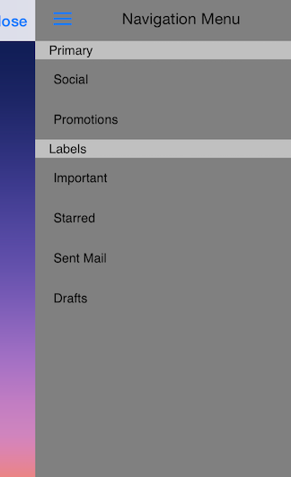

# TKSideDrawer: Appearance Positions

<code>TKSideDrawer</code> can be shown from all four sides of the screen.



In order to change the postion of <code>TKSideDrawer</code>, you should set its <code>position</code> property:

```Objective-C
self.sideDrawer.position = TKSideDrawerPositionRight;
```

```Swift
self.sideDrawer.position = TKSideDrawerPosition.Right
```

```C#
this.SideDrawer.Position = TKSideDrawerPosition.Right;
```