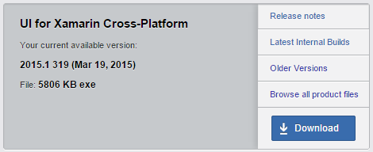

# UI for Xamarin.iOS: Getting Started

=======
This tutorial demonstrates how to get started with the Telerik UI for Xamarin.iOS wrappers.


## Downloading the UI for Xamarin.iOS wrappers

#### Trial version

There the Trial version of the UI for Xamarin.iOS wrappers is contained in the Trial package of the UI for Xamarin Cross-Platform product. You can download a Trial of UI for Xamarin Cross-Platform at [http://www.telerik.com/download/xamarin-ui](http://www.telerik.com/download/xamarin-ui).

#### Paid version

If you have already purchased UI for Xamarin.iOS, UI for Xamarin Cross-Platform or DevCraft Ultimate, you can download the wrappers following the steps below:

1. Go to *Your Account >> Products & Subscriptions >> UI for Xamarin.iOS / UI for Xamarin Cross-Platform / DevCraft Ultimate*. 

2. Click the blue button *Download installers and Other Resources*. 
 
	- If you have reached the blue button using your UI for Xamarin.iOS / UI for Xamarin Cross-Platform license, go to step 3
	- If you have reached the blue button using your DevCraft Ultimate, go to step 4. 
3. Clicking the blue button will open the list of files available for download. Download the *Manual Installation* file of UI for Xamarin.iOS / UI for Xamarin Cross-Platform respectively.

4. Clicking the blue button will open the list of products available with the DevCraft Ultimate license. Find the *UI for Xamarin Cross-Platform* product and click the *Download* button. This will download the *Manual Installation* file.
<br/>

## Unpacking the UI for Xamarin.iOS wrappers

#### UI for Xamarin Cross-Platform

The UI for Xamarin Cross-Platform products gives you access to a zip file that contains the Xamarin.iOS wrappers, Xamarin.Android wrappers, UI for Windows Phone, Xamarin.Forms controls and a Demo app for these Xamarin.Forms controls. Extract the contents of the zip file to a convenient place, preferably in *C:\Program Files\Telerik\UI for Xamarin\* if you are on Windows or in *Documents\Telerik\UI for Xamarin\* if you are on Mac. After you extract the contents, you can find the Xamarin.iOS assembly at Binaries\iOS\Telerik.Xamarin.iOS.dll

#### UI for Xamarin.iOS

The UI for Xamarin.iOS products gives you access to a zip file that contains the Xamarin.iOS wrappers and a Demo app for these wrappers. Extract the contents of the zip file to a convenient place, preferably in *C:\Program Files\Telerik\UI for Xamarin\* if you are on Windows or in *Documents\Telerik\UI for Xamarin\* if you are on Mac. The Telerik.Xamarin.iOS.dll assembly that contains the Xamarin.iOS wrappers is directly available at the top level  directory of the zip contents. 

## Setting up the project

After downloading and unpacking the UI for Xamarin.iOS wrappers, you can proceed with the steps below to create a new project. You can develop a Xamarin.iOS application with both Visual Studio / Xamarin Studio


- Open Visual Studio / Xamarin Studio and create a new project:

	- For Visual Studio: *File >> New Project, then Templates >> Visual C# >> iOS >> iPhone >> Single View App (iOS)*

	- For Xamarin Studio: *File >> New >> Solution, then C# >> Unified API >> iPhone >> Single View Application*


- Add a reference to the Telerik.Xamarin.iOS assembly:


- Open the RootViewController.cs file from the Solution tree and add the following using directives at the top of the file:
	```C#
	using TelerikUI;
	using CoreGraphics;
	using System.Collections.Generic;
	```

	Thanks to including TelerikUI we have access to the TKChart type. CoreGraphics provides access to the CGRect type for specifying the rectangle in which the Chart will be rendered, and System.Collections.Generic provides access to the generic List collection.  


- In the viewDidLoad method of the RootViewController, type of following code:
	```C#
	var chart = new TKChart(CGRect.Inflate(this.View.Bounds, -15, -15));
	chart.AutoresizingMask = UIViewAutoresizing.FlexibleWidth | 	UIViewAutoresizing.FlexibleHeight;
	this.View.AddSubview(chart);
	```

	This code creates a new instance of TKChart and adds it as a subview of the RootViewController's main view. The <code>autoresizingMask</code> property is set in order to allow correct resizing of the chart when the device is rotated in landscape mode.

- The next step is to create some random data that will be consumed by the chart. You can use the following code:
	```C#
	Random r = new Random();
	var randomNumericData = new List<TKChartDataPoint>();
	for (int i = 0; i < 10; i++)
	{
	    randomNumericData.Add(new TKChartDataPoint(new NSNumber(i), new 	NSNumber(r.Next(100))));
	}

	var randomNumericData2 = new List<TKChartDataPoint>();
	for (int i = 0; i < 10; i++)
	{
	    randomNumericData2.Add(new TKChartDataPoint(new NSNumber(i), new 	NSNumber(r.Next(100))));
	}
	```

	In this case create two lists setting the i variable as an x value, and a random number in the range between 0 and 100 as an y value.

- Now let's add this random data to the chart and present it. This is done by the following code:
	```C#
	chart.AddSeries(new TKChartLineSeries(randomNumericData.ToArray()));
	chart.AddSeries(new TKChartLineSeries(randomNumericData2.ToArray()));
	```
	
	For more information about populating TKChart with data, please refer to the following article:

- [Populating with Data](http://docs.telerik.com/devtools/ios/Chart/populating-with-data)

	The TKChartLineSeries tells the chart to present its data in the form of line charts and initialize it with the already created points.

- Let's add a title and a legend to our chart. We can do so by setting the corresponding properties to <code>false</code>:
	```C#
	chart.Title.Hidden = false;
	chart.Title.Text = "This is a chart demo";
	chart.Legend.Hidden = false;
	```

- Finally, we can easily employ the built-in animations support to create some fancy animations. To do so, we should set the <code>allowAnimations</code> property to <code>true</code>:
	```C#
	chart.AllowAnimations = true;
	```


For more information about customizing animations, please refer to the following articles:

- [Custom Animations](http://docs.telerik.com/devtools/ios/Chart/animations/custom)
- [Custom UIKit Dynamics Animations](http://docs.telerik.com/devtools/ios/Chart/animations/custom-uikit-dynamics)

Here is the full code of this example:

```C#
public override void ViewDidLoad()
{
    base.ViewDidLoad();

    var chart = new TKChart(CGRect.Inflate(this.View.Bounds, -15, -15));
    chart.AutoresizingMask = UIViewAutoresizing.FlexibleWidth | UIViewAutoresizing.FlexibleHeight;
    this.View.AddSubview(chart);

    Random r = new Random();
    var randomNumericData = new List<TKChartDataPoint>();
    for (int i = 0; i < 10; i++)
    {
        randomNumericData.Add(new TKChartDataPoint(new NSNumber(i), new NSNumber(r.Next(100))));
    }

    var randomNumericData2 = new List<TKChartDataPoint>();
    for (int i = 0; i < 10; i++)
    {
        randomNumericData2.Add(new TKChartDataPoint(new NSNumber(i), new NSNumber(r.Next(100))));
    }

    chart.AddSeries(new TKChartLineSeries(randomNumericData.ToArray()));
    chart.AddSeries(new TKChartLineSeries(randomNumericData2.ToArray()));

    chart.Title.Hidden = false;
    chart.Title.Text = "This is a chart demo";
    chart.Legend.Hidden = false;

    chart.AllowAnimations = true;
}
```

You can easily change the way data is presented in the Chart by changing the series type:
```C#
chart.AddSeries(new TKChartSplineAreaSeries(randomNumericData.ToArray()));
chart.AddSeries(new TKChartSplineAreaSeries(randomNumericData2.ToArray()));
```
