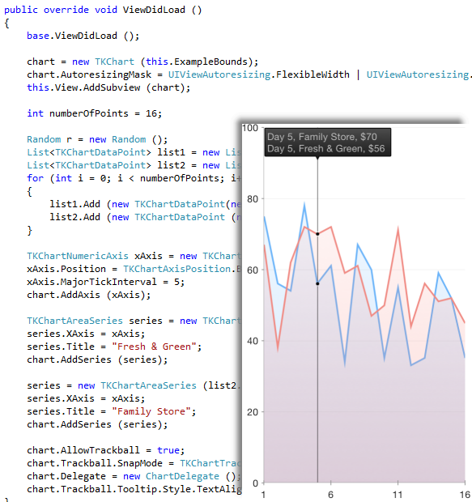

# UI for Xamarin.iOS: Overview

Telerik offers Xamarin.iOS wrappers on top of the native UI for iOS suite*. These wrappers are not included in the UI for iOS product, but are offered in a separate product called UI for Xamarin.iOS. As these wrappers are the base for our Xamarin Forms offering, you can find them as a part of our UI for Xamarin Cross-Platform product as well.

The API and scenarios of the Telerik Xamarin.iOS wrappers follow those of the native Telerik UI for iOS controls, so the documentation for UI for iOS is also the documentation for UI for Xamarin.iOS. For every supported feature where an Objective-C/Swift code snippet is included, you can also find a C# code snippet that shows how something can be achieved with the Xamarin.iOS wrappers.

You can learn more about the underlying UI for iOS product and controls from the [UI for iOS Overview page](../index). 

To get started with the Telerik Xamarin.iOS wrappers, check the common [Getting Started with Xamarin.iOS article](getting-started) article that is valid for all Telerik Xamarin.iOS controls.

> Note: There could be information for more controls in the UI for iOS suite that what is supported for the Xamarin.iOS wrappers. For a list of the supported Xamarin.iOS controls, you can refer to the [UI for Xamarin product page](http://www.telerik.com/xamarin-ui).

