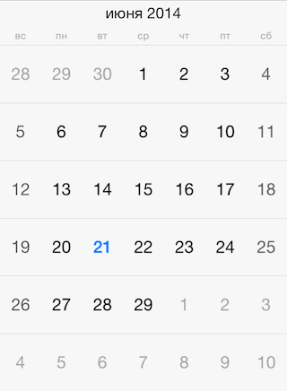
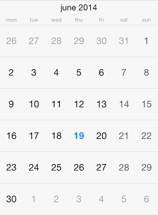

# Calendar: Localization



By defualt, <code>TKCalendar</code> uses the current system locale and calendar settings. However, it allows for specifying those settings explicitly, overriding the system settings. This article describes how to do this.

The <code>calendar</code> property of <code>TKCalendar</code> specifies the <code>NSCalendar</code> to be used. You can use this property to change the first day in week to Monday for example:

```Objective-C
NSCalendar *calendar = [[NSCalendar alloc] initWithCalendarIdentifier:NSGregorianCalendar];
calendar.firstWeekday = 2;
TKCalendar *calendarView = [[TKCalendar alloc] initWithFrame:self.view.bounds];
calendarView.calendar = calendar;
```
```Swift
let calendar = NSCalendar(calendarIdentifier: NSGregorianCalendar)
calendar.firstWeekday = 2
let calendarView = TKCalendar(frame: self.view.bounds)
calendarView.calendar = calendar
```



Or, you can change the calendar with one specific for your users:

```Objective-C
calendarView.calendar = [[NSCalendar alloc] initWithCalendarIdentifier:NSChineseCalendar];
```
```Swift
calendarView.calendar = NSCalendar(calendarIdentifier: NSChineseCalendar)
```

Month names and week day names are provided by the <code>locale</code> property. Use the following code to customize the current locale:

```Objective-C
calendarView.locale = [[NSLocale alloc] initWithLocaleIdentifier:@"ru_RU"];
```
```Swift
calendarView.locale = NSLocale(localeIdentifier: "ru_RU")
```

After modifying the locale you should call the <code>update:</code> method for the presenter:

```Objective-C
[calendarView.presenter update:NO];
```
```Swift
calendarView.presenter().update(false)
```


