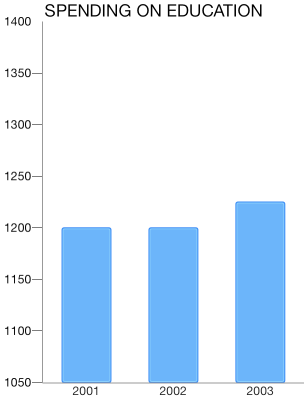
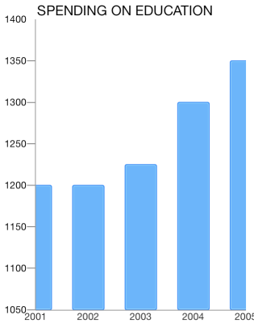

# Chart Axes: Datetime

The <code>TKChartDateTimeAxis</code> Categoric axis is an axis with NSDate values sorted chronologically. It also allows definitions of categories based on specific date time components – year, month, day etc. For example, if data values fall in the range of one year, the points can be plotted in categories for each month. If data values fall in the range of one month, the values can be categorized by days. It also introduces several important properties:

- <code>majorTickInterval</code> - defines an interval between major axis ticks.

- <code>baseline</code> - defines how the series data should be aligned. For example: The <code>TKChartBarSeries</code> might render its bars up and down depending on whether its value is greater or less than the baseline value.

- <code>offset</code> - determines an axis value where the axis is crossed with another axis.

## Configure a TKChartDateTimeAxis##

You can configure a date-time axis by initializing it and setting it as the main x-axis or y-axis of the chart:

```Objective-C
  TKChartDateTimeAxis *periodXAxis = [[TKChartDateTimeAxis alloc] init];
  chart.xAxis = periodXAxis;
```
```Swift
let periodXAxis = TKChartDateTimeAxis()
  chart.xAxis = periodXAxis
```

You can specify the axis range by setting the minimum and maximum indexes of categories:

```Objective-C
  - (NSDate *)dateWithYear:(NSInteger)year month:(NSInteger)month day:(NSInteger)day {
      NSCalendar *calendar = [[NSCalendar alloc] initWithCalendarIdentifier:NSGregorianCalendar];
      NSDateComponents *components = [[NSDateComponents alloc] init];
      [components setYear:year];
      [components setMonth:month];
      [components setDay:day];
      return [calendar dateFromComponents:components];
  }

  NSDate *date2001 = [self dateWithYear:2001 month:12 day:31];
  NSDate *date2003 = [self dateWithYear:2003 month:12 day:31];
    periodXAxis.range = [TKRange rangeWithMinimum:date2001 andMaximum:date2003];
```
```Swift
  func dateWithYear(year: Int, month: Int, day: Int) -> NSDate{
        let calendar = NSCalendar(calendarIdentifier: NSGregorianCalendar)
        let components = NSDateComponents()
        components.year = year
        components.month = month
        components.day = day
        return calendar.dateFromComponents(components)
    }
    
    let date2001 = self.dateWithYear(2001, month: 12, day: 31)
    let date2003 = self.dateWithYear(2003, month: 12, day: 31)
    periodXAxis.range = TKRange(minimum: date2001, andMaximum: date2003)
```

You can define the axis categories to be years by changing the interval unit property:

```Objective-C
  periodXAxis.majorTickIntervalUnit = TKChartDateTimeAxisIntervalUnitYears;
```
```Swift
periodXAxis.majorTickIntervalUnit = TKChartDateTimeAxisIntervalUnitYears
```



## Setting a plotting mode of axis##

 The <code>TKChartAxisPlotMode</code> is used by the axis to plot the data. Possible values are <code>TKChartAxisPlotModeBetweenTicks</code> and <code>TKChartAxisPlotModeOnTicks</code>. <code>TKChartAxisPlotModeBetweenTicks</code> plots points in the middle of the range, defined by two ticks. <code>OnTicks</code> plots the points over each tick.

 You should use the following lines of code to alter this behavior:

```Objective-C
  xAxis.plotMode = TKChartAxisPlotModeBetweenTicks;
```
```Swift
  periodXAxis.setPlotMode(TKChartAxisPlotModeBetweenTicks)
```


```Objective-C
xAxis.plotMode = TKChartAxisPlotModeOnTicks;
```
```Swift
periodXAxis.setPlotMode(TKChartAxisPlotModeOnTicks)
```


