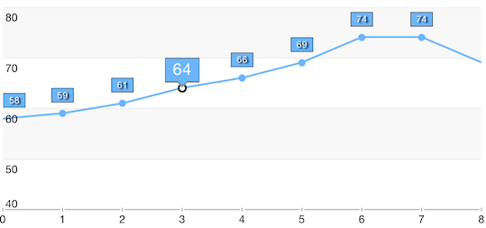

# Point Labels: Customization

<code>TKChart</code> lets you customize point labels using <code>TKChartPointLabelStyle</code>'s properties. However, sometimes you may need to draw specific shapes for the labels. In such cases you should sublcass <code>TKChartPointLabel</code> to create your own label and implement <code>TKChartDelegate</code> to use it.

## Customization using TKChartPointLabelStyle properies

Here is an example how to customize point labels changing <code>TKChartPointLabelStyle</code> settings.

```Objective-C
lineSeries.style.pointLabelStyle.textHidden = NO;
lineSeries.style.pointLabelStyle.layoutMode = TKChartPointLabelLayoutModeManual;
lineSeries.style.pointLabelStyle.labelOffset = UIOffsetMake(0, -20);
lineSeries.style.pointLabelStyle.insets = UIEdgeInsetsMake(-1, -5, -1, -5);
lineSeries.style.pointLabelStyle.font = [UIFont systemFontOfSize:10];
lineSeries.style.pointLabelStyle.textAlignment = NSTextAlignmentCenter;
lineSeries.style.pointLabelStyle.clipMode = TKChartPointLabelClipModeShow;
lineSeries.style.pointLabelStyle.textColor = [UIColor whiteColor];
lineSeries.style.pointLabelStyle.fill = [TKSolidFill solidFillWithColor:[UIColor colorWithRed:108/255.0 green:181/255.0 blue:250/255.0 alpha:1.0]];
lineSeries.style.pointLabelStyle.stroke = [TKStroke strokeWithColor:[UIColor blackColor]];
lineSeries.style.pointLabelStyle.blurRadius = 1.5;
lineSeries.style.pointLabelStyle.shadowColor = [UIColor blackColor];
lineSeries.style.pointLabelStyle.shadowOffset = CGSizeMake(2, 1);
```
```Swift
lineSeries.style.pointLabelStyle.textHidden = false
lineSeries.style.pointLabelStyle.layoutMode = TKChartPointLabelLayoutMode.Manual
lineSeries.style.pointLabelStyle.labelOffset = UIOffsetMake(0, -20)
lineSeries.style.pointLabelStyle.insets = UIEdgeInsetsMake(-1, -5, -1, -5)
lineSeries.style.pointLabelStyle.font = UIFont.systemFontOfSize(10)
lineSeries.style.pointLabelStyle.textAlignment = NSTextAlignment.Center
lineSeries.style.pointLabelStyle.clipMode = TKChartPointLabelClipMode.Show
lineSeries.style.pointLabelStyle.textColor = UIColor.whiteColor()
lineSeries.style.pointLabelStyle.fill = TKSolidFill(color: UIColor(red: 108/255.0, green: 181/255.0, blue: 250/255.0, alpha: 1.0))
lineSeries.style.pointLabelStyle.stroke = TKStroke(color: UIColor.blackColor())
lineSeries.style.pointLabelStyle.blurRadius = 1.5
lineSeries.style.pointLabelStyle.shadowColor = UIColor.blackColor()
lineSeries.style.pointLabelStyle.shadowOffset = CGSizeMake(2, 1)
```
```C#
```


## Custom point labels

Subclassing <code>TKChartPointLabel</code> lets you perform custom drawing and calculate the size of the point label. Once you create your own label you should implement <code>TKChartDelegate</code> to use it.

```Objective-C
- (TKChartPointLabel *)chart:(TKChart *)chart labelForDataPoint:(id<TKChartData>)dataPoint inSeries:(TKChartSeries *)series atIndex:(NSUInteger)dataIndex
{
    if (series.index == _selectedSeriesIndex && dataIndex == _selectedDataPointIndex) {
         return [[MyPointLabel alloc] initWithPoint:dataPoint style:series.style.pointLabelStyle text:[NSString stringWithFormat:@"%@", dataPoint.dataYValue]];
    }

     return [[TKChartPointLabel alloc] initWithPoint:dataPoint style:series.style.pointLabelStyle text:[NSString stringWithFormat:@"%@", dataPoint.dataYValue]];
}
```
```Swift
func chart(chart: TKChart!, labelForDataPoint dataPoint: TKChartData!, inSeries series: TKChartSeries!, atIndex dataIndex: UInt) -> TKChartPointLabel! {
   	if series.index == selectedSeriesIndex && dataIndex == selectedDataPointIndex {
        return MyPointLabel(point: dataPoint, style: series.style.pointLabelStyle, text: "\(dataPoint.dataYValue())")
    }
    
    return TKChartPointLabel(point: dataPoint, style: series.style.pointLabelStyle, text: "\(dataPoint.dataYValue())")
}
```
```C#
```



