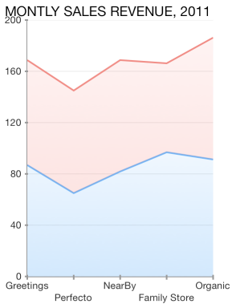
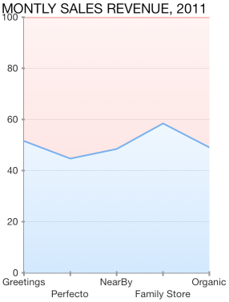
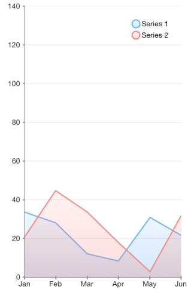

# Chart Series: Area

As a derivative of <code>TKChartLineSeries</code> series, <code>TKChartAreaSeries</code> plots its data points in line. Once positioned on a plane the points are connected to form a line. Further, the area enclosed between this line and the axis is filled. Below is a sample snippet that demonstrates how to set up two Area series:

```Objective-C
NSMutableArray *pointsWithCategoriesAndValues = [[NSMutableArray alloc] init];
NSMutableArray *pointsWithCategoriesAndValues2 = [[NSMutableArray alloc] init];
NSArray *categories = @[ @"Greetings", @"Perfecto", @"NearBy", @"Family Store", @"Fresh & Green"];
NSArray *values = @[ @70, @75, @58, @59, @88 ];
for (int i = 0; i < categories.count; i++) {
    TKChartDataPoint *dataPoint = [[TKChartDataPoint alloc] initWithX:categories[i] Y:values[i]];
    [pointsWithCategoriesAndValues addObject:dataPoint];
}

NSArray *values2 = @[ @40, @80, @35, @69, @95 ];
for (int i = 0; i < categories.count; i++) {
    TKChartDataPoint *dataPoint = [[TKChartDataPoint alloc] initWithX:categories[i] Y:values2[i]];
    [pointsWithCategoriesAndValues2 addObject:dataPoint];
}

TKChartAreaSeries* seriesForIncomes = [[TKChartAreaSeries alloc] initWithItems:pointsWithCategoriesAndValues];
[chart addSeries:seriesForIncomes];

TKChartAreaSeries *seriesForExpenses = [[TKChartAreaSeries alloc] initWithItems:pointsWithCategoriesAndValues2];
[chart addSeries:seriesForExpenses];
```
```Swift
var pointsWithCategoriesAndValues = [TKChartDataPoint]()
var pointsWithCategoriesAndValues2 = [TKChartDataPoint]()
let categories = ["Greetings", "Perfecto", "NearBy", "Family Store", "Fresh & Green" ];
let values = [70, 75, 58, 59, 88]
for var i = 0; i < categories.count; ++i {
    pointsWithCategoriesAndValues.append(TKChartDataPoint(x: categories[i], y: values[i]))
}
    
let values2 = [40, 80, 32, 69, 95]
for var i = 0; i < categories.count; ++i {
    pointsWithCategoriesAndValues2.append(TKChartDataPoint(x: categories[i], y: values2[i]))
}
```


## Configure stacking of line series

The <code>TKChartAreaSeries</code> can be combined by using different stack modes.

The Stack plots the points on top of each other:

```Objective-C
TKChartStackInfo *stackInfo = [[TKChartStackInfo alloc] initWithID:@(1) withStackMode:TKChartStackModeStack];

TKChartAreaSeries *seriesForIncome = [[TKChartAreaSeries alloc] initWithItems:pointsWithCategoriesAndValues];
seriesForIncome.stackInfo = stackInfo;

TKChartAreaSeries *seriesForExpences = [[TKChartAreaSeries alloc] initWithItems:pointsWithCategoriesAndValues2];
seriesForExpences.stackInfo = stackInfo;

[chart beginUpdates];
[chart addSeries:seriesForIncome];
[chart addSeries:seriesForExpences];
[chart endUpdates];
```
```Swift
let stackInfo = TKChartStackInfo(ID: 1, withStackMode: TKChartStackModeStack)
    
let seriesForIncome = TKChartAreaSeries(items: pointsWithCategoriesAndValues)
seriesForIncome.stackInfo = stackInfo
    
let seriesForExpenses = TKChartAreaSeries(items: pointsWithCategoriesAndValues2)
seriesForExpenses.stackInfo = stackInfo
    
chart.beginUpdates()
chart.addSeries(seriesForIncome)
chart.addSeries(seriesForExpenses)
chart.endUpdates()
```



The Stack100 displays the value as percent:

```Objective-C
TKChartStackInfo *stackInfo = [[TKChartStackInfo alloc] initWithID:@(1) withStackMode:TKChartStackModeStack100];

TKChartAreaSeries *seriesForIncome = [[TKChartAreaSeries alloc] initWithItems:pointsWithCategoriesAndValues];
seriesForIncome.stackInfo = stackInfo;

TKChartAreaSeries *seriesForExpences = [[TKChartAreaSeries alloc] initWithItems:pointsWithCategoriesAndValues2];
seriesForExpences.stackInfo = stackInfo;

[chart beginUpdates];
[chart addSeries:seriesForIncome];
[chart addSeries:seriesForExpences];
[chart endUpdates];
```
```Swift
let stackInfo = TKChartStackInfo(ID: 1, withStackMode: TKChartStackModeStack100)
    
let seriesForIncome = TKChartAreaSeries(items: pointsWithCategoriesAndValues)
seriesForIncome.stackInfo = stackInfo
    
let seriesForExpenses = TKChartAreaSeries(items: pointsWithCategoriesAndValues2)
seriesForExpenses.stackInfo = stackInfo
    
chart.beginUpdates()
chart.addSeries(seriesForIncome)
chart.addSeries(seriesForExpenses)
chart.endUpdates()
```



## Configure visual appearance of area series

If you want to change the series' fill and stroke, you should use the following code snippet:

```Objective-C
TKChartAreaSeries* seriesForAnnualRevenue = [[TKChartAreaSeries alloc] initWithItems:pointsWithCategoriesAndValues];
seriesForAnnualRevenue.style.palette = [[TKChartPalette alloc] init];
TKChartPaletteItem *palleteItem = [[TKChartPaletteItem alloc] init];
palleteItem.stroke = [TKStroke strokeWithColor:[UIColor brownColor]];
palleteItem.fill = [TKSolidFill solidFillWithColor:[UIColor redColor]];
[seriesForAnnualRevenue.style.palette addPaletteItem:palleteItem];
[chart addSeries:seriesForAnnualRevenue];
```
```Swift
let seriesForAnnualRevenue = TKChartAreaSeries(items: pointsWithCategoriesAndValues)
seriesForAnnualRevenue.style.palette = TKChartPalette()
let paletteItem = TKChartPaletteItem()
paletteItem.stroke = TKStroke(color: UIColor.brownColor())
paletteItem.fill = TKSolidFill(color: UIColor.redColor())
seriesForAnnualRevenue.style.palette.addPaletteItem(paletteItem)
chart.addSeries(seriesForAnnualRevenue);
```


