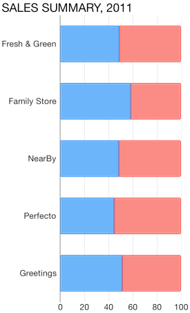

# Chart Series: Bar

<code>TKChartBarSeries</code> are used to visualize data points as bar blocks where the width of each bar denotes the magnitude of its value. The following snippet demonstrates how to manually populate one Bar series:

```Objective-C
NSMutableArray *pointsWithCategoriesAndValues = [[NSMutableArray alloc] init];
NSArray *categories = @[ @"Greetings", @"Perfecto", @"NearBy", @"Family Store", @"Fresh & Green" ];
NSArray *values = @[ @70, @75, @58, @59, @88 ];
for (int i = 0; i < categories.count; i++) {
    TKChartDataPoint *dataPoint = [[TKChartDataPoint alloc] initWithX:values[i] Y:categories[i]];
    [pointsWithCategoriesAndValues addObject:dataPoint];
}
        
TKChartBarSeries *series = [[TKChartBarSeries alloc] initWithItems:pointsWithCategoriesAndValues];
[chart addSeries:series];
```
```Swift
var pointsWithCategoriesAndValues = [TKChartDataPoint]()
let categories = ["Greetings", "Perfecto", "NearBy", "Family Store", "Fresh & Green"];
let values = [70, 75, 58, 59, 88]
for var i = 0; i < categories.count; ++i {
    pointsWithCategoriesAndValues += TKChartDataPoint(x: values[i], y: categories[i])
}
    
let series = TKChartBarSeries(items: pointsWithCategoriesAndValues)
chart.addSeries(series)
```
```C#
var pointsWithCategoriesAndValues = new List<TKChartDataPoint> ();
var categories = new [] { "Greetings", "Perfecto", "NearBy", "Family Store", "Fresh & Green" };
var values = new [] { 70, 75, 58, 59, 88 };
for (int i = 0; i < categories.Length; ++i) {
	pointsWithCategoriesAndValues.Add (new TKChartDataPoint (new NSNumber(values [i]), NSObject.FromObject(categories [i])));
}

chart.AddSeries (new TKChartBarSeries (pointsWithCategoriesAndValues.ToArray()));
```


## Configure clustering of bar series

If you want to cluster multiple bar series side by side, they should use a shared y-axis:

```Objective-C
NSMutableArray *pointsWithCategoriesAndValues = [[NSMutableArray alloc] init];
NSMutableArray *pointsWithCategoriesAndValues2 = [[NSMutableArray alloc] init];
NSArray *categories = @[ @"Greetings", @"Perfecto", @"NearBy", @"Family Store", @"Fresh & Green" ];
NSArray *values = @[ @70, @75, @58, @59, @88 ];
for (int i = 0; i < categories.count; i++) {
    TKChartDataPoint *dataPoint = [[TKChartDataPoint alloc] initWithX:values[i] Y:categories[i]];
    [pointsWithCategoriesAndValues addObject:dataPoint];
}

NSArray *values2 = @[ @40, @80, @35, @69, @95 ];
for (int i = 0; i < categories.count; i++) {
    TKChartDataPoint *dataPoint = [[TKChartDataPoint alloc] initWithX:values2[i] Y:categories[i]];
    [pointsWithCategoriesAndValues2 addObject:dataPoint];
}

TKChartCategoryAxis *categoryAxis = [[TKChartCategoryAxis alloc] initWithCategories:categories];
chart.yAxis = categoryAxis;

TKChartSeries *series1 = [[TKChartBarSeries alloc] initWithItems:pointsWithCategoriesAndValues];
series1.yAxis = categoryAxis;

TKChartSeries *series2 = [[TKChartBarSeries alloc] initWithItems:pointsWithCategoriesAndValues2];
series2.yAxis = categoryAxis;

[chart beginUpdates];
[chart addSeries:series1];
[chart addSeries:series2];
[chart endUpdates];
```
```Swift
var pointsWithCategoriesAndValues = [TKChartDataPoint]()
var pointsWithCategoriesAndValues2 = [TKChartDataPoint]()
let categories = ["Greetings", "Perfecto", "NearBy", "Family Store", "Fresh & Green" ];
let values = [70, 75, 58, 59, 88]
for var i = 0; i < categories.count; ++i {
    pointsWithCategoriesAndValues.append(TKChartDataPoint(x: values[i], y: categories[i]))
}
    
let values2 = [40, 80, 32, 69, 95]
for var i = 0; i < categories.count; ++i {
    pointsWithCategoriesAndValues2.append(TKChartDataPoint(x: values2[i], y: categories[i]))
}
    
let categoryAxis = TKChartCategoryAxis(categories: categories)
chart.yAxis = categoryAxis
    
let series1 = TKChartBarSeries(items: pointsWithCategoriesAndValues)
series1.yAxis = categoryAxis
   
let series2 = TKChartBarSeries(items: pointsWithCategoriesAndValues2)
series2.yAxis = categoryAxis
    
chart.beginUpdates()
chart.addSeries(series1)
chart.addSeries(series2)
chart.endUpdates()
```
```C#
var pointsWithCategoriesAndValues = new List<TKChartDataPoint> ();
var pointsWithCategoriesAndValues2 = new List<TKChartDataPoint>();
var categories = new [] { "Greetings", "Perfecto", "NearBy", "Family Store", "Fresh & Green" };
var values = new [] { 70, 75, 58, 59, 88 };

for (int i = 0; i < categories.Length; ++i) {
	pointsWithCategoriesAndValues.Add (new TKChartDataPoint (new NSNumber (values [i]), NSObject.FromObject (categories [i])));
}

var values2 = new [] { 40, 80, 32, 69, 95 };
for (int i = 0; i < categories.Length; ++i) {
	pointsWithCategoriesAndValues2.Add (new TKChartDataPoint (new NSNumber(values2 [i]), NSObject.FromObject(categories [i])));
}

List<NSObject> objectCategories = new List<NSObject> ();
for (int i = 0; i < categories.Length; i++) {
	objectCategories.Add (new NSString (categories [i]));
}
var categoryAxis = new TKChartCategoryAxis (objectCategories.ToArray());
chart.YAxis = categoryAxis;

var series1 = new TKChartBarSeries(pointsWithCategoriesAndValues.ToArray());
series1.YAxis = categoryAxis;

var series2 = new TKChartBarSeries(pointsWithCategoriesAndValues2.ToArray());
series2.YAxis = categoryAxis;

chart.BeginUpdates();
chart.AddSeries(series1);
chart.AddSeries(series2);
chart.EndUpdates();
```


## Configure stacking of bar series

The <code>TKChartBarSeries</code> can be combined by using different stack modes.

The Stack plots the points on top of each other:

```Objective-C
TKChartStackInfo *stackInfo = [[TKChartStackInfo alloc] initWithID:@(1) withStackMode:TKChartStackModeStack];

TKChartBarSeries *series1 = [[TKChartBarSeries alloc] initWithItems:pointsWithCategoriesAndValues];
series1.stackInfo = stackInfo;

TKChartBarSeries *series2 = [[TKChartBarSeries alloc] initWithItems:pointsWithCategoriesAndValues2];
series2.stackInfo = stackInfo;

[chart beginUpdates];
[chart addSeries:series1];
[chart addSeries:series2];
[chart endUpdates];
```
```Swift
let stackInfo = TKChartStackInfo(ID: 1, withStackMode: TKChartStackMode.Stack)
    
let series1 = TKChartBarSeries(items: pointsWithCategoriesAndValues)
series1.stackInfo = stackInfo
    
let series2 = TKChartBarSeries(items: pointsWithCategoriesAndValues2)
series2.stackInfo = stackInfo
   
chart.beginUpdates()
chart.addSeries(series1)
chart.addSeries(series2)
chart.endUpdates()
```
```C#
var stackInfo = new TKChartStackInfo(new NSNumber(1), TKChartStackMode.Stack);

var series1 = new TKChartBarSeries(pointsWithCategoriesAndValues.ToArray());
series1.StackInfo = stackInfo;

var series2 = new TKChartBarSeries(pointsWithCategoriesAndValues2.ToArray());
series2.StackInfo = stackInfo;

chart.BeginUpdates();
chart.AddSeries(series1);
chart.AddSeries(series2);
chart.EndUpdates();
```


The Stack100 displays the value as percent:

```Objective-C
TKChartStackInfo *stackInfo = [[TKChartStackInfo alloc] initWithID:@(1) withStackMode:TKChartStackModeStack100];

TKChartBarSeries *series1 = [[TKChartBarSeries alloc] initWithItems:pointsWithCategoriesAndValues];
series1.stackInfo = stackInfo;

TKChartBarSeries *series2 = [[TKChartBarSeries alloc] initWithItems:pointsWithCategoriesAndValues2];
series2.stackInfo = stackInfo;

[chart beginUpdates];
[chart addSeries:series1];
[chart addSeries:series2];
[chart endUpdates];
```
```Swift
let stackInfo = TKChartStackInfo(ID: 1, withStackMode: TKChartStackMode.Stack100)
    
let series1 = TKChartBarSeries(items: pointsWithCategoriesAndValues)
series1.stackInfo = stackInfo
    
let series2 = TKChartBarSeries(items: pointsWithCategoriesAndValues2)
series2.stackInfo = stackInfo
    
chart.beginUpdates()
chart.addSeries(series1)
chart.addSeries(series2)
chart.endUpdates()
```
```C#
var stackInfo = new TKChartStackInfo(new NSNumber(1), TKChartStackMode.Stack100);

var series1 = new TKChartBarSeries(pointsWithCategoriesAndValues.ToArray());
series1.StackInfo = stackInfo;

var series2 = new TKChartBarSeries(pointsWithCategoriesAndValues2.ToArray());
series2.StackInfo = stackInfo;

chart.BeginUpdates();
chart.AddSeries(series1);
chart.AddSeries(series2);
chart.EndUpdates();
```



## Configure visual appearance of bar series

If you would like to customize the appearance of bar series, you should change its <code>style</code> properties.

You can change the fill and stroke in the following manner:

```Objective-C
TKChartBarSeries *series = [[TKChartBarSeries alloc] initWithItems:pointsWithCategoriesAndValues];
series.style.palette = [[TKChartPalette alloc] init];

TKChartPaletteItem *palleteItem = [[TKChartPaletteItem alloc] init];
palleteItem.fill = [TKSolidFill solidFillWithColor:[UIColor redColor]];
palleteItem.stroke = [TKStroke strokeWithColor:[UIColor blackColor]];

[series.style.palette addPaletteItem:palleteItem];
[chart addSeries:series];
```
```Swift
let series = TKChartBarSeries(items: pointsWithCategoriesAndValues)
series.style.palette = TKChartPalette()
    
let paletteItem = TKChartPaletteItem()
paletteItem.fill = TKSolidFill(color: UIColor.redColor())
paletteItem.stroke = TKStroke(color: UIColor.blackColor())
series.style.palette.addPaletteItem(paletteItem)
chart.addSeries(series)
```
```C#
var series = new TKChartBarSeries (pointsWithCategoriesAndValues.ToArray());
series.Style.Palette = new TKChartPalette ();

var paletteItem = new TKChartPaletteItem ();
paletteItem.Fill = new TKSolidFill (UIColor.Red);
paletteItem.Stroke = new TKStroke (UIColor.Black);
series.Style.Palette.AddPaletteItem (paletteItem);
chart.AddSeries (series);
```


You can change the gap between columns with the following code snippet:

```Objective-C
TKChartBarSeries *series = [[TKChartBarSeries alloc] initWithItems:pointsWithCategoriesAndValues];
series.gapLength = 0.5;
[chart addSeries:series];
```
```Swift
let series = TKChartBarSeries(items: pointsWithCategoriesAndValues)
series.gapLength = 0.5
chart.addSeries(series)
```
```C#
var series = new TKChartBarSeries (pointsWithCategoriesAndValues.ToArray ());
series.GapLength = 0.5f;
chart.AddSeries (series);
```

Note that the value should be between 0 and 1, where a value of 0 means that a bar would take the entire space between two ticks, while a value of 1 means the bar will have zero width as all the space should appear as a gap.


