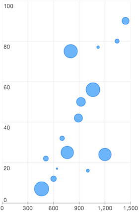

# Chart Series: Bubble


<code>TKChartBubbleSeries</code> derives from <code>TKChartScatterSeries</code> and it represents a bubble chart. Bubble series visualizes <code>TKChartBubbleDataPoint</code> which has three parameters - <code>dataXValue</code>, <code>dataYValue</code> and <code>area</code>. The <code>scale</code> and <code>biggestBubbleDiameterForAutoscale</code> properties determine the diameter of a bubble on the chart.

Here is an example of a bubble chart:

```Objective-C
NSArray *xValues = @[ @460, @510, @600, @640, @700, @760, @800, @890, @920, @1000, @1060, @1120, @1200, @1342, @1440];
NSArray *yValues = @[ @7, @22, @12, @17, @32, @25, @75, @42, @50, @16, @56, @77, @24, @80, @90 ];
NSArray *areaValues = @[@800, @100, @122, @10, @82, @623, @715, @269, @311, @38, @762, @29, @623, @72, @199];

NSMutableArray *array = [[NSMutableArray alloc] init];
for (int i = 0; i<xValues.count; i++) {
    [array addObject:[TKChartBubbleDataPoint dataPointWithX:xValues[i] Y:yValues[i] area:areaValues[i]]];
}

TKChartBubbleSeries *bubbleSeries = [[TKChartBubbleSeries alloc] initWithItems:array];
bubbleSeries.biggestBubbleDiameterForAutoscale = @30;
[chart addSeries:bubbleSeries];
``` 
```Swift
let xValues = [ 460, 510, 600, 640, 700, 760, 800, 890, 920, 1000, 1060, 1120, 1200, 1342, 1440]
let yValues = [ 7, 22, 12, 17, 32, 25, 75, 42, 50, 16, 56, 77, 24, 80, 90 ]
let areaValues = [800, 100, 122, 10, 82, 623, 715, 269, 311, 38, 762, 29, 623, 72, 199]
    
var array = [TKChartDataPoint]()
for var i = 0; i < xValues.count; ++i {
    array.append(TKChartBubbleDataPoint(x: xValues[i], y: yValues[i], area: areaValues[i]))
}
    
var bubbleSeries = TKChartBubbleSeries(items: array)
bubbleSeries.biggestBubbleDiameterForAutoscale = 30
chart.addSeries(bubbleSeries)   
```


