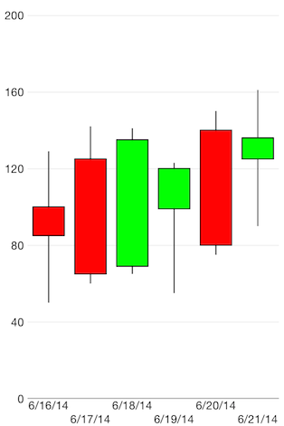

# Chart Series: Candlestick

**TKChart** supports **Candlestick** stock series. This series operates with a special kind of data in the form of four parameters defining the stock market - open, high, low, and close. Candlestick series have body, which has a different color depending on the value of open and close prices of the financial data point. Here is how to set up Candlestick series:

```Objective-C
NSArray *openPrices = @[@100, @125, @69, @99, @140, @125];
NSArray *closePrices = @[@85, @65, @135, @120, @80, @136];
NSArray *lowPrices = @[@50, @60, @65, @55, @75, @90];
NSArray *highPrices = @[@129, @142, @141, @123, @150, @161];
NSDate *dateNow = [NSDate date];
NSMutableArray *financialDataPoints = [[NSMutableArray alloc] init];
for (int i = 0; i < openPrices.count; i++) {
    NSDate *date = [dateNow dateByAddingTimeInterval:60 * 60 * 24 * i];
    TKChartFinancialDataPoint *dataPoint = [TKChartFinancialDataPoint dataPointWithX:date open:openPrices[i] high:highPrices[i] low:lowPrices[i] close:closePrices[i]];
    [financialDataPoints addObject:dataPoint];
}

TKChartCandlestickSeries *candlestickSeries = [[TKChartCandlestickSeries alloc] initWithItems:financialDataPoints];
[chart addSeries:candlestickSeries];
TKChartDateTimeAxis *xAxis = (TKChartDateTimeAxis *)chart.xAxis;
xAxis.minorTickIntervalUnit = TKChartDateTimeAxisIntervalUnitDays;
xAxis.plotMode = TKChartAxisPlotModeBetweenTicks;
xAxis.majorTickInterval = 1;
``` 
```Swift
let openPrices = [100, 125, 69, 99, 140, 125]
let closePrices = [85, 65, 135, 120, 80, 136]
let lowPrices = [50, 60, 65, 55, 75, 90]
let highPrices = [129, 142, 141, 123, 150, 161]
var dateNow = NSDate.date()
var financialDataPoints = [TKChartFinancialDataPoint]()
   
for var i = 0; i < openPrices.count; ++i {
    var date = dateNow.dateByAddingTimeInterval(CDouble(60 * 60 * 24 * i))
    financialDataPoints.append(TKChartFinancialDataPoint(x: date, open: openPrices[i], high: highPrices[i], low: lowPrices[i], close: closePrices[i]))
    }
    
let candlestickSeries = TKChartCandlestickSeries(items: financialDataPoints)
chart.addSeries(candlestickSeries)
   
let xAxis = chart.xAxis as TKChartDateTimeAxis
xAxis.minorTickIntervalUnit = TKChartDateTimeAxisIntervalUnitDays
xAxis.setPlotMode(TKChartAxisPlotModeBetweenTicks)
xAxis.majorTickInterval = 1
```


## Configure visual appearance of candlestick series

If you want to customize the appearance of cthe andlestick series, you should implement the**TKChartDelegate** protocol as shown below:

```Objective-C
- (TKChartPaletteItem *)chart:(TKChart *)chart paletteItemForSeries:(TKChartSeries *)series atIndex:(NSUInteger)index
{
    id<TKChartData> dataPoint = [series dataPointAtIndex:index];
    TKStroke *stroke = [TKStroke strokeWithColor:[UIColor blackColor]];
    TKSolidFill *fill;
    if ([dataPoint.close doubleValue] < [dataPoint.open doubleValue]) {
        fill = [TKSolidFill solidFillWithColor:[UIColor redColor]];
    } else {
        fill = [TKSolidFill solidFillWithColor:[UIColor greenColor]];
    }

    TKChartPaletteItem *paletteItem = [TKChartPaletteItem paletteItemWithStroke:stroke andFill:fill];
    return paletteItem;
}
```
```Swift
func chart(chart: TKChart!, paletteItemForSeries series: TKChartSeries!, atIndex index: UInt) -> TKChartPaletteItem {
    var dataPoint = series.dataPointAtIndex(index)
    
    var stroke = TKStroke(color: UIColor.blackColor())
    var fill = TKSolidFill()
    if dataPoint?.close!().doubleValue < dataPoint?.open!().doubleValue {
        fill.color = UIColor.redColor()
    } else {
        fill.color = UIColor.greenColor()
    }
    
    var paletteItem = TKChartPaletteItem(stroke: stroke, andFill: fill)
    return paletteItem
}
```


