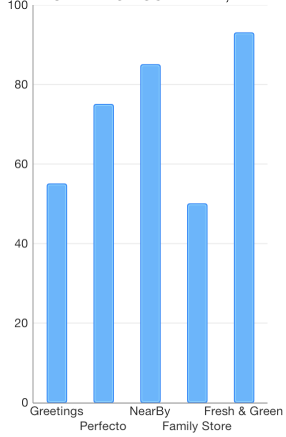

# Chart Series: Column

<code>TKChartColumnSeries</code> are used to visualize data points as column blocks where the height of each bar denotes the magnitude of its value. The following snippet demonstrates how to manually populate one Column series:

```Objective-C
	NSMutableArray *pointsWithCategoriesAndValues = [[NSMutableArray alloc] init];
    NSArray *categories = @[ @"Greetings", @"Perfecto", @"NearBy", @"Family Store", @"Fresh & Green" ];
    NSArray *values = @[ @70, @75, @58, @59, @88 ];
    for (int i = 0; i < categories.count; i++) {
        TKChartDataPoint *dataPoint = [[TKChartDataPoint alloc] initWithX:categories[i] Y:values[i]];
        [pointsWithCategoriesAndValues addObject:dataPoint];
    }
    
    TKChartColumnSeries *series = [[TKChartColumnSeries alloc] initWithItems:pointsWithCategoriesAndValues];
    [chart addSeries:series];
```
```Swift
	var pointsWithCategoriesAndValues = [TKChartDataPoint]()
    let categories = ["Greetings", "Perfecto", "NearBy", "Family Store", "Fresh & Green" ];
    let values = [70, 75, 58, 59, 88]
    for var i = 0; i < categories.count; ++i {
        pointsWithCategoriesAndValues.append(TKChartDataPoint(x: categories[i], y: values[i]))
    }
        
    let series = TKChartColumnSeries(items: pointsWithCategoriesAndValues)
    chart.addSeries(series)
```


## Configure clustering of column series

If you want to cluster multiple column series side by side, they should use a shared x-axis:

```Objective-C
NSMutableArray *pointsWithCategoriesAndValues = [[NSMutableArray alloc] init];
NSMutableArray *pointsWithCategoriesAndValues2 = [[NSMutableArray alloc] init];
NSArray *categories = @[ @"Greetings", @"Perfecto", @"NearBy", @"Family Store", @"Fresh & Green" ];
NSArray *values = @[ @70, @75, @58, @59, @88 ];
for (int i = 0; i < categories.count; i++) {
    TKChartDataPoint *dataPoint = [[TKChartDataPoint alloc] initWithX:categories[i] Y:values[i]];
    [pointsWithCategoriesAndValues addObject:dataPoint];
}

NSArray *values2 = @[ @40, @80, @35, @69, @95 ];
for (int i = 0; i < categories.count; i++) {
    TKChartDataPoint *dataPoint = [[TKChartDataPoint alloc] initWithX:categories[i] Y:values2[i]];
    [pointsWithCategoriesAndValues2 addObject:dataPoint];
}

TKChartCategoryAxis *categoryAxis = [[TKChartCategoryAxis alloc] initWithCategories:categories];
chart.xAxis = categoryAxis;

TKChartColumnSeries *series1 = [[TKChartColumnSeries alloc] initWithItems:pointsWithCategoriesAndValues];
series1.xAxis = categoryAxis;

TKChartColumnSeries *series2 = [[TKChartColumnSeries alloc] initWithItems:pointsWithCategoriesAndValues2];
series2.xAxis = categoryAxis;

[chart beginUpdates];
[chart addSeries:series1];
[chart addSeries:series2];
[chart endUpdates];
```
```Swift
var pointsWithCategoriesAndValues = [TKChartDataPoint]()
var pointsWithCategoriesAndValues2 = [TKChartDataPoint]()
let categories = ["Greetings", "Perfecto", "NearBy", "Family Store", "Fresh & Green" ];
let values = [70, 75, 58, 59, 88]
for var i = 0; i < categories.count; ++i {
    pointsWithCategoriesAndValues.append(TKChartDataPoint(x: categories[i], y: values[i]))
}
    
let values2 = [40, 80, 32, 69, 95]
for var i = 0; i < categories.count; ++i {
    pointsWithCategoriesAndValues2.append(TKChartDataPoint(x: categories[i], y: values[i]))
}
    
let categoryAxis = TKChartCategoryAxis(categories: categories)
chart.xAxis = categoryAxis
    
let series1 = TKChartColumnSeries(items: pointsWithCategoriesAndValues)
series1.xAxis = categoryAxis
    
let series2 = TKChartColumnSeries(items: pointsWithCategoriesAndValues2)
series2.xAxis = categoryAxis
    
chart.beginUpdates()
chart.addSeries(series1)
chart.addSeries(series2)
chart.endUpdates()
```


## Configure stacking of column series

The <code>TKChartColumnSeries</code> can be combined by using different stack modes.

The Stack plots the points on top of each other:

```Objective-C
TKChartStackInfo *stackInfo = [[TKChartStackInfo alloc] initWithID:@(1) withStackMode:TKChartStackModeStack];

TKChartColumnSeries *series1 = [[TKChartColumnSeries alloc] initWithItems:pointsWithCategoriesAndValues];
series1.stackInfo = stackInfo;
[chart addSeries:series1];

TKChartColumnSeries *series2 = [[TKChartColumnSeries alloc] initWithItems:pointsWithCategoriesAndValues2];
series2.stackInfo = stackInfo;
[chart addSeries:series2];
```
```Swift
let stackInfo = TKChartStackInfo(ID: 1, withStackMode: TKChartStackModeStack)
    
let series1 = TKChartColumnSeries(items: pointsWithCategoriesAndValues)
series1.stackInfo = stackInfo
chart.addSeries(series1)
    
let series2 = TKChartColumnSeries(items: pointsWithCategoriesAndValues2)
series2.stackInfo = stackInfo
chart.addSeries(series2)
```


The Stack100 displays the value as percent:

```Objectie-C
TKChartStackInfo *stackInfo = [[TKChartStackInfo alloc] initWithID:@(1) withStackMode:TKChartStackModeStack100];

TKChartColumnSeries *series1 = [[TKChartColumnSeries alloc] initWithItems:pointsWithCategoriesAndValues];
series1.stackInfo = stackInfo;
[chart addSeries:series1];

TKChartColumnSeries *series2 = [[TKChartColumnSeries alloc] initWithItems:pointsWithCategoriesAndValues2];
series2.stackInfo = stackInfo;
[chart addSeries:series2];
```
```Swift
let stackInfo = TKChartStackInfo(ID: 1, withStackMode: TKChartStackModeStack100)
    
let series1 = TKChartColumnSeries(items: pointsWithCategoriesAndValues)
series1.stackInfo = stackInfo
chart.addSeries(series1)
    
let series2 = TKChartColumnSeries(items: pointsWithCategoriesAndValues2)
series2.stackInfo = stackInfo
chart.addSeries(series2)
```


## Configure visual appearance of column series

If you want to customize the appearance of a column series, you should change its <code>style</code> properties.

You can change the fill and stroke in the following manner:

```Objective-C
TKChartColumnSeries *series = [[TKChartColumnSeries alloc] initWithItems:pointsWithCategoriesAndValues];
series.style.palette = [[TKChartPalette alloc] init];
TKChartPaletteItem *palleteItem = [[TKChartPaletteItem alloc] init];
palleteItem.fill = [TKSolidFill solidFillWithColor:[UIColor redColor]];
palleteItem.stroke = [TKStroke strokeWithColor:[UIColor blackColor]];
[series.style.palette addPaletteItem:palleteItem];
[chart addSeries:series];
```	
```Swift
let series = TKChartColumnSeries(items: pointsWithCategoriesAndValues)
series.style.palette = TKChartPalette()
let paletteItem = TKChartPaletteItem()
paletteItem.fill = TKSolidFill(color: UIColor.redColor())
paletteItem.stroke = TKStroke(color: UIColor.blackColor())
series.style.palette.addPa
```


You can change the gap between columns with the following code snippet:

```Objective-C
TKChartColumnSeries *series = [[TKChartColumnSeries alloc] initWithItems:pointsWithCategoriesAndValues];
series.gapLength = 0.5;
[chart addSeries:series];
```
```Swift
let series = TKChartColumnSeries(items: pointsWithCategoriesAndValues)
series.gapLength = 0.5
chart.addSeries(series)
```

Note that the value should be between 0 and 1, where a value of 0 means that a bar would take the entire space between two ticks, while a value of 1 means the bar will have zero width as all the space should appear as a gap.


