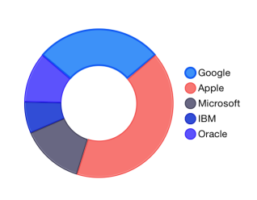

# Chart Series: Donut

TKChartDonutSeries derives from <code>TKChartPieSeries</code> and it represents a donut chart. The <code>innerRadius</code> property determines the width of the donut, and it is measured in values between 0 and 1. The higher value you set in the range between 0 and 1, the thinner the donut will be. For example, a value of 0.9 will make the donut chart take only 0.1 percent of the whole pie chart surface.

Here is an example of a donut chart:

```Objective-C
NSMutableArray *pointsWithValueAndName = [[NSMutableArray alloc] init];
[pointsWithValueAndName addObject:[[TKChartDataPoint alloc] initWithValue:@20 name:@"Google"]];
[pointsWithValueAndName addObject:[[TKChartDataPoint alloc] initWithValue:@30 name:@"Apple"]];
[pointsWithValueAndName addObject:[[TKChartDataPoint alloc] initWithValue:@10 name:@"Microsoft"]];
[pointsWithValueAndName addObject:[[TKChartDataPoint alloc] initWithValue:@5 name:@"IBM"]];
[pointsWithValueAndName addObject:[[TKChartDataPoint alloc] initWithValue:@8 name:@"Oracle"]];

TKChartDonutSeries *series = [[TKChartDonutSeries alloc] initWithItems:pointsWithValueAndName];
series.innerRadius = 0.5;

[chart addSeries:series];
chart.legend.hidden = NO;
chart.legend.style.position = TKChartLegendPositionRight;
```
```Swift
var pointsWithValueAndName = [TKChartDataPoint]()
pointsWithValueAndName.append(TKChartDataPoint(value: 20, name: "Google"))
pointsWithValueAndName.append(TKChartDataPoint(value: 30, name: "Apple"))
pointsWithValueAndName.append(TKChartDataPoint(value: 10, name: "Microsoft"))
pointsWithValueAndName.append(TKChartDataPoint(value: 5, name: "IBM"))
pointsWithValueAndName.append(TKChartDataPoint(value: 8, name: "Oracle"))
   
let series = TKChartDonutSeries(items: pointsWithValueAndName)
series.innerRadius = 0.5
    
chart.addSeries(series)
chart.legend().hidden = false
chart.legend().style.position = TKChartLegendPositionRight
```



