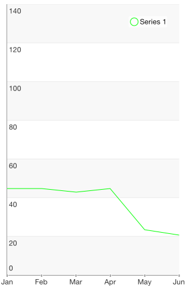

# Chart Series: Line

<code>TKChartLineSeries</code> plot their data points on Cartesian Area. Points are connected with straight lines. Here is how to set up two line series:

```Objective-C
NSMutableArray *expensesData = [[NSMutableArray alloc] init];
NSMutableArray *incomesData = [[NSMutableArray alloc] init];
NSMutableArray *profitData = [[NSMutableArray alloc] init];

NSArray *expensesValues = @[@60, @30, @50, @32, @31];
NSArray *incomesValues = @[@70, @75, @58, @59, @88];
NSArray *profitValues = @[@10, @45, @8, @27, @57];
NSArray *categories = @[@"Greetings", @"Perfecto", @"NearBy", @"Family Store", @"Fresh & Green"];
for (int i = 0; i < categories.count ; i++) {
    [expensesData addObject:[TKChartDataPoint dataPointWithX:categories[i] Y:expensesValues[i]]];
    [incomesData addObject:[TKChartDataPoint dataPointWithX:categories[i] Y:incomesValues[i]]];
    [profitData addObject:[TKChartDataPoint dataPointWithX:categories[i] Y:profitValues[i]]];
}

TKChartLineSeries* seriesForExpenses = [[TKChartLineSeries alloc] initWithItems:expensesData];
seriesForExpenses.title = @"Expenses";
[chart addSeries:seriesForExpenses];

TKChartLineSeries* seriesForIncomes = [[TKChartLineSeries alloc] initWithItems:incomesData];
seriesForIncomes.title = @"Incomes";
[chart addSeries:seriesForIncomes];

TKChartLineSeries* seriesForProfit = [[TKChartLineSeries alloc] initWithItems:profitData];
seriesForProfit.title = @"Profit";
[chart addSeries:seriesForProfit];
chart.legend.hidden = NO;
```
```Swift
var expensesData = [TKChartDataPoint]()
var incomesData = [TKChartDataPoint]()
var profitData = [TKChartDataPoint]()
    
let categories = ["Greetings", "Perfecto", "NearBy", "Family Store", "Fresh & Green" ];
let expensesValues = [60, 30, 50, 32, 31]
let incomesValues = [65, 75, 58, 59, 88]
let profitValues = [5, 45, 8, 27, 57]
    
for var i = 0; i < categories.count; ++i {
    expensesData.append(TKChartDataPoint(x: categories[i], y: expensesValues[i]))
    incomesData.append(TKChartDataPoint(x: categories[i], y: incomesValues[i]))
    profitData.append(TKChartDataPoint(x: categories[i], y: profitValues[i]))
}
    
let seriesForExpenses = TKChartLineSeries(items: expensesData)
seriesForExpenses.title = "Expenses"
chart.addSeries(seriesForExpenses)
    
let seriesForIncomes = TKChartLineSeries(items: incomesData)
seriesForIncomes.title = "Incomes"
chart.addSeries(seriesForIncomes)
    
let seriesForProfit = TKChartLineSeries(items: profitData)
seriesForProfit.title = "Profit"
chart.addSeries(seriesForProfit)
chart.legend().hidden = false
```
```C#
var expensesData = new List<TKChartDataPoint> ();
var incomesData = new List<TKChartDataPoint> ();
var profitData = new List<TKChartDataPoint> ();

var categories = new [] { "Greetings", "Perfecto", "NearBy", "Family Store", "Fresh & Green" };
var expensesValues = new [] { 60, 30, 50, 32, 31 };
var incomesValues = new [] { 65, 75, 58, 59, 88 };
var profitValues = new [] { 5, 45, 8, 27, 57 };

for (int i = 0; i < categories.Length; ++i) {
	expensesData.Add (new TKChartDataPoint (new NSString (categories [i]), new NSNumber (expensesValues [i])));
	incomesData.Add (new TKChartDataPoint (new NSString (categories [i]), new NSNumber (incomesValues [i])));
	profitData.Add (new TKChartDataPoint (new NSString (categories [i]), new NSNumber (profitValues [i])));
}

var seriesForExpenses = new TKChartLineSeries(expensesData.ToArray());
seriesForExpenses.Title = "Expenses";
chart.AddSeries(seriesForExpenses);

var seriesForIncomes = new TKChartLineSeries(incomesData.ToArray());
seriesForIncomes.Title = "Incomes";
chart.AddSeries(seriesForIncomes);

var seriesForProfit = new TKChartLineSeries(profitData.ToArray());
seriesForProfit.Title = "Profit";
chart.AddSeries(seriesForProfit);

chart.Legend.Hidden = false;
```


## Configure input and selection of line series

If you would like to configure the distance between finger touch and line to perform selection:

```Objective-C
TKChartLineSeries *seriesForProfit = [[TKChartLineSeries alloc] initWithItems:profitData];
seriesForProfit.selectionMode = TKChartSeriesSelectionModeSeries;
seriesForProfit.marginForHitDetection = 30.f;
[chart addSeries:seriesForProfit];
```
```Swift
let seriesForProfit = TKChartLineSeries(items: profitData)
seriesForProfit.selectionMode = TKChartSeriesSelectionMode.Series
seriesForProfit.marginForHitDetection = 30.0
chart.addSeries(seriesForProfit)
```
```C#
var seriesForProfit = new TKChartLineSeries (profitData.ToArray());
seriesForProfit.SelectionMode = TKChartSeriesSelectionMode.Series;
seriesForProfit.MarginForHitDetection = 30.0f;
chart.AddSeries(seriesForProfit);
```

If you would like to change the series' stroke, you should use the following code snippet:

```Objective-C
TKChartLineSeries *seriesForProfit = [[TKChartLineSeries alloc] initWithItems:profitData];
seriesForProfit.style.palette = [[TKChartPalette alloc] init];
TKChartPaletteItem *palleteItem = [[TKChartPaletteItem alloc] init];
palleteItem.stroke = [TKStroke strokeWithColor:[UIColor greenColor]];
[seriesForProfit.style.palette addPaletteItem:palleteItem];
[chart addSeries:seriesForProfit];
```
```Swift
let seriesForProfit = TKChartLineSeries(items: profitData)
seriesForProfit.style.palette = TKChartPalette()
let paletteItem = TKChartPaletteItem()
paletteItem.stroke = TKStroke(color: UIColor.greenColor())
seriesForProfit.style.palette.addPaletteItem(paletteItem)
chart.addSeries(seriesForProfit)
```
```C#
var seriesForProfit = new TKChartLineSeries (profitData.ToArray());
seriesForProfit.style.palette = new TKChartPalette ();
var paletteItem = new TKChartPaletteItem ();
paletteItem.Stroke = new TKStroke (UIColor.Green);
seriesForProfit.Style.Palette.AddPaletteItem (paletteItem);
chart.AddSeries (seriesForProfit);
```



