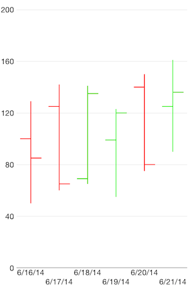

# Chart Series: OHLC

**TKChart** supports **Ohlc** stock series. This series operates with a special kind of data in the form of four parameters defining the stock market - open, high, low, and close. Here is how to set up OHLC series:

```Objective-C
NSArray *openPrices = @[@100, @125, @69, @99, @140, @125];
NSArray *closePrices = @[@85, @65, @135, @120, @80, @136];
NSArray *lowPrices = @[@50, @60, @65, @55, @75, @90];
NSArray *highPrices = @[@129, @142, @141, @123, @150, @161];
NSDate *dateNow = [NSDate date];
NSMutableArray *financialDataPoints = [[NSMutableArray alloc] init];
for (int i = 0; i < openPrices.count; i++) {
    NSDate *date = [dateNow dateByAddingTimeInterval:60 * 60 * 24 * i];
    TKChartFinancialDataPoint *dataPoint = [TKChartFinancialDataPoint dataPointWithX:date open:openPrices[i] high:highPrices[i] low:lowPrices[i] close:closePrices[i]];
    [financialDataPoints addObject:dataPoint];
}

TKChartOhlcSeries *ohlcSeries = [[TKChartOhlcSeries alloc] initWithItems:financialDataPoints];
[chart addSeries:ohlcSeries];
TKChartDateTimeAxis *xAxis = (TKChartDateTimeAxis *)chart.xAxis;
xAxis.minorTickIntervalUnit = TKChartDateTimeAxisIntervalUnitDays;
xAxis.plotMode = TKChartAxisPlotModeBetweenTicks;
xAxis.majorTickInterval = 1;
```
```Swift
let openPrices = [100, 125, 69, 99, 140, 125]
let closePrices = [85, 65, 135, 120, 80, 136]
let lowPrices = [50, 60, 65, 55, 75, 90]
let highPrices = [129, 142, 141, 123, 150, 161]
var dateNow = NSDate.date()
var financialDataPoints = [TKChartFinancialDataPoint]()
    
for var i = 0; i < openPrices.count; ++i {
    var date = dateNow.dateByAddingTimeInterval(CDouble(60 * 60 * 24 * i))
    financialDataPoints.append(TKChartFinancialDataPoint(x: date, open: openPrices[i], high: highPrices[i], low: lowPrices[i], close: closePrices[i]))
}
            
let ohlcSeries = TKChartOhlcSeries(items: financialDataPoints)
chart.addSeries(ohlcSeries)
    
let xAxis = chart.xAxis as TKChartDateTimeAxis
xAxis.minorTickIntervalUnit = TKChartDateTimeAxisIntervalUnit.Days
xAxis.setPlotMode(TKChartAxisPlotMode.BetweenTicks)
xAxis.majorTickInterval = 1
```
```C#
var openPrices = new [] { 100, 125, 69, 99, 140, 125 };
var closePrices = new [] { 85, 65, 135, 120, 80, 136 };
var lowPrices = new [] { 50, 60, 65, 55, 75, 90 };
var highPrices = new [] { 129, 142, 141, 123, 150, 161 };
var dateNow = NSDate.Now;
var financialDataPoints = new List<TKChartFinancialDataPoint> ();

for (int i = 0; i < openPrices.Length; ++i) {
    var date = dateNow.AddSeconds ((double)(60 * 60 * 24 * i));
    financialDataPoints.Add (new TKChartFinancialDataPoint (date, new NSNumber (openPrices [i]), new NSNumber (highPrices [i]),
        new NSNumber (lowPrices [i]), new NSNumber (closePrices [i]), null));
}

var ohlcSeries = new TKChartOhlcSeries (financialDataPoints.ToArray ());
chart.AddSeries (ohlcSeries);

var xAxis = chart.XAxis as TKChartDateTimeAxis;
xAxis.MinorTickIntervalUnit = TKChartDateTimeAxisIntervalUnit.Days;
xAxis.PlotMode = TKChartAxisPlotMode.BetweenTicks;
xAxis.MajorTickInterval = 1;
```


## Configure visual appearance of ohlc series

If you want to customize the appearance of ohlc series, you should implement the **TKChartDelegate** protocol as shown below::

```Objective-C
- (TKChartPaletteItem *)chart:(TKChart *)chart paletteItemForSeries:(TKChartSeries *)series atIndex:(NSInteger)index
{
    id<TKChartData> dataPoint = [series dataPointAtIndex:index];
    TKStroke *stroke;
    if ([dataPoint.close doubleValue] < [dataPoint.open doubleValue]) {
        stroke = [TKStroke strokeWithColor:[UIColor redColor]];
    } else {
        stroke = [TKStroke strokeWithColor:[UIColor greenColor]];
    }

    TKChartPaletteItem *paletteItem = [TKChartPaletteItem paletteItemWithStroke:stroke];
    return paletteItem;
}
```
```Swift
func chart(chart: TKChart!, paletteItemForSeries series: TKChartSeries!, atIndex index: Int) -> TKChartPaletteItem {
    var dataPoint = series.dataPointAtIndex(UInt(index))
    
    var stroke: TKStroke
    if dataPoint?.close!().doubleValue < dataPoint?.open!().doubleValue {
        stroke = TKStroke(color: UIColor.redColor())
    } else {
        stroke = TKStroke(color: UIColor.greenColor())
    }
    
    var paletteItem = TKChartPaletteItem(stroke: stroke)
    return paletteItem
}
```
```C#
class ChartDelegate: TKChartDelegate
{
    public override TKChartPaletteItem PaletteItemForSeries (TKChart chart, TKChartSeries series, nint index)
    {
        var dataPoint = series.DataPointAtIndex ((uint)index);
        TKStroke stroke = null;
        if (dataPoint.Close.DoubleValue < dataPoint.Open.DoubleValue) {
            stroke = new TKStroke (UIColor.Red);
        } else {
            stroke = new TKStroke (UIColor.Green);
        }
        var paletteItem = new TKChartPaletteItem (stroke);
        return paletteItem;
    }
}
```


