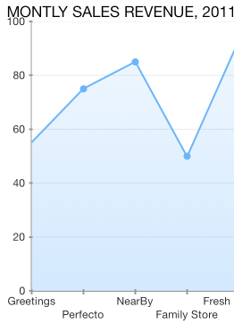
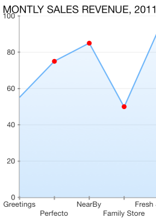

# Chart Series: Point Customization

The <code>TKChartSeries</code> can draw a point in particular shape. You can customize the appearance and shape of this point by accessing and altering the styling properties and palette items for shapePallete.

Note that the approach above is applicable to any series (except <code>TKChartPieSeries</code>, <code>TKChartBarSeries</code> and <code>TKChartColumnSeries</code>). If you want to change the shape of each point, you should use the following code snippet:

```Objective-C
areaSeries.style.pointShape = [TKPredefinedShape shapeWithType:TKShapeTypeStar andSize:CGSizeMake(8, 8)];
```
```Swift
areaSeries.style.pointShape = TKPredefinedShape(type: TKShapeTypeCircle, andSize: CGSizeMake(8, 8))
```
```C#
areaSeries.Style.PointShape = new TKPredefinedShape (TKShapeType.Circle, new SizeF (8, 8));
```



You can specify many predefined shapes by using the following enum:

- TKShapeTypeNone - No shape
- TKShapeTypeSquare - Square shape
- TKShapeTypeCircle - Circle shape
- TKShapeTypeTriangleUp - Triangle pointing up
- TKShapeTypeTriangleDown - Triangle pointing down
- TKShapeTypeDiamond - Diamond shape
- TKShapeTypeRhombus - Rhombus shape
- TKShapeTypePentagon - Pentagon shape
- TKShapeTypeHexagon - Hexagon shape
- TKShapeTypeStar - Star shape
- TKShapeTypeHeart - Heart shape

In addition, you can change a point background color by using the following lines of code:

```Objective-C
areaSeries.style.pointShape = [[TKPredefinedShape alloc] initWithType:TKShapeTypeCircle andSize:CGSizeMake(8, 8)];
TKChartPaletteItem *paletteItem = [[TKChartPaletteItem alloc] init];
paletteItem.fill = [TKSolidFill solidFillWithColor:[UIColor redColor]];
TKChartPalette *palette = [[TKChartPalette alloc] init];
[palette addPaletteItem:paletteItem];
areaSeries.style.shapePalette = palette;
```
```Swift
areaSeries.style.pointShape = TKPredefinedShape(type: TKShapeTypeCircle, andSize: CGSizeMake(8, 8))
let paletteItem = TKChartPaletteItem()
paletteItem.fill = TKSolidFill(color: UIColor.redColor())
let palette = TKChartPalette()
palette.addPaletteItem(paletteItem)
areaSeries.style.shapePalette = palette
chart.addSeries(areaSeries)
```
```C#
areaSeries.Style.PointShape = new TKPredefinedShape (TKShapeType.Circle, new SizeF (8, 8));
var paletteItem = new TKChartPaletteItem ();
paletteItem.Fill = new TKSolidFill (UIColor.Red);
var palette = new TKChartPalette ();
palette.AddPaletteItem (paletteItem);
areaSeries.Style.ShapePalette = palette;
chart.AddSeries (areaSeries);
```




